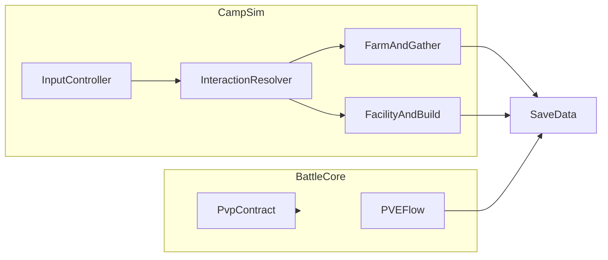
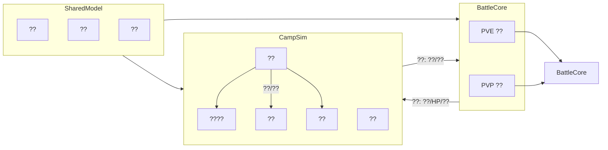
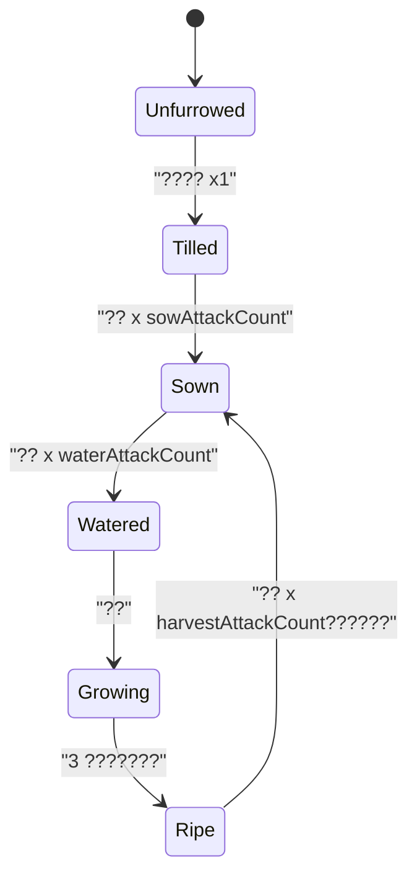
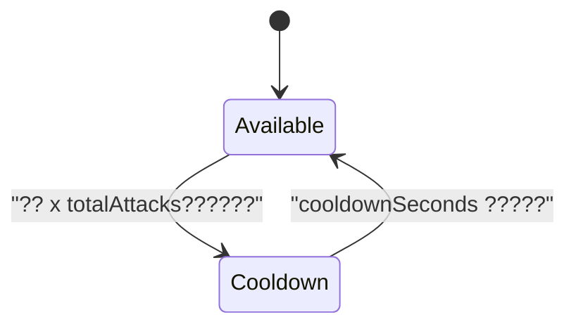

# 宠物 Demo 游戏 SPEC（重写版）
## 1. 文档信息
- 文档名称：宠物 Demo 游戏 SPEC
- 工程路径：`Pet Demo`
- 目标平台：Unity 2D（PC 优先，预留移动端输入）
- 当前目标：营地循环、PVE 回合战斗、PVP 接口预留
- 文档基准：以当前代码实现为准，文档与代码不一致时先修正文档

## 2. ?????????

### 2.1 ????



- CampSim ? BattleCore ?? `SaveData` ????????
- ????????????????????

### 2.2 ????

- ??????????? `ICampInputSource` ?????`CampInputController` ? `Priority` ?????????
- ???????`HeroMoveIntent { intent: Vector2, intentActive: bool }`?
- ??/API ???`RegisterSource`?`UnregisterSource`?`CurrentIntent`?
- ??????P0 ???????P1 ????????P2 ???????
- ???????????????????????????

### 2.3 ???????

- ???????`HeroMotor` ? `FixedUpdate` ????????`MoveIdleDetector` ?????????`EightWayPresentation` ???????
- ???????`Velocity`?`LastNonZeroIntent`?`EightWayDirection`?
- ??/API ???`HeroController.EnableControl(bool)`?`MoveIdleDetector.OnMoveIdleChanged`?
- ??????P0 ?????????P1 ????????P2 ??/?????
- ?????????????????????????????????

### 2.4 ??????

- ???????`CampInteractionResolver` ???????????? `FarmUnlockGuard` ?????????
- ???????`ResolverCommandKind.BeginFarmUnlockFlow`?`InteractableKind.FarmUnlockGuard`?
- ??/API ???`TryBeginUnlockFlow()`?`HandleBattleResult(isWin)`?
- ??????P0 ???????????P1 ???? BattleCore ???
- ?????????? active ???????????????

### 2.5 ?????????

- ???????`GameBootstrap` ??????/????????????????
- ???????`HeroTemplateId=Hero_Role_cunmin`?`HeroRootName=HeroRoot`?
- ??/API ???`AutoBootstrap()`?`EnsureHeroComponents(...)`?`CameraFollow.EnsureAndBind(...)`?
- ??????P0 ????????P1 ??????P2 ??????
- ?????????????????? `EnsureHeroComponents` ??????

### 2.6 ????? Demo ??

#### 2.6-6 ????
- ???????????? `CameraFollow` ??????????
- ???????`smoothTime`?`offset`?`target`?
- ??/API ???`EnsureAndBind(followTarget)`?
- ??????P0 ?????P1 ?????P2 ?????
- ????????? `Camera.main`?????????????

#### 2.6-7 ???????
- ?????????????????/?????????????????
- ???????`StartupSaveChoiceState`?
- ??/API ???`ResolveRuntimeSaveData`?`FinalizeStartupChoice`?
- ??????P0 ?????P1 ?????
- ???????????????? `Time.timeScale`?

#### 2.6-8 ?????
- ??????????????????????????
- ???????`scriptedEnemyBindings`?`FlowState`?
- ??/API ???`TryStartScriptedIntroBattle(...)`?
- ??????P0 ??????????P1 ???/???
- ?????????????????????????

## 3. ?????CampInteractionResolver?

### 3.1 ??????

- ?????????????? `Interactable`?????? `ActiveInstances`?
- ???????`InteractableKind`?`interactionRadius`?`interactionPriority`?
- ??/API ???`GetAnchorPosition()`?`IsInRange(...)`?
- ??????P0 ?????????P1 ?????
- ???????????????? `Interactable` ???

### 3.2 ?????????

- ???????????????????????????????????????
- ???????`ResolverCommand`?`currentFocus`?
- ??/API ???`ResolveFocus(...)`?`DispatchFocus(...)`?`OnResolverCommand`?
- ??????P0 ???????P1 ?????
- ?????????????? + ???????????

### 3.3 ????

- ???????Resolver ??? Build/Facility/Farm/Gather??????????
- ??????????? `activeFarmFieldId`?`activeGatherPointId`?????
- ??/API ???`BeginBuildFlow`?`BeginFacilityFlow`?`BeginFarmFieldFlow`?`BeginGatherPointFlow`?
- ??????P0 ???????P1 ???????
- ????????????????????? Tick?????????

### 3.4 ??????

- ???????`BuildManager`?`FacilityManager`?`FarmManager`?`GatherManager` ???????Resolver ???????
- ?????????????????????
- ??/API ???`BindSaveData`?`TickProduction`?`ApplyAttack`?
- ??????P0 ????????P1 Tick ??????
- ??????????????????????????

## 4. ??????

### 4.1 ??
- ??????? -> ???? -> ????/?? -> ?????????

### 4.2 ????
- ???????????????????????????

### 4.3 ????
- `BindSaveData(save)`?`RegisterScene*`?`ApplyAttack(...)`?`TryTransferPetBagToPlayerInventory(...)`?

### 4.4 Camp ??? Farm/Gather ?????
- ???????Farm/Gather ????+?????????
- ???????`attackIntervalSec`???????
- ??/API ???`BeginFarmFieldFlow`?`BeginGatherPointFlow`?
- ??????P0 ?????P1 ?????
- ?????????????????????

### 4.5 FarmField ????????
- ???????`FarmManager` ?? `_sceneFields`?`_runtimes`?`_worldDrops`????????/??/???
- ???????`FarmFieldRuntime`?`WorldDropEntry`?`unlockedSystems` token?
- ??/API ???`RegisterSceneField`?`ApplyAttack`?`UnlockGroup`?
- ??????P0 Bind ??????????P1 worldDrop ???
- ???????`ReRegister...` ???????????????????

### 4.6 FarmFieldGroup ? Rage
- ??????????? `FarmFieldGroupUnlockGuard + FarmUnlockBattleFlowController` ???Rage ????????
- ???????`farmGroup:<groupId>` token?`currentCount/threshold`?
- ??/API ???`TryBeginUnlockFlow`?`HandleBattleResult`?`NotifyFarmAttackSuccess`?
- ??????P0 ??????P1 Rage ???????
- ?????????? `SaveData.unlockedSystems` ???????

### 4.7 GatherPoint ??
- ???????`GatherManager` ? Farm ?????? `Available/Cooldown`???? `CampSimClock` ???
- ???????`GatherPointRuntime`?`GatherConfig`?
- ??/API ???`RegisterScenePoint`?`ApplyAttack`?`FindNearestAvailablePoint`?
- ??????P0 Bind ???????P1 ????????
- ???????`ReRegister...` ?? runtime???? `_scenePoints`?

### 4.8 ShopFog ?????
- ????????????? `campUpgradeCount`???? `ShopFogOverlay` ?????
- ???????`campUpgradeCount`?`shopFogCenterAnchorId`?
- ??/API ???`TryCommitUpgrade`?`ApplyCampUpgradeLevel`?`TryGetShopFogCenter`?
- ??????P0 ????????????P1 ??????
- ?????????????????????

## 5. PVE ????

### 5.1 ??
- Battle ?? Model/Core/Scene ???????? Unity ???

### 5.2 ?????
- ???????`BattleStateMachine` ?? `Setup -> RoundStart -> SelectAction -> Resolve -> CheckEnd`?
- ???????`BattleState`?`BattlePhase`?`turnOrder`?
- ??/API ???`Step(...)`?`AutoResolve(...)`?
- ??????P0 ???????P1 ???????
- ???????????????????????

### 5.3 ???????
- ???????????????????????
- ???????`BattleAction`?`CombatUnit`?
- ??/API ???`ResolveAction`?`CheckBattleEnd`?
- ??????P0 ???????P1 ???????
- ????????? `BattleDelta` ??????????

### 5.4 ?????
- ???????`BattleSceneAdapter` ??????????????????
- ???????`pveProgress`?
- ??/API ???`BindSaveData`?`StartBattle`?`StepOnce`?`AutoResolve`?
- ??????P0 ????????P1 ???????
- ?????????????? `ResultCode`????????

### 5.5 ??????
- ???????????PVE ??????????
- ???????????????? hash?

## 6. PVP ??

### 6.1 ????
- ???????PVP ? PVE ?? BattleCore???? `BattleRuleVersion.Current` ??????
- ???????`RuleVersion`?
- ??/API ???`IPvpBattleClient.RuleVersion`?
- ??????P0 ????????
- ????????????????????????

### 6.2 ?????
- ?????????????????????
- ??/API ???`SubmitPartySnapshot(...)`?`FetchRemoteAction(...)`?
- ??????P1 ?? mock?P2 ?????
- ???????? lockstep ????????????

### 6.3 ????
- Demo ????????????????????????

## 7. ????

### 7.1 SaveData ????
- ???????`SaveData` ?? Farm/Gather/Inventory/Unlock/Progress ??????
- ???????`farmFields`?`gatherPoints`?`worldDrops`?`inventory`?`campStorage`?`unlockedSystems`?
- ??/API ???`TryLoad`?`TrySave`?
- ??????P0 ??????P1 ?????
- ?????????????????????????????

### 7.2 ????????
- ????????????????????????
- ???????`RuntimeSave`?
- ??/API ???`ResolveRuntimeSaveData(continueGame)`?
- ??????P0 ???????
- ?????????????????????

### 7.3 Bind ??
- ?????????????????? `BindSaveData` ?????????
- ???????????????????????
- ??/API ???`BindRuntimeSaveData()`?
- ??????P0 ???????P1 ????????
- ?????????? `ReRegister...` ???????????

## 8. ??????

- P0????????Farm/Gather ????PVE ????????????
- P1???????? BattleCore?????????? UI ???
- P2?PVP mock ??????????????????

?????
- ??????????? API ???????
- ????????????????

## 9. Unity ???????

### 9.1 ?????????
- ?????????????????????????????????
- ?????????????????????

### 9.2 CampSimClock Tick ??
- ???????Farm ??? Gather ????? Tick ???
- ?????Tick ??/???????????????

### 9.3 ?????
- ???????????????? + ????? + ?????????
- ??????? B.5/B.6 ??????????????

## ?? A???????

- ??????????????????????
- ??????????? CJK ?????????
- ???? UTF-8?? BOM??????????

## ?? B????????

### B.1 Cursor codereview ??
- ??????????????-> ???? -> ?????

### B.2 ?????????
- ????? `unlockedSystems` ????PlayerPrefs ??????

### B.3 Hotfix Notes?v1.33?
- ?? `FarmManager` ????? `GatherManager` ???????????????

### B.4 Hotfix Notes?v1.34?
- ??? `UnityEditor.Graphs.Edge.WakeUp` ????????????????????

### B.5 Hotfix Notes?v1.35?
- ???`FarmManager.ReRegisterSceneFieldsToCurrentRuntimeList` ?????????????
- ??????????????????????????

### B.6 Hotfix Notes?v1.36?
- ???`GatherManager.ReRegisterScenePointsToCurrentRuntimeList` ?????
- ???`RegisterScenePointRuntimeOnly` ???????????

### B.7 Feature Notes?v1.37?
- `DemoBattleActorView` ? `SpineAttackPlayer` ??????????????? track 1?

### B.8 Feature Notes?v1.38?
- ??? `OnGUI` ????????????????????????

### B.9 Feature Notes?v1.39?
- ?????????????????????????? 18 ??? 36?

### B.10 Feature Notes?v1.40?
- ??????????????????????????????

## ?????v1.44?

- ????????????????????????? + ????????
- ????????????????????????????????
- ?????????????? SPEC ????????????
### B.3 ??????_2026??????????????v1.43?

- **????**?`VirtualJoystick`?`CampInputController`?`HeroMotor` ?????
- **??**?
  - ?????????????
  - ?????????????????????
  - ??????????????????????????????? `moveIntent`?

#### B.3.1 ??????

- ??????????
  - `Hidden`???????????????`ReadIntent()` ??????
  - `Active`???????????????????????????????
  - `ReleaseToHidden`??????????? `Hidden`?
- ?????????????????????????????????

#### B.3.2 ??????

```text
VirtualJoystickRuntime
  isPressed: bool
  isVisible: bool
  dragOriginLocal: Vector2       // ??????????
  currentLocal: Vector2          // ??????????
  delta: Vector2                 // currentLocal - dragOriginLocal
  currentNormalized: Vector2     // ClampMagnitude(delta, radius) / radius
```

#### B.3.3 ??/API ??

- `ICampInputSource.ReadIntent()` ?????
  - ?????????? `HeroMoveIntent.Zero`?
  - ??????????? `HeroMoveIntent(currentNormalized, true)`?
- `CampInputController` ????????? `Priority` ????????

#### B.3.4 ????????

- **P0**??? `VirtualJoystick`????? + ?????? + ????????
- **P1**????????????????????????????
- ???????? `VirtualJoystick` ???????????????

#### B.3.5 ??????

- ?? `RectTransformUtility.ScreenPointToLocalPointInRectangle` ????????????
- ?? `OnPointerDown` ?? `dragOriginLocal`?????????????
- `OnPointerUp` ???????????????????UI ???
- ?? `Graphic` ???????????????? `enabled` ? `CanvasGroup`??????????

#### B.3.6 ????????

- `SPEC_GAME.md` ??? UTF-8 ???????? ANSI ???
- ?? SPEC ?????????????????????
  - `????`
  - `????`
  - `???`
  - `??`
- ???????? `?`??????????????????????????????
## ????????

- **??**??? `SPEC_GAME.md` ???? **UTF-8** ?????????????????? ANSI ???????????? `???` ????

---

- 
### B.3 Hotfix Notes (v1.33)

- Date: 2026-04-23
- Scope: `FarmManager` world-drop rebuild path references `GatherManager`.
- Design note:
  - Cross-module singleton access from `PetDemo.Farm` to `PetDemo.Gather` must keep explicit type visibility (`using PetDemo.Gather;` or fully-qualified name).
  - Keep behavior unchanged: gather loot sprite fallback still resolves by `GatherManager.TryResolveLootSprite`.
- Data/API impact:
  - No data structure change.
  - No API signature change.
- Priority and dependency:
  - Priority: P0 (compile blocker).
  - Dependency: `FarmManager.RebuildWorldDropsInScene`.
- Implementation suggestion:
  - Prefer adding namespace import for readability and low-risk fix.
  - Re-validate with `dotnet build` to ensure CS0103 is eliminated.

### B.4 Hotfix Notes (v1.34)

- Date: 2026-04-23
- Scope: fix recurrent editor exception `NullReferenceException` from `UnityEditor.Graphs.Edge.WakeUp()` during domain reload.
- System design:
  - This exception is treated as an editor-layout corruption issue (most commonly `UserSettings/Layouts/default-2021.dwlt` storing invalid graph window state).
  - Add a one-shot self-healing flow at editor startup:
    1. Check Unity `Editor.log` tail for the signature stack (`UnityEditor.Graphs.Edge.WakeUp` + `mode-current-id-Pet Demo`).
    2. If hit, back up and remove project layout cache files in `UserSettings/Layouts`.
    3. Persist a session marker to avoid repeated deletion loops.
- Data structure definition:
  - `LayoutRecoveryDecision`
    - `bool shouldRecover`
    - `string reason`
    - `string[] targetLayoutFiles`
    - `string markerKey`
- API/interface design:
  - `EditorGraphLayoutRecovery.TryRecoverFromKnownGraphWakeUpNullRef()`
    - Input: none (reads `Editor.log` and project layout files).
    - Output: bool (`true` when recovery action executed).
  - `EditorGraphLayoutRecovery.IsKnownWakeUpNullRefInRecentEditorLog(...)`
    - Input: recent log text
    - Output: bool
- Priority and dependencies:
  - Priority: P0 (editor usability issue, recurring on script reload).
  - Dependency: Unity Editor-only assembly (`Assets/Scripts/Editor`), no runtime dependency.
- Implementation suggestion:
  - Keep scope editor-only, no gameplay code changes.
  - Backup files as `*.bak-<timestamp>` before deletion for rollback.
  - Emit clear `Debug.LogWarning` once recovery runs.

- System design:
  - `BindSaveData` ?????? `_sceneFields` ? `_runtimes` ???????????? `Dictionary`???? `foreach` ????????????????
  - ?????????????????? `FarmFieldComponent`???? `_sceneFields` ?????? `_sceneFields`?????????? `Dictionary`??
  - ?????`ReRegister...` ????????????????????????????????????????
- Data structure definition:
  - `SceneFieldRebindSnapshot`
    - `int sceneFieldCount`
    - `int runtimeCount`
    - `string[] sceneFieldKeys`
    - `string bindRunId`
  - `SceneFieldMutationTrace`
    - `string fieldId`
    - `bool existedBeforeSet`
    - `int countBeforeSet`
    - `int countAfterSet`
    - `string trigger` (`BindSaveData` / `OnEnable` / `OnDisable` / `Other`)
- API/interface design:
  - ????? API?????????
  - `ReRegisterSceneFieldsToCurrentRuntimeList` ??????????? key/value?????? `Dictionary` ????????
- Priority and dependency:
  - Priority: P0?????????????
  - Dependency: `FarmManager.BindSaveData`?`FarmManager.RegisterSceneField`?`FarmFieldComponent` ??????????
- Implementation suggestion:
  - ????????????????? runtime?????????????? key ??????
  - ????????????????????????? `BindSaveData` ????????????
  - ??????????fieldId???????????post-fix ??? Debug?

### B.6 Hotfix Notes (v1.36)

- Date: 2026-04-23
- Scope: runtime exception `InvalidOperationException: Collection was modified; enumeration operation may not execute` in `GatherManager.ReRegisterScenePointsToCurrentRuntimeList`?? B.5 ???????
- System design:
  - `GatherManager` ? `FarmManager` ???????????????`BindSaveData` ????????? `_scenePoints` ? `_runtimes`?
  - ????? `_scenePoints` ???? `_scenePoints` ???
  - ?? B.5?`RegisterScenePoint`???????? `RegisterScenePointRuntimeOnly`??????? `ReRegister...` ??????????????
- Data structure definition:
  - ? B.5 ????? `SceneFieldMutationTrace` ??????????????????? `pointId` ???
- API/interface design:
  - ????? API?????? `RegisterScenePointRuntimeOnly` ??????????
- Priority and dependency:
  - Priority: P0?? Farm ????Gather ???????
  - Dependency: `GatherManager.BindSaveData`?`GatherManager.RegisterScenePoint`?`GatherPointComponent` ?????
- Implementation suggestion:
  - ?? `debug-08db5e.log` ? `HG1/HG2/HG3` ??????????? `_scenePoints` ??????????
  - ?? `ReRegister...` ??????????? `RegisterScenePointRuntimeOnly` ????????????
  - ??????????post-fix ???????????

### B.7 Feature Notes (v1.37) ? Demo ????? Spine ??

- Date: 2026-04-24
- Scope: `DemoBattleActorView.PlayAttackOnce` used by `FarmUnlockBattleFlowController` (scripted intro battle / unlock battle overlay).
- System design:
  - `SkeletonAnimation` ??????????`DemoBattleActorView` ?? `GetComponent<SkeletonAnimation>()` ??????????? locomotion ????? API?
  - ? `GameBootstrap.EnsureHeroComponents` ? `SpineAttackPlayer` ???? 2.3-5 ???? Spine **track 1** ??????`HeroSpineLocomotion` ?? track 0?????? `SpineAttackPlayer.PlayAttackOnce()` ??????????????????
  - ?? `SpineAttackPlayer` ????? prefab?`DemoBattleActorView` ? `SkeletonAnimation` ?? `Attack` ?? **track 1**?`Complete` ?? track 1 `SetEmptyAnimation`??? track 0 ? Idle/Walk??????
- Data structure definition: ????????????? `SkeletonAnimation` ???
- API/interface design: `DemoBattleActorView` ?? `PlayAttackOnce()` / `PlayDeath()`??????? `SpineAttackPlayer` ? Spine overlay track???? `Animator` ???`GetComponentInChildren` ????????
- Priority: P0???????????????????????
- Implementation suggestion: ? `SpineAttackPlayer` ?? `attackAnimationName` ?? `"Attack"`?`PlayDeath` ????? `SkeletonAnimation` ???????

### B.8 Feature Notes (v1.38) ? ???????????OnGUI?

- Date: 2026-04-24
- Scope: `FarmUnlockBattleFlowController` ???? UI???????????????????????
- System design:
  - ?????? Demo ??????? `OnGUI` ???????? UI ???
  - ???????????????????????????????????????
  - ?????????? Tick ??????????`DrawBattleOverlay` ?????
- Data structure definition:
  - Runtime fields:
    - `playerHpRatioDisplay: float`??? `[0,1]`?
    - `enemyHpRatioDisplay: float`??? `[0,1]`?
    - `playerHpTargetRatio: float`??? `[0,1]`?
    - `enemyHpTargetRatio: float`??? `[0,1]`?
    - `hpSettleStarted: bool`
  - Constants:
    - `loserTargetRatio = 0f`
    - `winnerTargetRatioRange = [0.15f, 0.35f]`
- API/interface design:
  - `EnterBattleState()`??????????????? `1.0`????????
  - `TickBattle(dt)`?
    - ???????????????
    - ???????????????? `0`??? `Random.Range(0.15, 0.35)`???????
  - `DrawBattleOverlay()`??????????????????????????
- Priority and dependency:
  - Priority: P0??????????
  - Dependency: `DemoBattleActorView` ???? transform?`Main Camera` ????????
- Implementation suggestion:
  - ???????? `Mathf.Clamp01` ?????
  - ??????/?/??/??????????????? World Space Canvas?
  - ????????????????????????????

### B.9 Feature Notes (v1.39) - Battle foot HP bar anchor/styling adjustment

- Date: 2026-04-24
- Scope: `FarmUnlockBattleFlowController` OnGUI battle foot HP bars.
- System design:
  - HP bar anchor must be the actor root transform position (`actor.transform.position`) only.
  - Do not sample renderer bounds each frame, so the bar does not jitter with animation pose changes.
  - The bar remains fixed at a constant downward screen offset from the actor anchor.
- UI rule update:
  - Foot HP bar height is increased from `18` to `36` (2x).
  - Width and colors remain unchanged in this revision.

### B.10 Feature Notes (v1.40) - Storage proximity auto-deposit with fly-in FX

- Date: 2026-04-24
- Scope: Hero + Pet auto-deposit to `campStorage` when entering storage range.
- System design:
  - Trigger model is **range-enter event**, not MoveIdle: when actor is outside range in previous frame and inside range in current frame, auto-deposit is fired once.
  - Hero and Pet are handled independently; if both enter in same frame, process in deterministic order (Hero first, then each Pet in runtime order).
  - Logic settlement and VFX are decoupled: item transfer commits first, then fly-in FX plays best-effort.
- Data structure definition:
  - Runtime guard states:
    - `heroInStorageRange: bool`
    - `petInStorageRange: Dictionary<string, bool>`
    - `lastDepositTsByActor: Dictionary<string, float>` for debounce/cooldown
  - Transfer result shape:
    - `acceptedEntries: List<ItemStack>` (committed into storage)
    - `overflowEntries: List<ItemStack>` (kept in source container; no silent drop)
- API/interface design:
  - `TryAutoDepositToStorage(EntityId actor, ItemContainer sourceContainer, float triggerTime)`:
    - Input: actor identity + source container.
    - Output: `Result` with message `accepted=<n>;overflow=<n>`.
  - `PlayDepositFlyFx(EntityId actor, string itemId, int quantity, Vector3 storagePos)`:
    - Called only for accepted quantity.
  - `OnStorageRangeEnter(actor)` / `OnStorageRangeExit(actor)`:
    - Defined in interaction layer; enter triggers deposit, exit resets one-shot gate.
- Priority and dependency:
  - P0: Hero enter-range auto-deposit + fly-in.
  - P0: Pet enter-range auto-deposit + fly-in.
  - P1: Debounce/cooldown and duplicate-trigger guard.
  - P1: Debug logs and graceful fallback when storage anchor missing.
- Technical implementation suggestions:
  - Reuse existing transfer FX coroutine path in `FarmManager` (`PlayTransferToStorageFxRoutine`).
  - Keep storage anchor source unified with existing transport anchor resolution (`farmTransportPointAnchorId`).
  - For batch entries, commit all data first, then play FX per accepted stack to avoid partial visual-state mismatch.
  - Missing storage anchor must not block deposit commit; skip FX and log warning only.

# ?? Demo ?? SPEC????? + ???? + PK

## 1. ????

| ? | ?? |
| --- | --- |
| ???? | ?? Demo ?? SPEC |
| ???? | ????????????**PVE ??**?**PK/PVP ??** ???????? |
| ???? | Unity ?? [`Pet Demo`](Pet Demo)?2D ??????PC????????? |
| Unity ?? | [`Pet Demo`](Pet Demo) |
| ???? | v1.29 |
| ???? | ???? Demo ?????????? `BattleCore`???????? Spine ????**???? 4.5 ???**?**??? 4.7 ??**????PVP ???????? |

? SPEC ?**?????**???C# ????????????**???????**?????????? SPEC?

---

## 2. ?????????

? Demo ??????

1. **???????**???????????????????? MoveIdle ???????
2. **?? PVE ??**??????????????????????????????
3. **?? PK/PVP**?? PVE ???? `BattleCore` ???**????**???????? SPEC ???????????? Demo ??????

### 2.1 ????????



???

- **??**?????????????? roster ??????
- **????**?? C# ?????**?** Unity ???????????? `SaveData` ??????????? ID?

### 2.5 ????????Demo?

?????????????? Demo ?????????????

- `PlayerHeroTemplate = Hero_Role_cunmin`?`Assets/Art/Hero/Role_cunmin` ? Spine ?? + `Assets/Art/Hero/Hero_Role_cunmin.prefab`??  
- `PetCandidatePool = "Pet Demo/Assets/Fantazia Animated 2D Monsters/Prefabs/*.prefab" - { Hero_Role_cunmin }`?????????????????? ID??????? `Art/Hero` ???  
- ????? **prefab ?????? ID?** ?????? `Source_Animations` ?? prefab ???

?????????????????????????????????????GM ????????????????????

### 2.6 ????????????Demo?

??? Demo ?????????????????????

1. **??????????**  
   - ???????????? `Assets/Scenes/SampleScene.unity`?  
   - `SampleScene.unity` ???? Build Settings ??????? `enabled = true`?  
   - ??????????????????????????????

2. **??????????**  
   - ??????????????????? 1 ????????  
   - ??????? `Hero_Role_cunmin`??2.5 ?????? `Art/Hero/Role_cunmin` Spine?  
   - ????????????`sceneExistingHero -> serializedHeroPrefab -> fallbackCapsule`?  
   - `serializedHeroPrefab` ??????????????????????? `Assets/Art/Hero/Hero_Role_cunmin.prefab`?  
   - ??????????? `HeroSpawnPoint`??????????????? `(0, 0, 0)` ???????????

3. **??????**  
   - ???????????????????????????????? UI ???  
   - ?????????? `W/A/S/D` ???????????????????? `moveIntent` ???

4. **???????**  
   - `GameBootstrap`???????????????????????????  
   - `HeroController`???????????????????????????/?????????????
   - ??????? `AssetDatabase` ????????????????????????

5. **???????????Demo?**  
   - Standalone?PC??????????? `1080x1920`?  
   - ???????????? `1080x1920`?  
   - ?????????? Portrait?  
     - `allowedAutorotateToPortrait = 1`  
     - `allowedAutorotateToPortraitUpsideDown = 0`  
     - `allowedAutorotateToLandscapeLeft = 0`  
     - `allowedAutorotateToLandscapeRight = 0`

#### 2.6-6 ???????Demo?

- **????**????????? `HeroRoot`?? ?2.6-2 ????????  
- **????**?????? `Main Camera`?`Tag=MainCamera`????? Cinemachine ?????????  
- **????**?`CameraFollow` ??? `LateUpdate` ??? `Vector3.SmoothDamp` ?????`smoothTime` ????????? `0.15` ???  
- **????**???????? `x`?`y`?**??**???? `z`??? 2D?`-10`?? `orthographic size` ??????  
- **????**??? `offset`?`Vector2`???????????????????  
- **??**???**?**????? clamp???????? `CameraFollow` ??? `min/max` ?????  
- **????**?`GameBootstrap` ? `EnsureHeroComponents` ???????????? `BindCameraFollow` ?????`CameraFollow.EnsureAndBind(heroRoot.transform)`??? `Main Camera` ???????????????? `Main Camera`????????????????  
- **????**??? `Camera.main`?? `Tag=MainCamera`??????????????? `FindObjectsOfType<Camera>()` ???

#### 2.6-7 ?????????Demo?v1.27?

- **??**?Play ?????????????????????????????????????????????
- **????????**?`GameBootstrap` ?????? `StartupSaveChoiceState` ???
  - `None`???????????????
  - `WaitingChoice`?????????????
  - `Confirmed`????????????? `SaveData`??????????
- **????????**??? `WaitingChoice` ????? `Time.timeScale = 0f`??? `Confirmed` ??? `BindSaveData` ??? `Time.timeScale = 1f`?
- **????????**?
  - **????**??? `SaveIO.TryLoad(out save)`?????????????? `save = new SaveData()`???????????
  - **???**??? `save = new SaveData()`?
- **????????**?????????????????`BuildManager`?`FacilityManager`?`PetManager`?`FarmManager` ? `BindSaveData(save)`?
- **UI ??????**??????? IMGUI ??????????????? `50`?? ?4.6.8 ????????????????????????????
- **????**?
  - `GameBootstrap`?????????????????????
  - `SaveIO`??????? I/O???? UI ?????

#### 2.6-8 ??????????Demo?v1.30?

- **??**??????????? `???` ?????????????????????????? ?4.6 ?????????????????????????
- **??????**?`ConfirmStartupSaveChoice(NewGame)` ??????`ResolveRuntimeSaveData(NewGame)` -> `StartIntroBattle` -> `ShowPostDefeatDialog` -> `ClickGoto` -> `BindRuntimeSave` ????????
- **????????**????????? `100%` ????? `winRate = 0`??????????????
- **????????**??????????? `enemyId`?????? ID?????????????? `enemyId` ?????? `DemoBattleActorView`?
- **UI ??????**?
  - ???????????????IMGUI??
  - ????????? `50`?
  - ???????????? `??`?
  - ??????`??????????????????????????????????????????????`
- **????????**?????? `??` ???????????? `EnsureCampRuntimeAfterSaveBound` ? `Time.timeScale = 1`??????????
- **????**?
  - `????` ??????????? ?2.6-7 ?????
  - ????????? `FarmFieldGroupUnlockGuard.HandleBattleResult`????????????? token?
- **??????**??? Demo ?????????????????????????????????????????????????

### 2.2 ????

| ?? | ?? |
| --- | --- |
| ???BuildSlot? | ???/?????????????? |
| ???Blueprint? | ????????????????? |
| ???Haul? | ?????????????????????? |
| ???Facility? | ???????????????? |
| ???Recipe? | ????????????????? |
| ?????BattleCore? | ????????????????? |
| ?????VirtualJoystick? | UI ????????????????????**?????**?????? |
| ?????EightWayPresentation? | ???/????? 8 ?????????????? |
| ???MoveIdle? | ???????????????????????????? ?2.4? |
| ?????FacilityPhase? | ????????????????????????????????????????? |
| ?????Interactable? | ????????????? `interactionRadius` ?????????????? |
| ??????PetStateMachine? | ?????????????????/??/??/??/?????????? |
| ??????Satiety? | 0~100 ???????????????? |
| ??????Stamina? | 0~100 ???????????????? |

### 2.3 ?????????????

**????**????**??????????/???????**????????????????????????**?????**???????????????????????????????????????????????????????

1. **????**  
   - ????**????**???????? `moveIntent`????? `|moveIntent| ? 1`??  
   - **?????**??????**????**?**?????**????????`CampSim` ??? `HeroMoveIntent`???? DTO?`vec2 intent`, `bool intentActive`??

2. **?????**  
   - **???**????**??????**? **????**????????**????????????????????**???? **8 ???**?? 45? ???`E, NE, N, NW, W, SW, S, SE`??  
   - **??**?`|moveIntent| < intentDeadZone` ???????????????????  
   - **????????**?`heading = atan2(vy, vx)`?? `floor((heading + ?/8) / (?/4)) mod 8` ??????????????

3. **? Unity ???**  
   - UI?`VirtualJoystick` ? ??? ? `HeroMotor` / `Rigidbody2D` ?????  
   - **??**?? `Update` ?? UI ?????? `TryStartProduction` ????????????????????

4. **???? Spine ?????`HeroRoot`?Demo?**  
   - **??**?? `HeroRoot`???????? Spine ????? `HeroSpineLocomotion` ??? **Spine ??????**?`Idle` / `Walk`?? **??????**?**???** `HeroMotor` ????????  
   - **Walk / Idle??????**  
     - **Walk**?????**??**?????????(a) `|Velocity| ? walkVelocityThreshold`?? `MoveIdleDetector.vStableThreshold` ??????????????????????????(b) `intentActive` ? `|moveIntent| ? intentDeadZone`?? ?2.3-2?`MoveIdleDetector` ?????????????????????????  
     - **Idle**?????????? `Idle`????? Spine ??????  
     - **????**?????? / ?????**??**??? `AnimationState.SetAnimation`??????? Set?  
   - **?????2D ???**?? **`Skeleton.ScaleX` ??**?? Spine ?? API?????**????**??? `Velocity.x`?? `|Velocity.x| < horizontalDeadZone` ???? `HeroMotor.LastNonZeroIntent.x`?? ?2.3-2?????????????????????????????????  
   - **????**?`HeroSpineLocomotion` ????? `invertHorizontalFacing`?Spine ???????????????`ScaleX` ??????????????????? `Hero_Role_cunmin` ??????  
   - **??????**?`EightWayPresentation` ?????????????**??? Demo** ?????????? Spine ???????? + `Walk`/`Idle`?  
   - **??????v0.3?**???????? `SkeletonAnimation`?? `fallbackCapsule` ??????? **????? no-op**??????????????  
   - **???**?v2026-04 ??????????? `Art/Hero/Role_cunmin`????????? `Hero_Role_cunmin`? `HeroSpineLocomotion` ????? **`standby_1`?`move_1`**?? Spine ????? `Idle`/`Walk`? ?????????? SPEC/?????????  

5. **???? Spine ?????`SpineAttackPlayer`?Demo?v1.12?**  
   - **??**???"????????"???????????4.5 ??????????4.4 Farming ??????????? `HeroSpineLocomotion`?**??? Idle/Walk ??**?  
   - **????**?`AnimationState.SetAnimation(1, attackAnimationName, false)`?**?? track 1**?? `HeroSpineLocomotion`?track 0?????????? `OnComplete` ??? track 1????????????? track 0?  
   - **???**????????? `attackAnimationName`??? `"Attack"`?? Skeleton ????????????????? `SkeletonAnimation`??**???? no-op**?????????????????  
  - **????**?`PlayAttackOnce()`?????????????????????????????  
  - **??**?`PlayAttackOnce(string animationNameOverride)`?override ?????????? `attackAnimationName`?Skeleton ?????????? **???? no-op**?  
  - **Role_cunmin / HeroRoot**?`Art/Hero/Role_cunmin`?`Role_cunmin_SkeletonData`??`CampInteractionResolver` ????? `PlayAttackOnce("attack_1")`?**????/?????????**?`PlayAttackOnce("attack_2")`?**?? wood/stone/berry ????? GatherConfig ???????**?**?????**?`PlayAttackOnce()` ? `attackAnimationName`??? `"Attack"`??**?????????**?`DemoBattleActorView` / `FarmUnlockBattleFlowController`?  
  - **????**?`GameBootstrap.EnsureHeroComponents` ??? `heroRoot` ????`PetManager.TrySpawnCampPetVisual` ?????????????

6. **????????Demo?v1.15?**
   - `HeroMotor` ??????????? `NavigationService.IsWorldWalkable(nextPosition)`????????????????????????????????????????????  
   - ?????????????????? `GridNavigationMap`???? ?9.1.3 Tilemap Collision Layer???????????  
   - ???????????????????????????????????????????????2.4??

### 2.4 ??????????????

1. **?????MoveIdle?????**  
   ?????  
   - **??????**????????? `|moveIntent| < intentDeadZone`?  
   - **????**????????? `|v| < vStableThreshold` **??** `T_stable` ???????????? 120?200ms????????  

2. **??????**  
   - ???? `Interactable`?`BuildSlotDef` / `FacilityDef` ??? `interactionRadius` **????**??-???-AABB????????  

3. **??????**  
   - ? **(????????) ? MoveIdle** ??? **`CampInteractionResolver`** ?**??????? Tick** ??**????**???????????????**???**????????????????????? / ?????????????????????? `interactionLock` ????  

4. **???????????????**  
   - ??????????? `Interactable` ?????? **`interactionPriority` ????**??????????**??**??**???????????**??  
   - `interactionPriority` ?? `Interactable` ???????????? `999`??????  

5. **`CampInteractionResolver`??????**  
   - ???`heroPose`?`moveIntent`?`velocity`?`overlappingInteractables[]`??? `SaveData` ???  
   - ???`None` | `BeginBuildFlow(slotId)` | `AutoFacilityTick(facilityId)` | `OpenHaulHints(...)` ?**? UI ???**????UI ???????  
   - **????**??????????? `autoInteractBuild == true`?? ?3.2??????????? `TryBeginBuild` / ????????????? `autoInteractBuild` ??????????????**????? `TryBeginBuild` ??????? `buildingId` ??????????? `EnqueueHaulTask`**??????????  
   - **????**?????? ?4 ? **`TryResolveAndStartFacilityWork`**??????? `FacilityPhase` ???? `TryStartProduction` ??? `recipeId`??

6. **`Interactable` ??????????**  
   - ???????????`BuildSiteComponent`??? `FacilityComponent` / `GatherPointComponent` / `StorageComponent` ??**?????** `Interactable` ?????  
   - ???`interactionRadius: float`??????????`interactionPriority: int`??? `999`??????????? 4 ??????  
   - ???`InteractableKind { None, BuildSite, Facility, Gather, Storage, FarmField, FarmUnlockGuard, GatherPoint }`?`FarmField` ? ?4.5 v1.12?`GatherPoint` ? ?4.7 v1.29??????? `Kind` ???????  
   - ?????`GetAnchorPosition() -> Vector3`?????????????? `transform.position`??  
   - ?????`IsInRange(Vector3 heroPos) -> bool`???? `||heroPos - anchor||? ? interactionRadius?`??-?????2.4-2 ?????  
   - ?????????? `OnEnable` ?????`OnDisable` ?????`CampInteractionResolver` ??????????????? `FindObjectsOfType` ??????

---

## 3. ?????????

### 3.1 ????

- ??**?????????**????????????????**?????????????**?**??**????????????
- **????**??**?????**?**????**?????????????????????????????????
- ?????????????????????????????????????????

### 3.2 ?????????

```text
// ???ScriptableObject / ???????
BuildSlotDef:
  slotId: string
  worldAnchor: TransformRef | TileCoord  // ?????????
  allowedBuildingIds: string[]           // ??????????
  interactionRadius: float               // ?????? UI / ???????
  interactionPriority: int               // ?????????? ?2.4
  autoInteractBuild: bool                // true??? ?2.4 ????????????????/???

BuildingTypeDef:
  buildingId: string
  displayNameKey: string
  blueprintId: string

Blueprint:
  blueprintId: string
  requiredMaterials: ItemStack[]         // ????
  progressPerDeliveredUnit: map<itemId, float>  // ??? 1 ????????????
  totalProgress: float                   // ???????
  onCompleteUnlock: string[]             // ??? facilityId / ????????

// ????????
BuildSiteRuntime:
  slotId: string
  buildingId: string | null              // ????
  currentProgress: float
  deliveredCounts: map<itemId, int>    // ????? UI ????????
  activeHaulTaskIds: string[]

HaulTask:
  taskId: string
  carrierId: EntityId                    // ??????
  itemId: string
  quantity: int
  sourceRef: WorldRef                    // ??????????????
  sinkRef: WorldRef                      // ????????
  state: enum { Created, InTransit, Delivered, Cancelled }

EntityId:
  kind: enum { Hero, Pet }
  id: string
```

#### 3.2.1 ?????????????

???SO?????????????**??????**???

- `BuildSiteComponent`??? `Interactable`?? ?2.4-6??`MonoBehaviour`?**?????**?`slotDef: BuildSlotDef`????? `Kind = BuildSite`?`GetAnchorPosition() => transform.position`?`InteractionRadius` ? `InteractionPriority` ??? `slotDef` ???????????????????????  
- **????**?`Awake/OnEnable` ?? `BuildManager` ?????? `slotDef.slotId`??`OnDestroy/OnDisable` ?????? `slotId` ??????????????????????  
- **?????**?`BuildSiteComponent` ????? `BuildSiteRuntime` ??????? `BuildManager` ? `slotId` ???????????????????????`TryGetRuntime(out BuildSiteRuntime)`?  
- **???**???????????? UI????????? + ???? + ??????

#### 3.2.2 HaulTask ????

```text
Created -> InTransit -> Delivered
                 `-> Cancelled
```

- `Created`?`EnqueueHaulTask` ???????????????`carrierId`??????  
- `InTransit`???????? `sinkRef` ?????? 2 ??? `HaulExecutor` ? GM ????????  
- `Delivered`?`TryDeliverHaul` ??????????????????? `sinkRef.kind == BuildSlot`?????? `sinkRef.kind == StorageSlot`??  
- `Cancelled`?????????????????????  
- **????????**?  
  - `TryDeliverHaul` **???** `state == InTransit` ? `executor == carrierId`????? `HaulTaskStateInvalid` ? `CarrierMismatch`?  
  - ??? `Delivered / Cancelled` ????????????  
  - ????????3.3-5???????? `Created / InTransit` ??????? `Cancelled`?

### 3.3 ?????

1. ???????? `interactionRadius`?  
   - **????**????????????????? buildingId??  
   - **????**?? `autoInteractBuild == true` ??? **?2.4 ??** ????? `CampInteractionResolver` ??????????????????????????????????????????
2. ?????`buildingId` ? `BuildSlotDef.allowedBuildingIds`?????????
3. ?????????? `HaulTask`?**????????????**??? `carrierId`????????????????????? 1??
4. ???? `sinkRef` ?????????`AddBuildProgress(slotId, itemId, qty)`?
5. `currentProgress >= totalProgress` ????????????? `FacilityRuntime` ??????????????????  
   - **??????v1.5?**???????? `BuildManager.BuildSiteCompleted` ???`FacilityManager` ????????????????? `onCompleteUnlock`????? token ????? `FacilityDef.facilityId`???? `TryRegisterFacility(facilityId)` ??? `FacilityRuntime`?? `SaveData.facilities`????????????? token ??? `SaveData.unlockedSystems`?

### 3.4 ??????API?

| ?? | ?? | ?? | ?? |
| --- | --- | --- | --- |
| `TryBeginBuild(slotId, buildingId, hero)` | ???????????? | `Result` | ???????????? `BuildSiteRuntime` |
| `EnqueueHaulTask(request)` | ??????????????? | `taskId` / ?? | ???????????????? |
| `TryDeliverHaul(taskId, heroOrPet)` | ?????? | `Result` | ??????????????? |
| `GetBuildProgress(slotId)` | ?? | `BuildProgressDto` | UI ???DTO ???? |
| `OnCampMoveIdle(resolverContext)` | ??????????????? | ???? | ????????? MoveIdle ?????????? `TryBeginBuild` / `EnqueueHaulTask` |

**`BuildProgressDto` ????????**?

```text
BuildProgressDto:
  slotId: string
  buildingId: string | null
  currentProgress: float
  totalProgress: float
  progressRatio: float          // currentProgress / totalProgress???????? 0
  deliveredCounts: ItemStack[]  // ????????????
  isComplete: bool              // currentProgress >= totalProgress
```

**`BuildManager` ????????ResultCode ???**?

| ??? | ???? |
| --- | --- |
| `BuildSlotNotFound` | `slotId` ??????????? |
| `BuildingNotAllowed` | `buildingId` ?? `BuildSlotDef.allowedBuildingIds` |
| `BlueprintMissing` | `BuildingTypeDef.blueprint` ??? `blueprintId` ??? |
| `HaulTaskNotFound` | `TryDeliverHaul` ???? `taskId` |
| `HaulTaskStateInvalid` | ?????????????? `Created` ?????`Delivered` ????? |
| `CarrierMismatch` | `TryDeliverHaul` ? `executor` ? `HaulTask.carrierId` ??? |
| `FacilityNotFound` | `facilityId` ??????? `FacilityRuntime` |
| `RecipeNotFound` | `recipeId` ?? `FacilityDef.recipes` ??? |
| `FacilityNotReady` | ?????????????? `HeroNotReady` ??? |
| `PhaseNotActive` | ?????? `activePhaseId` ??? |

**?????**?`BuildSiteRuntime`?`HaulTask` ???????????????? ID??? id????? id????????? Unity ?????

---

## 4. ?????????????

### 4.1 ????

- ??**??**???????  
  1. **??????FacilityPhase?**????????????**?????**???????????? **??** ????? **??**????? `isComplete` ????????????????  
  2. **?????ProductionRecipe?**???**??????????**?**????????????**???????????????????????????

- **????????**  
  - ?????????????**????? `CampSimClock` Tick**??? **?2.4 ????**???? `FacilityDef.phases[]` ? `priority` **??**?????????? **`canEnter(state)`** ?????? `activePhase`?  
  - ??? `activePhase` ???????????????????????????????????????????????????**??????**??????**???**????????? + ??????? `RefreshPhases` ???????????  
  - ? `activePhase.isComplete == true`?**??**??????? `activeRecipeId`?**????**????????????????????????

- **????**?? ?2.4 ???**????**??  
  1. **????**?????? `interactionRadius` ????? **MoveIdle????** ???  
  2. ???????**??????**?????? `requiredPetTags` ?????????? `maxAssignedPets`??  
  3. ?? `activePhase` ????????????????????????????????????

- **???**???????**?? + ??????**???????????????????`heroPresent` ????? ? MoveIdle?????? `heroReadyForWork`?

- **??????? / ???**?`TryStartProduction(facilityId, recipeId)` ????????????? GM?**??????**?? **`TryResolveAndStartFacilityWork`** ?? `activePhase` ??? `recipeId` ??????????

- **????**????????? `ProductionRecipe.tickMode` ??????????????

### 4.2 ?????????

```text
FacilityDef:
  facilityId: string
  slotId: string
  recipes: ProductionRecipe[]           // ???????????? recipeId ??
  phases: FacilityPhaseDef[]             // ??????????
  interactionRadius: float
  interactionPriority: int               // ??????????????? ?2.4
  maxAssignedPets: int
  defaultTickMode: enum { TimedAccumulator, DiscreteTick }

FacilityPhaseDef:
  phaseId: string                        // ??Till, Sow, Harvest
  priority: int                          // ?????
  recipeId: string                       // ?? ProductionRecipe??????????????
  // canEnter?????????v1.5 ?????? ConditionExpr ???
  requiredPrevPhaseMarks: string[]       // ????? completedPhaseMarks ???????Sow ?? Till?
  excludesPrevPhaseMarks: string[]       // ?????????????????????????
  // isComplete?????????
  completionMode: enum { Duration, Cycles }
  completionThreshold: float             // Duration ?????Cycles ?????
  blocksLowerPriorityWhileActive: bool   // ???? true?????????????

ProductionRecipe:
  recipeId: string
  inputs: ItemStack[]
  outputs: ItemStack[]
  baseDurationSec: float
  requiredPetTags: string[]
  tickMode: enum { TimedAccumulator, DiscreteTick }

FacilityRuntime:
  facilityId: string
  assignedPetIds: string[]
  activePhaseId: string | null           // ??????
  activeRecipeId: string | null          // ? activePhase ??????
  phaseProgressSec: float                // ???? / ???????Duration ??????
  tickAccumulator: float                 // DiscreteTick ???????????
  completedPhaseMarks: List<string>      // ???????? Sow ?? Till ????
  completionCycles: int                  // Cycles ?????Duration ?????
  heroInRange: bool                      // ? CampInteractionResolver ??
  heroMoveIdle: bool                     // ? CampInteractionResolver ??
```

**??? `recipes[]` ???**?`FacilityDef.recipes` ?**????**?`FacilityPhaseDef.recipeId` **??**?????????????????????????**??**???????

### 4.3 ??????API?

| ?? | ?? |
| --- | --- |
| `TryAssignPet(facilityId, petId)` | ???????????? `requiredPetTags`?`maxAssignedPets`??? `assignedPetIds`?????`FacilityNotFound` / `PetNotAssigned` / `AlreadyExists` |
| `TryUnassignPet(facilityId, petId)` | ??????????????????????????????? |
| `TryStartProduction(facilityId, recipeId)` | **??/??**??? `heroInRange && heroMoveIdle`??????????????????**?????**??????`FacilityNotFound` / `RecipeNotFound` / `HeroNotReady` / `PetNotAssigned` / `InsufficientMaterial` |
| `TryResolveAndStartFacilityWork(facilityId)` | **????**??? `SelectActivePhase` ? ?? `recipeId` ? ????? `TryStartProduction`?????`FacilityNotFound` / `NoEligiblePhase` / `RecipeNotFound` ??? `TryStartProduction` ??? |
| `SelectActivePhase(facilityId) -> Result<string>` | ? ?4.1 ???? `phases`?????? `CanEnter(runtime)==true` ? `phaseId` ?????? `NoEligiblePhase`?**??**??????? |
| `TickProduction(dt)` | ? `CampSimClock` ????? `heroInRange && heroMoveIdle && assignedPetIds.Count>0 && activePhaseId != null` ????Duration ?? `phaseProgressSec`?Cycles ???????? `completionCycles`??? `IsCompleteFor` ??? outputs?? `completedPhaseMarks`??? `SelectActivePhase` |
| `OnHeroProximityChanged(facilityId, inRange)` | ?? `heroInRange`?`inRange==false` ???? `activePhaseId`?????????????? |
| `OnHeroMoveIdleChanged(facilityId, isIdle)` | ?? `heroMoveIdle`?`true` ???? `TryResolveAndStartFacilityWork`??????????????? |
| `RefreshFacilityPhases(facilityId)` | ???? `activePhase`??????? null ??? `SelectActivePhase`?????? `blocksLowerPriorityWhileActive==true`????????????????????? |
| `TryRegisterFacility(facilityId)` | ?? `_defCatalog[facilityId]` ?? `FacilityRuntime` ??? `SaveData.facilities`???????? `BuildSiteCompleted` ???????? |

### 4.4 ?????Demo?

#### 4.4.1 ?????Demo ???

- ?? Demo ?????**?????????????????**???  
- ???????? **GM ??**??? `SaveData.pets`?  
  - ?????`GM_AddPet(petTemplateId, level, count)`????????  
  - ????????`Free`??????`satiety=100`?`stamina=100`?`lastWorkType=null`?  
- **??????????**?`petTemplateId` ???? `PetCandidatePool`?? ?2.5??  
  - ??? `Monster_22_Skeleton King` ??????????????? `ErrInvalidPetTemplate`?  
- ????????GM ?????????????????
- **??????Demo?**?`GMAddPet` ? `BindSaveData` ???????????`PetManager` ?? `PetCatalog.TryGetPrefab` ???? `Instantiate` ?? prefab????????????? `HeroController` ? Transform ?????????????????`BindSaveData` ???????????????????????????

**???????????2026-04-24 ?????????GameBootstrap + PetFollowHero??*  

- ??`SaveData.petRuntimes` ???????????????????????? `GameBootstrap.BindRuntimeSaveData` ??? `PetManager.BindSaveData` ????????? `GMAddPet("Monster_4001", 1, 1)`??? **Monster_4001** ??????????????????????????????? 
- `Monster_4001` ????????`PetCatalogAsset`??Assets/Data/PetCatalogAsset.asset`?????? `Assets/Fantazia Animated 2D Monsters/Prefabs/Monster_4001.prefab` ????? 
- ??????????????? `Monster_4001` ????????`PetFollowHero`?????????????? `Free` ?????`NavigationService` ??? + `Vector2` ???????????????????????? `HeroController`?????`Work` ??? `PetWorkExecutor` ????????PetFollowHero` ??????? 

#### 4.4.1.1 ????????

- ???????`templateId`????? prefab ???? `Monster_22_Skeleton King`??  
- ?????  
  1. `templateId == Monster_22_Skeleton King` ? `roleKind = Hero`?  
  2. `templateId in PetCandidatePool` ? `roleKind = Pet`?  
  3. ??? ? ?????  
- ?????????????? `sourceTemplateId` ? `roleKind`???????????

#### 4.4.2 ?????????

??????? 5 ?????????????

- `Free` ?????0?
- `Work` ?????1?
- `Rest` ?????2?
- `Eat` ?????3?
- `Breed` ?????4????

**????**?

1. ?????????????????**???????**????  
2. ?????????????  
   - **?????**?? 1 ???????????????  
   - **????**?? `satiety < 30` ? `stamina <= 20` ??????????????????????? `Eat` ? `Rest`??  
3. `Breed` ???????????????????????

#### 4.4.3 ?????????v0.6 ???

??? Demo ????????????

- ???????? 10 ? `-2`?  
- ???????? 10 ? `-2`?  
- ??????????? `Work` ?? 10 ??? `-3`???? 10 ? `-5`??  
- ???????????? `+20 satiety`?? 5 ??????????  
- ?????? 10 ??? `+5 stamina`?  

????????? `[0, 100]`?

#### 4.4.4 ?????

1. **?????Free?**  
   - ?????  
   - ????? `50%` ????????????????  
   - ? 1 ??????????????????????????????

2. **?????Eat????**  
   - ?????`satiety < 30`?  
   - ??????????????????????????  
   - ???????????????????? 5 ??? `+20 satiety`?  
   - ???????????????????? `Eat`??? 5 ????????  
   - ?????`satiety >= 100`?????? `Free`?

3. **?????Rest????**  
   - ?????`stamina <= 20`?  
   - ??????????????????????????  
   - ????????????? 10 ??? `+5 stamina`?  
   - **???????????**?????????????????  
   - ?????`stamina >= 100`?????? `Free`?

4. **?????Breed?**  
   - ??????????????????????4??

5. **?????Work?**  
   - ?????????? 1 ??????? `Work` ?????????`Rest/Eat/Breed`?????????? `Work`?  
   - ??????????? `workAbilities` ??? `abilityValue > 0` ????????? 1 ??  
   - ????????? `lastWorkType`??????? `Work` ????????????????????????????  
   - ???????????????????/??????????

#### 4.4.5 ?????????

```text
HeroConfig:
  defaultTemplateId: "Monster_22_Skeleton King"

PetCatalog:
  sourcePrefabRoot: "Pet Demo/Assets/Fantazia Animated 2D Monsters/Prefabs"
  // sourcePrefabRoot ??? Editor ?????????
  // ???? PetCatalogAsset?ScriptableObject????? prefab ??? templateIds?
  // ?????????? AssetDatabase?? ?2.6-4 / ?9.3??
  allowedTemplateIds: string[]           // Editor ???: Prefabs/*.prefab ??? HeroConfig.defaultTemplateId

PetRuntime:
  petId: string
  roleKind: enum { Hero, Pet }           // PetRuntime ??? Pet?????????/??
  sourceTemplateId: string               // ?: Monster_38_Wolf
  templateId: string
  state: enum { Free, Work, Rest, Eat, Breed }
  satiety: int          // [0,100]
  stamina: int          // [0,100]
  lastStateCheckTs: long
  lastFoodSearchTs: long
  lastWorkType: string | null
  workAbilities: map<workType, int>   // >0 ?????
  targetFacilityId: string | null
  targetGatherPointId: string | null     // ?4.7 ????????????
  // ?????????????
  isMoving: bool
  facingSignX: int                     // -1(??) / +1(??)
  lastNonZeroMoveDirX: float           // ??????????

PetStatePriority:
  Free: 0
  Work: 1
  Rest: 2
  Eat: 3
  Breed: 4
```

#### 4.4.6 ??????API?

| ?? | ?? |
| --- | --- |
| `BuildPetCandidatePool()` | **Editor ?**?? `Fantazia Animated 2D Monsters/Prefabs` ? `.prefab`??? `Monster_22_Skeleton King`??? `PetCatalogAsset`?ScriptableObject??????? SO???? `AssetDatabase` |
| `ValidatePetTemplate(templateId)` | ??????? `PetCatalog.allowedTemplateIds`????? `ErrInvalidPetTemplate` |
| `GMAddPet(templateId, level, count)` | ? Demo ?????????? `SaveData.pets`???????? |
| `TickPetNeeds(dt)` | ??????/??????????????????????? |
| `EvaluatePetState(petId, nowTs)` | ?? 1 ????????????????????? |
| `TryEnterEatState(petId)` | ?????/??????????????? 5 ??? |
| `TryEnterRestState(petId)` | ??????????????? |
| `SelectWorkType(petId)` | ? `workAbilities>0` ???????? `lastWorkType` |
| `ResolveWorkTarget(petId, workType)` | ?????????/?? |
| `UpdatePetLocomotionHint(petId, velocity, targetDir)` | ????????????+????????????? `Walk/Idle` ????????? AI/Work ????? `SetAnimation` |

#### 4.4.7 Farming ?????v1.16?

- **????????**?`GMAddPet` ?????????? `PetProgressEntry.workAbilities` ??? `{"Farming": 1, "Gathering": 1}`??? ?4.5 ???????????????4.7 ??????????????????????????????????????
- **??????**?`PetWorkTypes.Farming = "Farming"`?`PetWorkTypes.Gathering = "Gathering"`??4.7???????????????????? `PetWorkTypes` ???????
- **??????????**??????? `PetState` ???????? `SaveModel.PetRuntimeSerializable`????? `PetDemo.SaveModel`??`PetAI`?`PetNeedsTicker`?`PetWorkExecutor` ????????? `using PetDemo.SaveModel;`??????????????????????????
- **????**?`PetAI.ResolveWorkTargetPlaceholder` ?? `workType == "Farming"` ??? `FarmManager.Instance.FindNearestWorkableField(petPosition, out fieldId, out worldPos)`??? `PetRuntime.targetFarmFieldId`?????????? ?7.1 ??????"??? / ??? / ??? / ???"??????**?? Growing ??**??
- **????**?`PetWorkExecutor`?????????????? prefab ?????Work ???? `NavigationService.TryFindPathWorld(startWorld, targetWorld)` ????????? `GridNavigationMap + GridAStarPathfinder`????????????????? `FarmFieldComponent.InteractionRadius` ????**?????? + ??? `CropConfig.attackIntervalSec` ??**?????? `SpineAttackPlayer.PlayAttackOnce()` + `FarmManager.ApplyAttack(fieldId, petEntityId, petPersonalBag)`?????????????? 0.25~0.5 ???????????????????????????????
- **????**?Demo ????????? UI????? `PetRuntime` ?? `personalBag: ItemContainer(capacity=4)`???????????????????? ?4.5 ??????????????????????????? `TryAdd`??
- **????????????**?? `personalBag` ?????? item ?????`IsFullForNewStack == true`???`PetWorkExecutor` ?????????????????????  
  1) ????????`SaveData.farmTransportPointAnchorId` ????????  
  2) ????? `FarmManager.TryTransferPetBagToPlayerInventory` ?????????? `SaveData.inventory`?  
  3) ?????????????? Farming ?????  
  4) ??????????????????????????????????????????????????????

#### 4.4.9 ??????????????v1.28?

- **????????**??????????????????????  
- **????????**?????????????????????????? `CarryAnchor`??????????????????????????????????????  
- **????????**????????????????? `+Y` ?????????? `stacks[]` ???  
- **????????**???????????? **30 ??**??????? `sprite.rect.height` ? `sprite.pixelsPerUnit` ???????  
- **??????????**???????????? `itemId -> CropConfig.fruitSprite`????? `itemId` ?????????  
- **?????**?  
  - ????? `SaveData.inventory.stacks`?  
  - ????? `PetRuntime.personalBag.stacks`?  
- **??????????**?`FarmManager.TryTransferPetBagToPlayerInventory` ???????? > 0????????????????????/????????????????????????  
- **????**?????????????????????????????????????????????????

#### 4.4.10 Carry ???????v1.30?

- **????**???????????????`CarryStackVisual` ????????????????????  
- **????**?`CarryStackVisual.EnsureAnchor()` ??? `transform.Find("CarryAnchor")` ???????????????????????/??????????????????????????????  

- **??????**?  
  - ????????????? + ?????? + ??????  
  - ??????? `carryAnchor` ??????????????????????????  
  - ?????????????????????  

- **??????**?  
  - `carryAnchor: Transform`????????????  
  - `DefaultAnchorName: string = "CarryAnchor"`????????  

- **??/API ??**?  
  - `EnsureAnchor()`???????????????????  
  - `TryFindAnchorRecursive(Transform root, string anchorName, out Transform anchor)`?? `root` ???????????  

- **?????**?  
  1. P0??? `CarryStackVisual` ?????????????????  
  2. P1??????????????????????????  
  3. P2???????????????? `carry_anchor`??  

- **??????**?  
  - ????? `includeInactive=true`?????/???????????  
  - ?????? `StringComparison.Ordinal`??????????  
  - ????????????????????????

#### 4.4.11 Carry ???????v1.31?

- **????**??????????????????????????????  
- **??????**?  
  - `CarryStackVisual` ????????????????`baseLocalPos`?????????  
  - ???????????? `SkeletonAnimation.Skeleton.ScaleX`???????????????? `localPosition.x` ?????  
  - ????? X ??Y/Z ????????  

- **??????**?  
  - `baseLocalPos: Vector3`??????????  
  - `initialFacingSign: float`??????????+1/-1??  
  - `facingSkeleton: SkeletonAnimation?`????????????????????  

- **??/API ??**?  
  - `ResolveFacingSign()`??????????  
  - `ApplyAnchorMirrorByFacing()`????????? X ?????  

- **?????**?  
  1. P0???????/?????????  
  2. P1?????????????????????  
  3. P2??????????????????????  

- **??????**?  
  - ? `ScaleX` ?? 0 ????????????????  
  - ??????? `EnsureAnchor()` ?????????????  
  - ?????????????????????????

#### 4.4.8 ???????v1.14?

- **????????**?????????`PetAI` / `PetWorkExecutor`????????`PetSpineLocomotion`??????????????????????????????
- **?????Work ???**?? Farming Work ????`isMoving=true` ??? `Walk`?track 0?loop?????? `Idle`?track 0?loop????????? `SpineAttackPlayer` ? track 1 ????????
- **????????**????????? `velocity.x`?? `|velocity.x| < horizontalDeadZone` ??? `targetDir.x`???? 0 ??? `lastNonZeroMoveDirX`????? `Skeleton.ScaleX` ??????????
- **????????**??? `isMoving` ????????????/?? API??????? `SetAnimation` ??????
- **????**??? `SkeletonAnimation` ???? `Idle/Walk` ???????? no-op???? Work ?????

---

## 4.5 ??????????FarmField?Demo?v1.12?

### 4.5.1 ????

- **????**?????? `FacilityDef / FacilityManager`?Facility ?"??+???????"??????"??????????????"+"Growing ???????????????"+"???????"????????`Interactable` ???`CampSimClock.OnTick` ???`CampInteractionResolver` ?????`EnsureInstance + BindSaveData` ???
- **?????v1.22?**?`Ripe` ???????**?????** `Ripe ? Sown`?? `ApplyAttack` ????????????????**?????**? `FarmManager` ???????????????????? ? **????? 0.3s** ? ??????????? `PeekTryAddOverflow(fruit)==0` ??????? Transform????????????? `TryAdd`???????????????`DropItemAtWorld` / `WorldDropItem` + `worldDrops`??Demo ???????????????????????????
- **????**?????????? `FarmFieldGroup`??????? `CropConfig` ???+ ??????? `FarmFieldComponent`???????**1 ?? = 1 ????**??????????? `CropConfig`?
- **???? 1 ???????**?`GameBootstrap` ????? `FarmManager` ???? `CropConfig defaultUnlockedCrop`?????? `SaveData.unlockedSystems.Add("crop:"+cropId)` ?????"?????????"????????
- **????????????**???????**????**??? sprite??????????????????????? `CropConfig` ScriptableObject ??????? `FarmFieldComponent` ? `FarmFieldGroup` ????????????????? `fieldId` ??????

### 4.5.2 ????6 ?????????

| ?? | ?? | ???? | ???? |
| --- | --- | --- | --- |
| ??? | `Unfurrowed` | ?????????????? | ???? ?1 ? `Tilled` |
| ?? | `Tilled` | ? `Unfurrowed` ???? | ??/???? ? `sowAttackCount`??? 1?? `Sown` |
| ?? | `Sown` | ? `Tilled` ??????? | ??/???? ? `waterAttackCount`??? 3?? `Watered` |
| ?? | `Watered` | ? `Sown` ??????? | ?????? ? `Growing`??? 0? |
| ???? | `Growing` | ? `Watered` ???? | 3 ??????? `growingPhaseSeconds[i]` ????? ? ???? `Ripe` |
| ??? | `Ripe` | `Growing` ? 3 ??????? | ??/???? ? `harvestAttackCount`??? 1?? **??**? `Sown`??????????????? ?4.5.1? |

- **????**????? `ApplyAttack` ? `FarmFieldRuntime.attackCount += 1`???????????????????????
- **????**?`Growing` ??? `growingPhaseIdx ? {0,1,2}` + `growingTimer` ???? `FarmManager` ?? `CampSimClock.OnTick` ??????????? sprite??? 2 ??? `Ripe`?
- **?????/????**?Growing ?????????????????????????????**??**????????? `InteractionRadius` ????????? tick ?????
- **??????????**???? `Unfurrowed` ????????????????? `Ripe` ????? `Sown`???????????????????????????????



### 4.5.3 ?????????

```text
// ???ScriptableObject????????
CropConfig:
  cropId: string
  displayNameKey: string
  // ??? sprite
  unfurrowedSprite, tilledSprite, sownSprite, wateredSprite, ripeSprite: Sprite
  growingSprites: Sprite[3]                 // 3 ???????
  growingPhaseSeconds: float[3]             // ???????? { 5, 5, 5 }
  // ??????????
  sowAttackCount: int = 1
  waterAttackCount: int = 3
  harvestAttackCount: int = 1
  attackIntervalSec: float = 1.0            // ??/???????????????????
  // ??
  fruit: ItemStack                          // { fruitItemId, quantity per harvest }

// ???
FarmFieldGroup (MonoBehaviour):
  cropConfig: CropConfig                    // ????????
  // ????? FarmFieldComponent ????

FarmFieldComponent (Interactable):
  fieldId: string                           // ????? "??_????" ????
  // InteractionRadius / Priority ??? Interactable
  Kind = InteractableKind.FarmField

// ????????
FarmFieldRuntime:
  fieldId: string
  cropId: string                            // ?? CropConfig
  state: FarmFieldState                     // { Unfurrowed, Tilled, Sown, Watered, Growing, Ripe }????? Unfurrowed???????? Sown?
  attackCount: int                          // ????????????
  growingPhaseIdx: int                      // 0..2?? Growing ??
  growingTimer: float                       // ????????

// ??????????
WorldDropEntry:
  itemId: string
  quantity: int
  x: float
  y: float
  fieldId: string                           // ?????????
```

### 4.5.4 ?????API?

| ?? | ?? | ?? | ?? |
| --- | --- | --- | --- |
| `FarmManager.EnsureInstance()` | ? | `FarmManager` | ???? |
| `BindSaveData(save)` | `SaveData` | ? | ?? `save.farmFields` / `save.worldDrops` |
| `RegisterCropConfig(crop)` | `CropConfig` | ? | ????????? `save.unlockedSystems`?Demo ??? 1 ?? |
| `RegisterSceneField(fc)` | `FarmFieldComponent` | ? | ????????? `FarmFieldRuntime`?state=Unfurrowed? |
| `UnregisterSceneField(fc)` | `FarmFieldComponent` | ? | ???????????? |
| `ApplyAttack(fieldId, carrier, carrierBag)` | `string, EntityId, ItemContainer` | `Result` | ????????????`Ripe` ????**??**?? `Sown` ??????????????? 0.3s?? `PeekTryAddOverflow(fruit)==0` ??????? `TryAdd`??? `DropItemAtWorld` ???????? |
| `FindNearestWorkableField(fromPos, out fieldId, out worldPos)` | `Vector3` | `bool` | ??? AI ??????? Growing ?????????? |
| `TryGetTransportPoint(out worldPos)` | ? | `bool` | ???????????????? `SaveData.farmTransportPointAnchorId`? |
| `TryTransferPetBagToPlayerInventory(petBag)` | `ItemContainer` | `Result` | ??????????? `SaveData.inventory`?????????????????? |
| `DropItemOnField(fieldId, overflow)` | `string, ItemStack` | ? | ?????**??????**??? `WorldDropItem` + ?? `save.worldDrops`????????????? |
| `TryGetRuntime(fieldId, out runtime)` | ? | `bool` | ???? |
| ?? `FieldStateChanged` | `fieldId, state, growingPhaseIdx` | ? | ? `FarmFieldVisual` ??? sprite |
| `TryResolveItemSprite(itemId, out sprite)` | `string` | `bool` | ???????????`itemId -> CropConfig.fruitSprite`? |

**?????ResultCode ???**?

| ??? | ???? |
| --- | --- |
| `FarmFieldNotFound` | `fieldId` ??? |
| `CropConfigMissing` | ?/????? `CropConfig` ??? `cropId` ??? |
| `FarmStateInvalidForAction` | `ApplyAttack` ? `Growing` ?????????????? |

### 4.5.5 ?????? ?2.4 ???

- `InteractableKind` ???? `FarmField = 5`?
- `CampInteractionResolver.DispatchFocus` ?? `FarmField` ?? ? `BeginFarmFieldFlow(FarmFieldComponent fc)`?
  1. ?? `_activeFarmFieldId`?????????????????????????????
  2. ????`Update`?????? FarmField ???? `IsInRange` ?**?**`MoveIdle == true` ??????????????????? `SpineAttackPlayer.PlayAttackOnce("attack_1")`?Hero `Role_cunmin`? + `FarmManager.ApplyAttack(fieldId, heroEntityId, save.inventory)`?
  3. ???????????? `_farmAttackTimer`?? `_farmAttackTimer >= crop.attackIntervalSec` ???????? `PlayAttackOnce("attack_1")` + `ApplyAttack(...)`?
  4. ??/??/?????? ? ?? `_activeFarmFieldId` ??????????????????????????????
- ???? `PetWorkExecutor`??4.4.7??????????? `ApplyAttack` ???

### 4.5.6 ????????? ?7.1 ???

- `ItemContainer` ?? `int capacity = 0`?**0 = ??**????? `campStorage`??
- ?? `TryAdd(stack) -> int overflowQuantity`??????? `itemId` ????????????? `stacks.Count < capacity` ??????????????????????? `Add` ???? wrapper???????????
- ?? `PeekTryAddOverflow(stack) -> int`?v1.22??? `TryAdd` ???????????**???** `stacks`?????????????????????????
- **????**?`SaveData.inventory.capacity = 9999`?????????????**???**?? `inventory.TryAdd(fruit)`???????????????????????? `DropItemAtWorld`?
- **?????**?Demo ?? `capacity = 4`??????????????????????? ?4.4.7 ??????
- **?????????**?`TryTransferPetBagToPlayerInventory` ?????????????????? `WorldDropItem` ??? `SaveData.worldDrops`?`WorldDropEntry.fieldId` ?????? `"transport"` ?????
- **????**?`WorldDropItem` ??**???**????? `FruitVis` ?? `SpriteRenderer` + `ItemStack` ?????? `SaveData.worldDrops`????????????**????????**??????????????? **0.45** ? **+50%**???? `0.675` ????????? `localScale` ??? **0.15**??????/??/URP ????? **`sortingLayerID` = `SortingLayer.layers[2].id`??? 2?**?? `Order=1`??? `Order=0`????? URP `Light2D`?`Point`??? Sorting Layer ?????????**???????**?????? 2D Light ????????????`Light2D` ? URP 2D ??????????????Demo ??**???? UI**?????

### 4.5.7 ????????? ?9.2 ???

- `FarmManager` `DefaultExecutionOrder = -135`??? `FacilityManager(-140)`?? `PetManager(-130)` ?????? `CampSimClock(-60)`?????? `OnTick` ???????
- `GameBootstrap.EnsureCampRuntime` ??????`FarmManager.EnsureInstance()` ? `RegisterCropConfig(defaultUnlockedCrop)`????? `PetManager` ???`CampSimClock` ???**v1.26**?`CampInteractionResolver` ???? `FarmRageManager` / `FarmRageProgressHud`??4.6.10??

## 4.6 FarmFieldGroup ?????Demo?v1.16?

### 4.6.1 ??????

- **??????????**??? `FarmFieldGroup` ????????????????? `groupId` ??????????????? `FarmFieldComponent` ???????????
- **?????????**????????????????????? `??` ??????????`??` ?????????????
- **????????**?????? `BattleCore`??? 2 ???????????????? `70% ?? / 30% ??` ?????
- **????????**??????????????? `FarmFieldGroup`???????????????

### 4.6.2 ???????????

```text
FarmFieldGroup (MonoBehaviour):
  groupId: string
  cropConfig: CropConfig
  startsUnlocked: bool = true                // Demo ???????
  unlockTokenOverride: string                // ??????? "farmGroup:"+groupId
  IsUnlocked(): bool
  SetUnlocked(bool): void

FarmFieldGroupUnlockGuard (Interactable):
  boundGroupId: string
  interactionRange: float
  isDefeated: bool
  TryBeginUnlockFlow(): bool
  HandleBattleResult(bool isWin): void

FarmUnlockBattleFlowController (MonoBehaviour):
  dialogMessage: "??????????????"
  battleTitle: "???"
  countdownSec: float = 2.0
  winRate: float = 0.7
  StartDialog(guard): void
  StartBattle(): void
  ResolveBattle(): void
```

### 4.6.3 ??/API ??

| ?? | ?? | ?? | ?? |
| --- | --- | --- | --- |
| `FarmManager.IsGroupUnlocked(groupId)` | `string` | `bool` | ???????? |
| `FarmManager.UnlockGroup(groupId)` | `string` | `bool` | ?????????????? |
| `CampInteractionResolver.BeginFarmUnlockFlow(guard)` | `FarmFieldGroupUnlockGuard` | `ResolverCommand` | ??????/???? |
| `FarmFieldGroupUnlockGuard.HandleBattleResult(isWin)` | `bool` | ? | ???????????? |

### 4.6.4 ????????Demo?

1. ??????????????????`CampInteractionResolver` ??? `Interactable` ???
2. ??????`??????????????`???? `??` ? `??`?
3. ?? `??`?
   - ??????????
   - ????????????????????
   - ???? `???` ? 2 ?????
4. ????????????
   - `Win(70%)`????????????????????????
   - `Lose(30%)`??????????????????????????

### 4.6.5 ?????

- **????????**????? `unlockToken = "farmGroup:" + groupId`??? `unlockTokenOverride` ????
- **????**????? `SaveData`???????? `SaveData.unlockedSystems`???????????Demo ?? `PlayerPrefs`????????????
- **????**?`FarmFieldGroup` ????? `SaveData token > ????? > startsUnlocked` ???????????
- **`startsUnlocked` ???v1.22?**?? Inspector ?? `startsUnlocked == true` ??????/?????????????????? `PlayerPrefs` ?????????????????????????????????????????????????? ?4.6.9 ?????????

### 4.6.6 ?????

- **P0**??????? + ??? + ????? + 2 ??????
- **P0**????????????????/????????
- **P1**????????Spine/Animator ?????????????
- **P1**??????????????

### 4.6.7 ???????????

- `FarmFieldGroupUnlockGuard` ???? `Interactable` ??????????? ?2.4 ???????
- ?????????? `BattleCore` ????? Demo ???? PVE ????
- ?????????????????????????????????
- ??????????????????????????????

### 4.6.8 ?????? UI ???Demo?v1.17?

- **????**?`FarmUnlockBattleFlowController` ???????????`??/??`?????????????
- **??????**??????????????? IMGUI `fontSize = 50`?
- **??????**??????????????? `240` ??? `30%`?? `312`??????????`min(760, Screen.width - 60)`??
- **?????**????????????????????????????????????????????
- **??????????v1.29?**????????????????????????????????????????????????????????????????????
- **??????????v1.29?**?????????????????????????????????? `battleOverlayScaleMultiplier = 3.0`?? 300%?????????????????????????
- **????????v1.29?**?`Battle` ????? `attackIntervalSec` ????????????????????????????????????????????????????????
- **?????????v1.41?**?`FarmUnlockBattleFlowController` ? `Battle` ???????????????? `Role_cunmin_SkeletonData` ? `attack_1`???? `DemoBattleActorView.PlayAttackOnce("attack_1")`?????????????????

### 4.6.9 ??????????v1.20?v1.22 ???

- **?????????????**??????? `FarmFieldGroupUnlockGuard.boundGroupId == FarmFieldGroup.groupId` ????????????????????????????**??**??? `startsUnlocked == true` ???4.6.5????????????????????????/?????????
- **?????????**?`CampInteractionResolver.BeginFarmFieldFlow` ? `FarmManager.ApplyAttack` ?????????`group.IsUnlocked == false` ??????????????? `FarmGroupLocked`?
- **??????????**?????????????????? `attackCount`?????????????????**??**?`startsUnlocked == true` ???????????????????
- **???????**???? `startsUnlocked` ????????? `SaveData token > ????? > startsUnlocked`??????????????????????????????????? `startsUnlocked` ??????????????????
- **????????**?????????? `CampInteractionResolver` ???????? `groupId/isUnlocked/guardAlive`?????????
- **???????v1.21?v1.22 ???**?`FarmFieldGroup.SyncUnlockedFromTokenSet` ???? token ????????????????????????????????????????? token ??????**??**?`startsUnlocked == true` ????????????????????????????????

### 4.6.10 ???????????????Demo?v1.26?

- **????**?
  - ???????????????? **`FarmManager.ApplyAttack` ???`Result.IsOk`?** ? 1 ??`Growing` ??????
  - **??????????**?`FarmUnlockBattleFlowController` ???????`Dialog`/`Battle`/`Result` ????**????????????**??**????**????????
  - **???????**???**??**?????? `current / threshold`?`threshold` ?? `40`?????????????? `FarmUnlockBattleFlowController` ??????**???**?????? UI ???
  - **?????????**?? `current` ????? `threshold` ??? `current` ???????????????? `FarmRageSpawnPoint` ???????? `FarmRageChaseMonster` ??????? `NavigationService` ?? A* ????????????? `MoveTowards`?? `TryProjectToNearestWalkable` ?????????????
  - **??????**??????????????XY?? ??? `stopDistance` ????**???????**??????????????????? `FarmUnlockBattleFlowController.TryStartBattleWithoutDialog(opponent, onEnded)`?**??**?????**??????**???????? ?4.6.4 ??? 2s ????? 70/30 ???`onEnded` ??? despawn ???**?**? `unlockedSystems`?**?**?? `FarmFieldGroup`?
- **? ?4.6.1?4.6.2 ???????**??????????/??**????**???? `farmGroup:<id>` ??? token??? `FarmFieldGroupUnlockGuard` ???
- **?????????v1.29?**?`TryStartBattleWithoutDialog` ?????? ?4.6.8 ????????????????????300% ???????????????????????????????????
- **???????????? SaveData ???**?

```text
FarmRageManager (MonoBehaviour, DontDestroyOnLoad):
  currentCount: int
  attackThreshold: int = 40
  chaseMonsterPrefab: GameObject            // ?? DemoBattleActorView??????
  spawnAnchorName: string                  // ?? "FarmRageSpawnPoint" ?
  IsChaseActive: bool
  Configure(prefab, anchorName, threshold)  // ? GameBootstrap ??
  RegisterChase / UnregisterChase
  NotifyFarmAttackSuccess()                 // ? CampInteractionResolver / PetWorkExecutor ? IsOk ???

FarmRageChaseMonster (MonoBehaviour):
  moveSpeed: float
  pathReplanIntervalSec: float = 0.25f
  stopDistance: float
  ??: NavigationService.TryFindPathWorld????????
```

- **API?????**?

| ?? | ?? |
| --- | --- |
| `FarmRageManager.NotifyFarmAttackSuccess()` | ???????? `currentCount++`?????????????? |
| `FarmUnlockBattleFlowController.TryStartBattleWithoutDialog(DemoBattleActorView, Action<bool> onEnded)` | ???????? `Battle`?`Result` ????? `onEnded`???????? `EndFlow` |
| `FarmUnlockBattleFlowController.IsFlowActive` / `IsAnyFlowActive` | ??? UI/?????? |
| `ShopFogOverlay.SetFogEnabled(bool)` | ???? UI ??????????????????????????????????????? |

- **? ?4.5.7 / ?9.2 ????**?`FarmRageManager` ? `FarmRageProgressHud` ? `CampInteractionResolver` ??????`GmPanel` ??? `GameBootstrap.EnsureCampRuntime` ?????? `GameBootstrap` ??????

## 4.7 ???????????GatherPoint?Demo?v1.29?

### 4.7.1 ????

- **????**??????? `FacilityDef / FacilityManager`????????4.5???????????`Interactable` ???`CampSimClock.OnTick` ???`CampInteractionResolver` ?????`EnsureInstance + BindSaveData` ???`WorldDropItem` ?????
- **3 ???????????**?

| ?? | gatherId | ?????? | ?? |
| --- | --- | --- | --- |
| ?? | `berry` | 2 | ???????? |
| ?? | `wood` | 4 | ???? |
| ?? | `stone` | 8 | ??????? |

- **????**?????????? `GatherPointComponent`?`MonoBehaviour`???? `GatherConfig`?ScriptableObject????????????????????? sprite??????????????????????
- **wood ???????v1.29 ?????**??????????????????????????????????????? 1.2??? `ResolveFocus` ???? `null`?`BeginGatherPointFlow` ????????berry/stone ??? wood ????`wood` ? `interactionRadius` ???????????????????????????????
- **????**?????? ?? ??/??????????????????"??"????????? `SpineAttackPlayer`?track 1??
- **????**?????????????????? 100%??????? `100 / totalAttacks` ???????? `attackCount > 0 && state == Available` ??????????????
- **?????**????????????????????????????????????????????????????????????? `cooldownSeconds` ???????
- **????**?????????????`workAbilities` ????? `{"Gathering": 1}`?? `Farming` ???????????????

### 4.7.2 ????2 ????

| ?? | ?? | ???? | ???? |
| --- | --- | --- | --- |
| ??? | `Available` | ???? / ???? | ????? `totalAttacks` ? ???? ? `Cooldown` |
| ??? | `Cooldown` | ????????? | `cooldownTimer` ????? ? ?? `attackCount` ? `Available` |

- **????**????? `ApplyAttack` ? `GatherPointRuntime.attackCount += 1`?`attackCount >= config.totalAttacks` ???????? `Cooldown`?
- **????**?`healthRatio = (totalAttacks - attackCount) / totalAttacks`?? `GatherManager.GetHealthRatio` ?????
- **????**?? `GatherManager` ?? `CampSimClock.OnTick` ???? `cooldownTimer`??????/?????



### 4.7.3 ?????????

```text
// ??????
GatherType: enum { Berry = 0, Wood = 1, Stone = 2 }

// ???ScriptableObject????????
GatherConfig:
  gatherId: string                    // ?: "berry", "wood", "stone"
  displayNameKey: string
  gatherType: GatherType
  // ??
  availableSprite: Sprite             // ???????
  cooldownSprite: Sprite              // ????????????? available + ????
  // ????
  totalAttacks: int                   // ?????????????2/??4/??8?
  attackIntervalSec: float = 1.0     // ??/???????????????????
  // ??
  loot: ItemStack                     // { itemId, quantity }
  lootSprite: Sprite                  // ???????????????????
  // ??
  cooldownSeconds: float = 30.0      // ?????????????????
  // ????
  healthBarOffsetY: float = 0.8      // ??????? Y ??

// ???????
GatherPointState: enum { Available = 0, Cooldown = 1 }

// ???
GatherPointComponent (Interactable):
  pointId: string                     // ????????????? GameObject ??
  gatherConfig: GatherConfig          // ??????
  Kind = InteractableKind.GatherPoint
  // InteractionRadius / Priority ??? Interactable
  GetAnchorPosition() => transform.position

// ????????
GatherPointRuntime:
  pointId: string
  gatherId: string                    // ?? GatherConfig
  state: GatherPointState             // { Available, Cooldown }
  attackCount: int                    // ???????
  cooldownTimer: float                // ???????? Cooldown ???
```

### 4.7.4 ?????API?

| ?? | ?? | ?? | ?? |
| --- | --- | --- | --- |
| `GatherManager.EnsureInstance()` | ? | `GatherManager` | ???? |
| `BindSaveData(save)` | `SaveData` | ? | ?? `save.gatherPoints` ? `save.worldDrops` |
| `RegisterGatherConfig(cfg)` | `GatherConfig` | ? | ??????????? `lootSprite` ????? |
| `RegisterScenePoint(gp)` | `GatherPointComponent` | ? | ????????? `GatherPointRuntime`?state=Available? |
| `UnregisterScenePoint(gp)` | `GatherPointComponent` | ? | ??? |
| `ApplyAttack(pointId, carrier, carrierBag)` | `string, EntityId, ItemContainer` | `Result` | ???????`attackCount >= totalAttacks` ???????????????????????????? `Cooldown` |
| `FindNearestAvailablePoint(fromPos, out pointId, out worldPos)` | `Vector3` | `bool` | ??? AI ??????? `Cooldown` ?????????? |
| `FindNearestAvailablePointFor(EntityId, fromPos, out pointId, out worldPos)` | `Vector3` | `bool` | ??????????? carrier ??? |
| `GetHealthRatio(pointId)` | `string` | `float` | ?? `(totalAttacks - attackCount) / totalAttacks`???? UI ?? |
| `TryGetRuntime(pointId, out runtime)` | ? | `bool` | ???? |
| `TryResolveLootSprite(itemId, out sprite)` | `string` | `bool` | ???????????`itemId -> GatherConfig.lootSprite`? |
| ?? `PointStateChanged` | `pointId, state` | ? | ? `GatherPointVisual` / `GatherHealthBar` ?? |

**?????ResultCode ???**?

| ??? | ???? |
| --- | --- |
| `GatherPointNotFound` | `pointId` ??? |
| `GatherConfigMissing` | ????? `GatherConfig` ??? `gatherId` ??? |
| `GatherPointOnCooldown` | `ApplyAttack` ? `Cooldown` ???? |

### 4.7.5 ?????? ?2.4 ???

- **v1.29 ?????????????????**?`MonitorFocusProximity` ????????? `Interactable` ????? `_currentFocus` ?? `null`??????????????????? `MoveIdle` ? `false -> true`??????? idle???? A ???????? B ??????`HandleMoveIdleChanged(true)` ???????????????????????????/???? Tick ?????????`CampInteractionResolver.Update` ? `MonitorFocusProximity` ?????? `IsIdle && _currentFocus==null` ???????? idle ???? `ResolveFocus` + `DispatchFocus`?**??**?????????? `DispatchFocus`??? `ClearActiveGatherPoint` ??????????????????????????????/?????????
- `InteractableKind` ???? `GatherPoint = 7`?
- `CampInteractionResolver.DispatchFocus` ?? `GatherPoint` ?? ? `BeginGatherPointFlow(GatherPointComponent gp)`?
  1. ?? `_activeGatherPointId`?????????????"?????????????"?
  2. ????`Update`?????? GatherPoint ???? `IsInRange` ?**?**`MoveIdle == true` ??????????????????? `SpineAttackPlayer.PlayAttackOnce("attack_2")`?Hero `Role_cunmin`? + `GatherManager.ApplyAttack(pointId, heroEntityId, save.inventory)`?
  3. ???????????? `_gatherAttackTimer`?? `_gatherAttackTimer >= config.attackIntervalSec` ???????? `PlayAttackOnce("attack_2")` + `ApplyAttack(...)`?
  4. ??/??/?????? ? ?? `_activeGatherPointId` ??????????????????????????????
- `ResolverCommandKind` ?? `BeginGatherPointFlow = 6`?
- ???? `PetWorkExecutor`??4.7.8??? Gathering ?????????? `ApplyAttack` ???

### 4.7.6 ????

- **????**??? `GatherPointComponent` ??????? `GatherHealthBar` ????????????????
- **?????????**????? `attackCount > 0 && state == Available` ????`attackCount == 0`???/????? `Cooldown` ??????
- **????**?`ratio = (totalAttacks - attackCount) / totalAttacks`?? `GatherManager.GetHealthRatio` ???
- **??**????????????? `healthBarOffsetY`??? 0.8???
- **????????**?IMGUI ??????? `FarmRageProgressHud` ?????????????????
- **????**??? `GatherHealthBar` ????????????????????

### 4.7.7 ?????

- **????**?`ApplyAttack` ?? `attackCount >= totalAttacks` ??????????? `Cooldown`?
- **????**???? ?4.5.1 ????????????
  1. ?????? + ????????? GO??? `WorldDropItem.SetupFruitDropVisuals`?
  2. ?????`HarvestFallDurationSec = 0.1s`?? ???`HarvestPostLandPauseSec = 0.3s`?? ??????`HarvestFlyDurationSec = 0.25s`?? `TryAdd` ???
  3. ??? `DropItemAtWorld`??? `FarmManager.DropItemOnField` ??????
- **???**??? `WorldDropItem.Spawn` ? `WorldDropItem.SetupFruitDropVisuals`?`CropConfig` ??? `null`?? `GatherConfig.lootSprite` ?? sprite ????

### 4.7.8 ?? Gathering ?????v1.29?

- **????????**?`GMAddPet` ?????????? `PetProgressEntry.workAbilities` ??? `{"Gathering": 1}`?? `Farming` ?????????????????????????
- **??????**?`PetWorkTypes.Gathering = "Gathering"`?? `PetWorkTypes.Farming` ???
- **????**?`PetAI.ResolveWorkTargetPlaceholder` ?? `workType == "Gathering"` ??? `GatherManager.Instance.FindNearestAvailablePoint(petPosition, out pointId, out worldPos)`??? `PetRuntime.targetGatherPointId`?
- **????**?`PetWorkExecutor` ?? `GatheringHarvest` WorkMode???? `FarmingHarvest` ??????????????????
  - ?? `NavigationService.TryFindPathWorld` ???????
  - ?? `GatherPointComponent.InteractionRadius` ???"?????? + ??? `GatherConfig.attackIntervalSec` ??"???
  - ?? `SpineAttackPlayer.PlayAttackOnce()` + `GatherManager.ApplyAttack(pointId, petEntityId, petPersonalBag)`?
- **?????**?? Farming ????????4.4.7?????????????????????

### 4.7.9 ???????

- `GatherManager` `DefaultExecutionOrder = -136`??? `FarmManager(-135)`??? `PetManager(-130)`?????? `OnTick` ???????
- `GameBootstrap.EnsureCampRuntime` ??????? `FarmManager.EnsureInstance()` ???? `GatherManager.EnsureInstance()`????????????/??/????
- `GatherManager` ?? `CampSimClock.OnTick` ?? `Cooldown` ????

### 4.7.10 ?????????????

- `GatherPointComponent`??? `Interactable`?? ?2.4-6??`MonoBehaviour`?**?????**?`gatherConfig: GatherConfig`?`pointId: string`????? `Kind = GatherPoint`?`GetAnchorPosition() => transform.position`?`InteractionRadius` ? `InteractionPriority` ? `gatherConfig` ??????????????????????????????
- **????**?`Awake/OnEnable` ?? `GatherManager` ?????? `pointId`??`OnDestroy/OnDisable` ?????? `pointId` ??????????????
- **?????**?`GatherPointComponent` ????? `GatherPointRuntime` ??????? `GatherManager` ? `pointId` ?????????

---

## 4.8 ?????ShopFog?Demo

### 4.8.1 ????

- **??**????? `ShopFogOverlay`?URP ?? `ShopFogRenderFeature` ?? `Hidden/PetDemo/ShopFogMask` ?? Blit???????????? `_FogColor` ?????????
- **??**?`clearRadiusPx`?`featherWidthPx`?`fogColor`??????????? UV ??????????????
- **?? clamp?v1.37+?**?`TryGetFogRenderParams` ????? shader ? `radiusPx` ????????? UV ????????????????? `featherWidthPx`???? `ShopFogMask.shader` ????????????? `clearRadiusPx` ???????????????????????????????????????

### 4.8.2 ?????????/??????

- **????????????????**?`ShopFogOverlay.clearCenterFollowsShopWorldAnchor = false` ??????????**??????**??????????????????????????????**??????????????**??????????????????
- **?????**?`clearCenterFollowsShopWorldAnchor = true` ????? `FarmManager.TryGetShopFogCenter` ??????? `Camera.WorldToScreenPoint` ????? id ?? `SaveData.shopFogCenterAnchorId`???????? `ShopCenterPoint`??? `GameObject.Find` ???????

### 4.8.3 ?????

```text
ShopFogOverlay (MonoBehaviour, Main Camera):
  fogEnabled: bool
  clearRadiusPx: float
  featherWidthPx: float
  fogColor: Color
  clearCenterFollowsShopWorldAnchor: bool   // ?? false?true = ??????????

  SetFogEnabled(bool)
  SetFogRadiusPx(float)
  ApplyCampUpgradeLevel(int upgradeCount)   // ?4.8.5?base * (1 + 0.15 * count)
  SetClearCenterFollowsShopWorldAnchor(bool)   // ?????
  RefreshFogCenterCacheIfNeeded()
  TryGetFogRenderParams(out FogRenderParams) -> bool
```

- **??**?`SaveData.shopFogCenterAnchorId` ?? `clearCenterFollowsShopWorldAnchor == true` ?????????????????????????????

### 4.8.4 ?????????

- **??**????????????????????????????????????????????????????????????????
- **??**???????????????????????????????????????????????? `clearCenterFollowsShopWorldAnchor`?

### 4.8.5 ?????Campfire1-1?

- **??**??? `Campfire1-1` ?? `CampUpgradeFlow` ? `proximityRadius` ???????IMGUI ???? 40 ???
- **?????**?????????**???????????????**?????????? `campUpgradeCount` ????????? `SaveIO.TrySave`?
- **ShopFog ????**?`ShopFogOverlay` ??? `ApplyCampUpgradeLevel` ??????? `clearRadiusPx`?Prefab/????? `DefaultRadiusPx`??`N = campUpgradeCount` ?  
  `radius = baseClearRadiusPx * (1 + 0.15 * N)`  
  ??????**??**???? **15% ??**??????? N ???????? `+0.15?N` ?????
- **???**?`SaveData.campUpgradeCount`?int??????????????? `GameBootstrap` ??????? `ShopFogOverlay.ApplyCampUpgradeLevel(campUpgradeCount)` ??????????????? `SaveIO.TrySave`?
- **????**?`CampInteractionResolver.BindPlayerInventory(SaveData.inventory)` ???/???????`CampUpgradeFlow` ?? `DontDestroyOnLoad`?`OnGUI` ?????????? `FarmUnlockBattleFlowController` ?????

### 4.8.6 ????????v1.38?

- `ShopFogOverlay` ????????? **Campfire1-1**???`ShopFogWorldCenterMode.ThisTransform`?????**???????**?????**?? URP ????**? `WorldToScreenPoint`??????????????????????????
- URP?`ShopFogRenderFeature` ?? `ShopFogOverlay.ResolveForRendering(????)`??? `OnEnable` ?????????? `Camera.GetComponent<ShopFogOverlay>()`???????????
- `GameBootstrap.EnsureBoundToMainCamera`??????? `ShopFogOverlay`???? `BindFarmManager`?**??**???? `AddComponent`?
- ?? `renderCameraOverride` ????/????????????????????? `Camera.main`?
- `ShopSaveAnchor` / `ViewportCenter` ????`TryGetFogRenderParams(Camera, out)` ? URP ??????????? clamp ? 4.8.1?

### 4.8.7 ??(Built-in) ??? Campfire1-1

- ? `GraphicsSettings` ??? URP/HDRP ???`defaultRenderPipeline` ??????**URP ?** `ShopFogRenderFeature` **????**???????????
- ??? **`OnRenderImage` ????? `Camera` ? GameObject ??????**?`ShopFogOverlay` ??? `Campfire1-1` ??????????????? `OnRenderImage` ?????? **`Camera.main` ???** `ShopFogBuiltInImageEffect`?? `OnRenderImage` ? `ResolveForRendering(????)` ? `BlitToDestination`?? URP ??? `Hidden/PetDemo/ShopFogMask`?
- `GameBootstrap` ? `ShopFogOverlay.EnsureBoundToMainCamera` ???? `FarmManager` ???????**??** `ShopFogOverlay`??**??** `AddComponent<ShopFogBuiltInImageEffect>`?????????????????????????
- URP/HDRP ???????? `OnRenderImage`??? `ShopFogBuiltInImageEffect` ??**???**???? `ShopFogRenderFeature`?? URP ?????? Renderer ??? `ShopFogRenderFeature` ??????????? URP ????

### 4.8.8 ??? Campfire1-1 ???v1.39?

**????**?`ShopSaveAnchor` ?? `GameObject.Find(SaveData.shopFogCenterAnchorId)` ???????? `Campfire1-1` ? Transform/???????????`ThisTransform` ??? `transform.position` ?????**??/??**?????????????

**??**?`ShopFogOverlay` ? `ShopFogWorldCenterMode.ThisTransform` ???

- **?????**?????
  1. `worldCenterOverride` ?? ? ?? `Transform` ?????????????????
  2. ??? `thisTransformUsesRendererBoundsCenter == true` ? ?? `GameObject` ???**??**? `Renderer` ?? AABB ? `bounds.center`?? `Campfire1-1` ?? Sprite ???**????**???? `Renderer` ?????
  3. ?? `transform.position`?
- ?????? `Camera.WorldToScreenPoint` ?????? UV???? 4.8.1 ???

**????**?Inspector??

- `worldCenterOverride: Transform?`

### 4.8.9 ????????????v1.42?

- **??????**
  - ?????? `Battle` ?????????????????????????????????
  - ?????? `EndFlow`?????????????????????????????????????
  - ?????? `FarmUnlockBattleFlowController` ??????????? `ShopFogOverlay` ??????????????????

- **??????**

```text
FarmUnlockBattleFlowController:
  _battleFogOverlay: ShopFogOverlay?
  _battleFogPrevEnabled: bool
  _battleFogCaptured: bool

CaptureBattleFogStateAndHide():
  overlay = ShopFogOverlay.ResolveForRendering(Camera.main)
  if overlay exists:
    _battleFogOverlay = overlay
    _battleFogPrevEnabled = overlay.TryGetFogRenderParams(...) == true
    _battleFogCaptured = true
    overlay.SetFogEnabled(false)

RestoreBattleFogIfNeeded():
  if _battleFogCaptured and _battleFogOverlay exists:
    _battleFogOverlay.SetFogEnabled(_battleFogPrevEnabled)
  reset cached fields
```

- **??/API ??**
  - `FarmUnlockBattleFlowController.EnterBattleState()`?????????? `CaptureBattleFogStateAndHide()`?
  - `FarmUnlockBattleFlowController.EndFlow()`???????????? `RestoreBattleFogIfNeeded()`?
  - `ShopFogOverlay` ?????????? `SetFogEnabled(bool)`?????? API?

- **?????**
  - P0??????????????????????????????????????????
  - P1????????????????????????
  - P2???????????????????????????

- **??????**
  - ???? `ShopFogOverlay.ResolveForRendering(Camera.main)` ?????????????????????????????????????
  - ???? `clearRadiusPx/fogColor`??? `fogEnabled`???????????????
  - ???????? `EndFlow()`?????????/???????
- `thisTransformUsesRendererBoundsCenter: bool`??? `true`?

**Demo ??**?`SampleScene` ????? `Campfire1-1` ?? `ShopFogOverlay` ??? `worldCenterMode = ThisTransform`?0?????? `ShopSaveAnchor` ????? `ShopCenterPoint` ??????

**?????**???????????? Renderer ????????????????????????? Unity ????????????????????? `worldCenterMode = ShopSaveAnchor`?

---

## 5. ?????PVE ?????

### 5.1 ????

- **????**?**??** + **??????**??? `K`??????? `K = 3`??
- **????**?????????????????????
- **????**??????????????????????????? **`agi` ??**???**???**?????? **tie-break**??? `side`??????????????????????????????? `entityInstanceId` ?????????????????
- **????**???????????Buff??????????

### 5.2 ?????????v1.7 ???

```text
CombatSide: enum { Player = 0, Enemy = 1 }
BattlePhase: enum { Setup, RoundStart, SelectAction, Resolve, CheckEnd, BattleEnd }
BattleEndResult: enum { None, PlayerWin, EnemyWin }
BattleActionKind: enum { BasicAttack, Skill, Pass }

CombatUnit:
  unitId: string
  side: CombatSide
  hp: int
  maxHp: int
  atk: int
  def: int
  agi: int
  skills: string[]                     // SkillId ??
  isAlive: bool

BattleParty:
  hero: CombatUnit
  pets: CombatUnit[]                   // length <= K??? K = 3?

BattleState:
  stageId: string
  ruleVersion: int                      // ?? BattleRuleVersion.Current?PVP ??
  turnIndex: int                        // ?????Setup?RoundStart ????? 1
  phase: BattlePhase
  endResult: BattleEndResult
  units: map<unitId, CombatUnit>
  turnOrder: string[]                   // ???????????????
  turnCursor: int                       // ?????? [0, turnOrder.Count)
  activeUnitId: string | null
  rngSeed: uint64                       // ????????????????

BattleAction:
  kind: BattleActionKind
  sourceId: string
  targetId: string | null               // BasicAttack ????????????
  skillId: string | null                // ??
```

### 5.3 ?????????v1.7 ???

| from \ event | ?????? | ?? |
| --- | --- | --- |
| `Setup` | `RoundStart` | `CreateBattle` ??? `Step` ???? |
| `RoundStart` | `SelectAction` | ?? `turnOrder`??????`turnIndex += 1`?`turnCursor = 0` |
| `SelectAction` | `Resolve` | ?? `actionProvider(state, activeUnitId)` ?? `BattleAction` |
| `Resolve` | `CheckEnd` | ? `ResolveAction` ????????? `Pass`?????? |
| `CheckEnd` | `RoundStart` / `BattleEnd` | ????? `isAlive == false` ? `BattleEnd`??? `turnCursor` ??????? `RoundStart` ?? |
| `BattleEnd` | ? | ??????? `endResult` ????? |

### 5.4 ???????API?v1.7 ???

| ?? | ?????? | ?? |
| --- | --- | --- |
| ??? | `CreateBattle(playerParty, enemyParty, stageId, seed) -> BattleState` | ?? `units`?`phase = Setup`?`ruleVersion = BattleRuleVersion.Current` |
| ????? | `BuildTurnOrder(state) -> List<string>` | ?? `isAlive == true` ????? `agi ? ? side ? ? unitId ??? ?` |
| ???? | `ResolveAction(state, action) -> Result` | ???????????? `state.units` ???? `hp / isAlive`???? IO????? |
| ???? | `CheckBattleEnd(state) -> BattleEndResult` | ????? ? ???? |

**??????????**?`damage = max(1, source.atk - target.def)`?????????????`rngSeed` ??????????????? 0?

**Action ??**?
- `BasicAttack`?`targetId == null` ???????????? `turnOrder` ????????`targetId` ?????? ? ??????????????? ? ???? `Pass`?
- `Skill`????? `ResultCode.NotFound`?????`Resolve` ???? `Pass`?
- `Pass`?????

**?? `actionProvider`?BasicAttackAI?**????? `BattleAction { kind = BasicAttack, sourceId = activeUnitId, targetId = null }`?? `ResolveAction` ??????GmPanel `Step` ? `AutoResolve` ????????

**??????**?`BattleCore` ? `Battle/Model` / `Battle/Pvp` ????? `UnityEngine`?? `Battle/Scene/BattleSceneAdapter` ??? Unity API?? ?9.4??

### 5.5 PVE ??????v1.7?

- **??????**?`PveStageDef : ScriptableObject`??? `chapterId / stageId / enemyTemplates[] / seed`?`enemyTemplates` ????? `{ unitId, hp, atk, def, agi }`?
- **?????`BattleSceneAdapter`?**?
  1. ? `SaveData.hero` ?? `CombatUnit(hero)`?
  2. ? `SaveData.pets` **?????**?? `K = 3` ?? `pets`?
  3. ? `BattleCore.CreateBattle`??? `BattleStateMachine` ? `BattleEnd`?
  4. **????????**???? `SaveData.pveProgress` ?? ??? `StageStars { chapterId, stageId, stars = 3 }`?????????????????????????**??** ?? `HeroProgress.hp` / `PetProgressEntry.hp`?????????
- **????**????????????? `K = 3`??????? `BattleConstants.PartyPetLimit`??

---

## 6. ?? PK?PVP?? ????

### 6.1 ?????????????

| ??? | ?? |
| --- | --- |
| ????? | ??????? `BattleCore` ?????????? `BattleRuleVersion.Current` ???`BattleState.ruleVersion` ?????????????? |
| ???? | ? PVE ????? + ?????? `K`??? `K = 3`? |
| ???? | ????????????????????????????? |
| ??? | ???????????**????**?**????????**????? |
| ???? | `IPvpBattleClient` ?????`RuleVersion` / `SubmitPartySnapshot` / `FetchRemoteAction`?????????? PVP ????????????????? `BattleCore` |

### 6.2 ???????

| ?? | ?? | ?? | ?? / ?? |
| --- | --- | --- | --- |
| ?? / ??? | ?????????????? | ?????? | ????? PK |
| ???? | ?????????????????? | ???????? | ???????????? |
| ??????????? | ????? `BattleState` | ???? | ??????? |
| ?????????? | ??? host????? | ????? | ??????????????? |

### 6.3 ????

- **?????? PVP ???**???????????????????????????????????????
- **??????? PVE ? PVP ??** `BattleCore`????????????????

---

## 7. ????????????

### 7.1 ?????????

```text
SaveData:
  version: int
  hero: HeroProgress                       // ???????????
  pets: PetProgress[]                     // roster?????????
  petRuntimes: PetRuntime[]               // ?????????state/satiety/stamina/lastWorkType?
  inventory: ItemContainer               // ???Demo capacity=9999?0 ?????
  campStorage: ItemContainer             // ?????????????????capacity ?? 0 ???
  buildSites: BuildSiteRuntime[]
  facilities: FacilityRuntime[]
  haulTasks: HaulTask[]
  farmFields: FarmFieldRuntime[]         // ?4.5 v1.12 ?????
  gatherPoints: GatherPointRuntime[]     // ?4.7 v1.29 ??????
  worldDrops: WorldDropEntry[]           // ?4.5 v1.12 ??????????????????
  farmTransportPointAnchorId: string     // ?4.4.7 v1.16 ?????????????? "FarmTransportPoint"?
  shopFogCenterAnchorId: string          // ?4.8 v1.30 ???????????? "ShopCenterPoint"?
  unlockedSystems: string[]              // ??????????? "crop:<cropId>"?
  pveProgress: map<chapterId, StageStars>

ItemContainer:
  containerId: string
  capacity: int                          // 0 = ???>0 ???? N ??????????
  stacks: ItemStack[]

GameSession:
  save: SaveData
  battle: BattleState | null             // ??????????????????checkpoint + ???????

HeroSpawnConfig:
  heroTemplateId: string                 // Demo ??: Monster_22_Skeleton King
  heroPrefabRef: GameObject | null       // ??????????????
  spawnPointName: string                 // Demo ??: HeroSpawnPoint
  fallbackPosition: vec3                 // ?? (0,0,0)
  ensureSingleHeroInstance: bool         // true: ???????????/??

HeroControlRuntime:
  heroInstanceId: string
  moveSpeed: float
  moveIntent: vec2                        // ??????????
  controlEnabled: bool

StartupSaveChoiceRuntime:
  state: StartupSaveChoiceState            // None | WaitingChoice | Confirmed
  selectedMode: StartupSaveMode            // Continue | NewGame
  hasDecision: bool                        // ?????????
  uiFontSize: int                          // ?????????Demo ?? 50?
```

### 7.2 ?? vs ??? vs ???

| ?? | ?? | ?? |
| --- | --- | --- |
| ?? | `BuildingTypeDef`?`ProductionRecipe`??????? | `ScriptableObject` ??? JSON??? |
| ??? | `heroInRange`?`heroMoveIdle`?`activePhaseId`?`phaseProgressSec`?`pet.state/satiety/stamina`??????? | ???????? `SaveData` |
| ??? | roster?`petRuntimes`????????????? | ??? `SaveData`???????? ID |

### 7.3 ??????????API?

| ?? | ?? | ?? | ?? |
| --- | --- | --- | --- |
| `ResolveStartupScene()` | BuildSettings ?? | `scenePath` | ?????????Demo ????? `Assets/Scenes/SampleScene.unity` |
| `SpawnHeroAtStart(config)` | `HeroSpawnConfig` | `Result<heroInstance>` | ????????/?????? |
| `ResolveHeroSpawnPoint(name)` | ??? | `Transform \| null` | ??????????????? |
| `EnableHeroControl(heroId, enabled)` | ???? ID??? | `Result` | ?????? |
| `ApplyMoveIntent(heroId, moveIntent, dt)` | ???? ID????????? | `Result` | ??????????????/???? |
| `BindCameraFollow(target)` | `Transform`??????? | `Result` | ? `Main Camera` ? `CameraFollow` ???????? `target`??????????????? |
| `EnterStartupSaveChoice()` | ? | `Result` | ???????????????`Time.timeScale=0`? |
| `ConfirmStartupSaveChoice(mode)` | `StartupSaveMode`?`Continue`/`NewGame`? | `Result<SaveData>` | ???????????????????????? |
| `TryStartScriptedIntroBattle(enemyId, onGoto)` | `string`, `Action` | `bool` | ?????????????????? ID??????????? `??` ??????? |
| `BindRuntimeSave(save)` | `SaveData` | `Result` | ?????????? Build/Facility/Pet/Farm ????? |

---

## 8. ????????

| ??? | ?? | ?? |
| --- | --- | --- |
| **P0** | ???????`SampleScene`????????????/??????????????????????????**?????????????? ID?100% ?????? `??` ??????**?**????`Main Camera`????? `HeroRoot`**????????????????????????????????????????`MoveIdle` ???**?????????????????????????300% ?????????** | ? |
| **P1** | ???`FacilityPhase` ???????????? `CampInteractionResolver` ?????`TickProduction` | P0 |
| **P1.5** | ??????4.5??`CropConfig` + `FarmManager` 6 ???????/??????????????????? Farming ??????4.4.7?? Work ???????4.4.8??? + Walk/Idle??????????Tilemap Collision Layer?? 2D ?? A* ??????? + ???????? `FarmFieldGroup` ??????????4.6????/?????????????????????4.4.9? | P0???/??/Interactable?+ P1?CampSimClock? |
| **P1.5** | ???????4.7??`GatherConfig` + `GatherManager` 2 ?????Available / Cooldown??3 ????????/??/???????????/????????? Gathering ??????4.7.8???????????? | P1.5???/Interactable/CampSimClock? |
| **P1.5** | ????????4.8??? `ShopCenterPoint` ?????????????? `1300px` ??? + ????????????/???????? | P0?MainCamera?+ P1?FarmManager/SaveData? |
| **P2** | PVE?`BattleCore`????????????????? | ???????????????????????? |
| **P3** | PVP ???? + ????????? | P2 ??????????? |

---

## 9. ????????????Unity?

1. **???**???????????????????????????? `rngSeed`?PVE ?? `seed = Hash(playerId, stageId, attemptCount)` ??????? seed?
2. **????**????????????**?? Tick ???**??? `CampSimClock`???????? `MonoBehaviour.Update` ??????
3. **????**???????Buff ??????? AI???? SPEC ??????????? `skills` ? `SkillId`?
4. **????**????????? `Pet Demo/Assets/Scripts/`????????????????????
5. **????**???? `MoveIdle` ??????? `CampInputController`?????????? DTO?? `CampInteractionResolver` ? `HeroMotor` ??????? `Update`?
6. **???????????**???????????????? Spine Runtime????????????????  
   - ??????????`#if SPINE_UNITY`??? `using` ??????  
   - ???????????????? `Animator` ????????????  
   - ??????????????????????????????  
7. **????????**???????????`CS0246`???????????  
   - `Packages/manifest.json` ???????  
   - `Assets`/UPM ???????????  
   - ????????????????????  
   - ??????????????????????????
8. **??????????**?? `UnityEngine` ? `System` ????????????? `Random`??????????????????? `UnityEngine.Random.Range(...)`???????? `using` ????????????
9. **??/Shader ????????**???????????Pink???????????????  
   - ?????????????????`material == null`???? `shader == null`?  
   - ???????Built-in / URP / HDRP???? Shader ???????  
   - ?????????????????  
   - ?????????????? Shader????????
10. **?????????Demo?**?????????? Shader ? `Hidden/InternalErrorShader`?? `shader == null`??????????????**??????**?  
   - **???????????? Shader**?  
     - `SpriteRenderer` ? `Sprites/Default`?  
     - `MeshRenderer`/`SkinnedMeshRenderer`?? Spine ???? `Unlit/Transparent`?  
   - ????????????????????  
   - ????????????????????? Shader???????
11. **???????????**???????????????????????????????  
   - ??????`SpriteRenderer`/`MeshRenderer`/`SkinnedMeshRenderer`?? `enabled` ???  
   - `sortingLayer/order`?`bounds.size`??????????????  
   - ??????????`mainTexture != null`????????`alpha`??  
   - ??? Sprite ?????????? `Sprites/Default` ?????????????????? Shader?
12. **SaveModel ???????????v1.13?**???? `CS0103/CS0246`?????????????????????????????? `check-savemodel-using.ps1`??? `Pet Demo/Assets/Scripts/**/*.cs`?  
   - ????? `PetState`?`PetRoleKind`?`PetRuntimeSerializable`?`SaveData`?`PetProgressEntry`?`WorkAbilityEntry` ???  
   - ????? `namespace PetDemo.SaveModel`?  
   - ???????? `PetDemo.SaveModel.*`?  
   - ??????? `using PetDemo.SaveModel;`???????? 0 ?????????????  
   ?????????? CI ????????????????????? Analyzer??
13. **????????????v1.14?**??????????????????? `PetSpineLocomotion`??????`PetAI` / `PetWorkExecutor` ?????????????????????? `SetAnimation` ???
14. **?????????????v1.14?**???????????????????????????????? `horizontalDeadZone` ??????????????????
15. **????????????v1.15?**???????????????? `Tilemap` ????????? `Collision`??????????????????????????????????????
16. **??????????v1.15?**??? 2D ???? `GridNavigationMap + GridAStarPathfinder`??? 8 ????????????????????????????????????
17. **??????????v1.15?**??????????????????????? `TryProjectToNearestWalkable`????? BFS/??????????????????????????????

### 9.1 ??????????

????????????????????????????????Tilemap ?????????????????????????????????/???/?????????????????

#### 9.1.1 ????Ground?

- **??**?????????????????????????????????????
- **????**??????????? `Ground_Base`?`Ground_Detail`?`Ground_Decal`???????????
- **????**??????????????????????????????????????????
- **??**??????????????????????????????????

#### 9.1.2 ????Decoration?

??????????????????????????

1. **??-???Deco_Low?**  
   - ????????  
   - ????????????????????????????????????

2. **??-???Deco_SameAsActor?**  
   - ??????????????  
   - ??????????????????????? `y` ??????????????????????????????????

3. **??-???Deco_High?**  
   - ????????  
   - ??????????????????????????????????????

#### 9.1.3 ????Collision?

- **??**?????????????????????????????????????????
- **???????????**??????? `Tilemap` ???????????????????????/?????? Collision Tilemap ?????????????????????
- **????????**????? `Grid` ????? Tilemap?????????????? `walkable = false`????????? `GridNavigationMap`?
- **????**???????????????????????????????
- **??????**?????????????????????????????????
- **??????**????????????????????destination?????????????????????????????
- **?????**???????????????/?????????????????????????????????????????????????????

### 9.2 CampSimClock ?? Tick ???v1.5?

- **???**?????????????????????? Needs ?????????????**??** `CampSimClock` ?????????? `MonoBehaviour.Update` ?????????????  
- **????**?`CampSimClock` ???????? `OnTick(float dt)` ???????? `FacilityManager.Instance?.TickProduction(dt)`?????????? `PetNeedsSystem` ?? `OnTick` ?????  
- **????**?`CampSimClock.DefaultExecutionOrder = -60`??? `MoveIdleDetector`?`-40`?????? Tick ??? `heroMoveIdle` ?????????? UI/???  
- **??**?`CampSimClock` ? `GameBootstrap` ?? `EnsureInstance()` ?????`SceneManager` ??????? `DontDestroyOnLoad`??????? `Time.timeScale=0` ???????  
- **???? Update ???**????`CampInputController` / `VirtualJoystick` / `KeyboardInputSource`?????`HeroMotor` / `MoveIdleDetector`?????`EightWayPresentation` / `CampInteractionResolver` ????????? `MonoBehaviour.Update`?????????????? Unity ??/????????????????????  
- **???**?`CampSimClock` ?????? `ITimeSource`????? `UnityTimeSource`?????/?????????? `float DeltaTime { get; }`?
- **v1.26 ??**?`FarmRageManager` / `FarmRageProgressHud` ? `CampInteractionResolver` ??????????????? `Update` ?????? `FarmUnlockBattleFlowController` ????????? + ?????????? ?4.6.10??

### 9.4 ?????????v1.7?

- **????**?`Battle/Model`?`Battle/Core`?`Battle/Pvp` ???? C# ?? **??** `using UnityEngine`???????? `UnityEngine.Object`?`MonoBehaviour` ?????????????????????????
- **?? Unity ??**?`Battle/Scene/BattleSceneAdapter` ?**??**???? Unity API ????????? `SaveData`?`GmPanel`???????????
- **?????**?`Battle/Config/PveStageDef` ?? `ScriptableObject` ?????? `UnityEngine`??????????????? `PveStageDef` ?????? API?????????`Instantiate` ?????
- **?? Tick ??**?BattleCore ???? `BattleStateMachine.Step` / `AutoResolve` **????**?**?** ?? `CampSimClock`??9.2??????????????????????????????
- **???**????? `Random` ????????? `BattleState.rngSeed`???????? `max(1, atk - def)`??????

### 9.3 ?????? Tick ??????v1.6?

- **????**?????????? `PetCatalogAsset`?`ScriptableObject`????? Editor ?? `PetCatalogBuilder`??? `PetDemo/Build Pet Catalog`?? Editor ???? `Assets/Fantazia Animated 2D Monsters/Prefabs` ??????????????? `AssetDatabase`?? ?2.6-4 ????
- **?? Tick**?`PetManager` ????? `CampSimClock.OnTick` ??????????? `PetNeedsTicker.Tick(dt)` ? `PetAI.Tick(dt)`?????? `MonoBehaviour.Update` ?????????/AI ????? ?9.2 ????
- **????????**?`PetStateMachine.PriorityOf` ? ?4.4.2/?4.4.5 ???`Free=0 / Work=1 / Rest=2 / Eat=3 / Breed=4`????????`Breed` ????????
- **???????????**?? ?4.4.3 ???`Rest` ??? `stamina` ????????????? `satiety` ?? 10 ? `-2` ???? SPEC ?4.4.3 ??????
- **GM ???Demo?**??? `GmPanel`?IMGUI?`OnGUI`????? GM ???????????? `GMAddPet(templateId, level, count)`????????`petId / templateId / state / satiety / stamina`??**???**??? IMGUI ???`Screen.width` ? `Screen.height` ?????????????????????????Demo ????**?????? IMGUI ????? 36**??????????/????????????????`F1` ??????? 1 ??????Development ? Release ??????Demo ????
- **GM ????**??? GM ?????????????? `GmPanel`?IMGUI??????????????? `OnGUI` ???????????????? UI ????

---

## ?? A???????????

| ???? | SPEC ?? |
| --- | --- |
| ???? + ???? + PK ???? | ?2??3??6 |
| ?????????????????? | ?3 |
| ???????/???????????? | ?4 |
| ?????GM???????????????? | ?4.4 |
| ??????????`Monster_22_Skeleton King` ?????? Prefabs ???? | ?2.5??4.4.1 |
| ??????????????? | ?5?`BattleParty` |
| ???????? PVE ?? | ?5.3 / ?5.5 |
| PK ??????? | ?6?`IPvpBattleClient` ??? |
| ?????? + ???? | ?2.3 |
| ?????????????? | ?2.4??3.3??4.1 |
| ??????????????????????? | ?4.1??4.3 |
| ????????????/???/???????????? | ?9.1 |
| ?? 6 ??????/??/??/??/????/???+ ??/?????? + ???? + ?? | ?4.5??4.4.7 |
| ??? 3 ??????/??/???+ 2 ??????/???+ ?? + ??/???? + ???? + ?? | ?4.7??4.7.8 |

---

## ?? B?????

| ?? | ?? | ?? | ???? |
| --- | --- | --- | --- |
| v0.1 | 2026-04-20 | ? | ???????/???PVE ?????PVP ????????? |
| v0.2 | 2026-04-20 | ? | ???????????????MoveIdle ?????`CampInteractionResolver` ????????? `autoInteractBuild`??? `FacilityPhase` ??????????/?????? |
| v0.3 | 2026-04-20 | ? | ?????????????????? Spine??????? + ?????????????????? |
| v0.4 | 2026-04-20 | ? | ?????????`UnityEngine`/`System` ????????????????`UnityEngine.Random`???? `CS0104` ???? |
| v0.5 | 2026-04-20 | ? | ??????????????????????????????Shader ?????????????????? |
| v0.6 | 2026-04-20 | ? | ???????Demo??GM ??????????????????????/??/??/????????????????? `petRuntimes` |
| v0.7 | 2026-04-20 | ? | ??????????????? `Hidden/InternalErrorShader` ??????????? 2D Sprite Shader???????? |
| v0.8 | 2026-04-20 | ? | ???????????????????/???/???/??/??????????????????????????? |
| v0.9 | 2026-04-20 | ? | ????????????`Monster_22_Skeleton King` ????????`Fantazia Animated 2D Monsters/Prefabs` ??? prefab ????????????????????? |
| v1.0 | 2026-04-20 | ? | ?????????????????????????????????????????????/?????????/??????? |
| v1.1 | 2026-04-21 | ? | ??????????????????????? `SampleScene`??? `HeroSpawnPoint` ????????????????????????? |
| v1.2 | 2026-04-21 | ? | ?????????????????? `sceneExistingHero -> serializedHeroPrefab -> fallbackCapsule` ???????????????????????????? `AssetDatabase` |
| v1.3 | 2026-04-21 | ? | ??????????????? `1080x1920` ?????PC ???????????????????????? |
| v1.4 | 2026-04-21 | ? | ?? 2 P0 ????????? ?2.4-6 `Interactable` ????????3.2.1 `BuildSiteComponent` ???????3.2.2 `HaulTask` ??????3.4 `BuildProgressDto` ????? `BuildManager` ??????6 ?? |
| v1.5 | 2026-04-22 | ? | ?? 3 P1 ????????4.2 `FacilityPhaseDef` ?? `ConditionExpr` ?????????????`requiredPrevPhaseMarks`/`excludesPrevPhaseMarks` + `completionMode ? { Duration, Cycles }`???4.2 `FacilityRuntime` ?? `completedPhaseMarks`/`completionCycles`??4.3 API ??? `TryRegisterFacility` ?????????3.3-5 ????????? `TryRegisterFacility`?????9.2 ?? `CampSimClock` ?? Tick ????3.4 ?????? `FacilityNotFound`/`RecipeNotFound`/`FacilityNotReady`/`PhaseNotActive` |
| v1.6 | 2026-04-22 | ? | ?? 4 P1 ????????4.4.5 `PetCatalog` ?? `sourcePrefabRoot` ??? Editor ???????? `PetCatalogAsset`?`ScriptableObject`?? prefab ????4.4.6 `BuildPetCandidatePool` ????Editor ?? + ????? SO???9 ?? ?9.3??????? Tick ???????`PetManager` ?? `CampSimClock.OnTick`????? `PetNeedsTicker ? PetAI`?`GmPanel`?IMGUI????? GM ????????`F1` ???????? |
| v1.7 | 2026-04-22 | ? | ?? 5 P2 ???? BattleCore ????5.2 ? `BattlePhase` / `BattleEndResult` / `ruleVersion` / `turnCursor` ????5.3 ??????????5.4 ?????? `max(1, atk - def)`?tie-break?`agi? ? side? ? unitId?`???? `BasicAttackAI` ????5.5 ?? PveStageDef ? BattleSceneAdapter ?????????? `pveProgress` ????????6.1 ?? `RuleVersion` ???? `IPvpBattleClient` ????9 ?? ?9.4???????????`Battle/Model?Core?Pvp` ?? `UnityEngine`?????? `CampSimClock` |
| v1.8 | 2026-04-22 | ? | ???????Demo???2.6-6 ?? `Main Camera` ?? `CameraFollow`?`SmoothDamp`??? `HeroRoot`?? XY??? Z???? clamp??7.3 ?? `BindCameraFollow`??8 P0 ????????? |
| v1.9 | 2026-04-22 | ? | ?? ?2.3????? Spine ?????? 4 ??`HeroSpineLocomotion` ?? `Idle`/`Walk`??????????? `ScaleX`?`GameBootstrap` ??? `HeroController` ?????????? Spine ???? |
| v1.10 | 2026-04-22 | ? | ?9.3 `GmPanel`???? 380?640 ?????? IMGUI ?????????????? Play ?????? |
| v1.11 | 2026-04-22 | ? | ?9.3 `GmPanel`?IMGUI ??????? 36??????/???/????????????? |
| v1.12 | 2026-04-22 | ? | ????????4.5??`CropConfig` ??????? 6 ??????/??/??/??/????/?????`FarmFieldGroup`?????+ `FarmFieldComponent : Interactable` ?????`FarmManager` ?? `CampSimClock.OnTick` ?? Growing ??????? `CampInteractionResolver` ??+????????????????4.4.7??? `workAbilities.Farming=1`?`PetWorkExecutor` + `PetAI` Farming ??????????2.3-5 ?? `SpineAttackPlayer`?track 1???7.1 `SaveData` ?? `farmFields/worldDrops`?`ItemContainer` ?? `capacity`?0=???? `TryAdd`??8 ?? P1.5 ??? |
| v1.13 | 2026-04-22 | ? | ?9 ?? SaveModel ????????????????? `check-savemodel-using.ps1` ??????????????? `using PetDemo.SaveModel;` ????????????? |
| v1.14 | 2026-04-22 | ? | ????????????4.4.8 ?? Work ? `Walk/Idle` ????????????????????????????????????4.4.5 ?????????????4.4.6 ?? `UpdatePetLocomotionHint` ????8 P1.5 ??????????9 ????????????? |
| v1.15 | 2026-04-22 | ? | ??????????????9.1.3 ???????? Tilemap Collision Layer????????????4.4.7 ?? Farming ??????? `GridNavigationMap + GridAStarPathfinder` ??????8 P1.5 ????????????9 ??????/??????????????????? |
| v1.16 | 2026-04-22 | ? | ?? `FarmFieldGroup` ?????? Demo ????4.6 ???????????????? `??/??` ???2 ???????? 70/30 ?????????????/??????????? token?`farmGroup:<groupId>`????????????? |
| v1.16 | 2026-04-22 | ? | ??????????4.4.7 ?????????????????????????????????????????????4.5.4 ?? `TryGetTransportPoint` / `TryTransferPetBagToPlayerInventory` ????4.5.6 ? ?7.1 ???????????????? 4? |
| v1.16 | 2026-04-22 | ? | ???????????????????? `9999`???????????? `3`????? ?4.4.7??4.5.6??7.1 ?????????? |
| v1.17 | 2026-04-22 | ? | ???????? UI??4.6.8 ?????????????????? 30%?240?312?????????????? 50 |
| v1.18 | 2026-04-22 | ? | ??????????4.5.2 ??????? `Unfurrowed` ?? `Sown`?????????????? ?4.5.3/?4.5.4 ????? API ???? |
| v1.19 | 2026-04-22 | ? | ?????????????????????? `attackIntervalSec`?????????????????? `attackIntervalSec` ???????? ?4.4.7??4.5.3??4.5.5 ??????????? |
| v1.20 | 2026-04-22 | ? | ?? ?4.6.9 ????????????????????????????????????????????????? |
| v1.21 | 2026-04-22 | ? | ?? ?4.6.9 ???????token ????????????????????? SaveData ?????? |
| v1.22 | 2026-04-23 | ? | ?4.5 ??????????????????????????? 0.3s??????????????? `TryAdd`?????????4.5.4/?4.5.6 ?? API ? `PeekTryAddOverflow`??4.4.7 ??????????`DropItemOnField` ???????????? |
| v1.23 | 2026-04-23 | ? | ?4.5.6?`WorldDropItem` / ?????? `SpriteRenderer` ?? Sorting Layer `Layer 2`?Order in Layer 1 |
| v1.24 | 2026-04-23 | ? | ?4.5.6??????? `sortingLayerID` ?? `SortingLayer.layers[2]`?????????? |
| v1.25 | 2026-04-23 | ? | ?4.5.6???????????? 0.45 ? +50%???? `FruitVis` ?? `scale=0.15`?`FruitHalo` ?? + ?? URP `Light2D` ?? |
| v1.26 | 2026-04-23 | ? | ?? ?4.6.10 ??????????? `ApplyAttack` ????????? 40/???????????????`FarmRageChaseMonster`+`NavigationService` ???`TryStartBattleWithoutDialog` ???????????????`GameBootstrap` ? `CampInteractionResolver` ????????? `SaveData` |
| v1.27 | 2026-04-23 | ? | ?? ?2.6-7 ?????????Play ????????????/?????????? `save.json`?????????????? `new SaveData()`??????????????????? 50??? ?7.1/?7.3/?8 ????????API ?????? |
| v1.28 | 2026-04-23 | ? | ?? ?4.4.9??????????????????+????????????? 30px ?????????????????????????????????4.5.4 ?? `TryResolveItemSprite` ????8 ??????? |
| v1.29 | 2026-04-23 | ? | ?? ?4.7 ??????GatherPoint??`GatherConfig`?SO?+ `GatherManager` 2 ?????Available/Cooldown?+ 3 ?????????2/???4/???8?+ ?????IMGUI????????+ ??/?????? + ???? + ???????????`InteractableKind` ?? `GatherPoint = 7`??????? `Gathering` ??????4.4.7??`PetRuntime` ?? `targetGatherPointId`??4.4.5??`SaveData` ?? `gatherPoints`??7.1???8 ?? P1.5 ??????? |
| v1.29 | 2026-04-23 | ? | ??????????4.6.8 ????????????????????`battleOverlayScaleMultiplier = 3.0`???????????????4.6.10 ??????????????????8 P0 ?????????????? |
| v1.30 | 2026-04-23 | ? | ?? ?2.6-8 ??????????????????????? ID ??????100% ???????????????? 50?? `??` ????????? `BindRuntimeSave` ???????7.3/?8 ?????????? |
| v1.31 | 2026-04-23 | ? | ?? Cursor ??? `codereview` ???????????????????/??/???????????????+??????? Findings/OpenQuestions/Summary ?????????`/codereview <task>` ??????????????????????P0=????????P1=?????P2=?????????????????? `readonly=true`???????????????? |
| v1.40 | 2026-04-24 | ? | Hero Role_cunmin: `SpineAttackPlayer.PlayAttackOnce(string)`; `CampInteractionResolver` ?? `attack_1`??? `attack_2`?? ?2.3-5??4.5.5??4.7.5 |
| v1.41 | 2026-04-24 | ? | ????/??????????????????? `Role_cunmin_SkeletonData.attack_1`?`DemoBattleActorView.PlayAttackOnce("attack_1")`????????????? |
| v1.42 | 2026-04-24 | ? | ??4.8.9?? `FarmUnlockBattleFlowController` ???? `Battle` ????? `ShopFogOverlay.SetFogEnabled(false)`? `EndFlow` ????????????????????????????? |

### B.1 Cursor ??? codereview?v1.31?

- **??????**?`codereview` ?????????????????????????????????????? bug????????????????
- **??????**?
  - ???`ReviewRequest { goal: string, scope?: string[], constraints?: string[] }`
  - ???`ReviewReport { findings: Finding[], openQuestions: string[], summary: string }`
  - `Finding { severity: "high"|"medium"|"low", file: string, issue: string, evidence: string, recommendation: string }`
- **??/API ??**?
  - ?????`/codereview <review task>`
  - ??????????? `description` ?????????
  - ?????`Findings -> Open Questions/Assumptions -> Change Summary`
- **?????**?
  - P0?????????????????
  - P1??????????????????????????
  - P2????????Unity/C# ?????????????
- **??????**?
  - ?? `.cursor/agents/codereview.md` ???frontmatter ???? `name`?`description`?`readonly`
  - ??????????????????????????????
  - ???????????????????????????????

### B.2 ???????/?????????????v1.32?

- **??**?????????????????????????????????????????????????
- **??????????**
  - `FarmManager.BindSaveData` ? `GatherManager.BindSaveData` ????????? save ?????????
  - ?????????????`_sceneFields` / `_scenePoints` ??????????????????? runtime?
  - ?????/?????????????? runtime ??????????????????????????????
- **??????PlayerPrefs ??? SaveData ??????**
  - ????? `PlayerPrefs` ?????????
  - ??? `SaveData.unlockedSystems` ????? token????????? token ????????
  - ???? token ??????? `PlayerPrefs` ???`startsUnlocked` ??????
  - ??????????? guard ??????? token ??? unlocked ?????????????
- **URP ?????????????????**
  - ?4.8 ?????? URP ?????? `ScriptableRendererFeature + ScriptableRenderPass`???
  - ?? `OnRenderImage` ????????????
  - `ShopFogOverlay` ?????????????????/??/??/????????????????????
- **worldDrops ???????**
  - `BindSaveData(save)` ??????????????????? `WorldDropItem`??????????
  - ?? `save.worldDrops` ??????????????????????????????????
  - ??? Farm/Gather ????????? `save.worldDrops`??????????????????????
- **??????????????**
  - `PetWorkExecutor.TransportToPoint` ???????????
  - ???????????????????/?????????????????????????????
  - ???????????????? transport ???`WorkMode`????????
- **????????**
  - ?????? runtime ????????????????
  - ??????????????????????????????
  - URP ??????????????????????????
  - ?????????????????????????????
  - ?????????????????????????????
