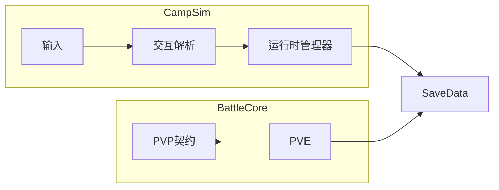

# 宠物 Demo 游戏 SPEC

## 1. 文档信息

- 文档名称：宠物 Demo 游戏 SPEC
- 工程目录：`Pet Demo`
- 文档目标：定义营地循环、资源交互、战斗系统与存档契约
- 事实基线：以当前代码实现为准，文档用于约束后续开发
- 编码要求：UTF-8 无 BOM，禁止 ANSI 写入

## 2. 系统总览

### 2.1 模块边界

- CampSim：输入、交互、建造、生产、采集、迷雾与升级
- BattleCore：回合状态机、行动结算、胜负判定
- SaveModel：统一存档模型，承载所有运行时真值
- Presentation：角色表现、攻击演出、摄像机与界面显示

### 2.2 架构关系



### 2.3 设计原则

- 交互层只做路由，不直接持久化
- 管理器维护状态真值，场景组件负责桥接
- 战斗核心无 Unity 依赖，便于测试和复用
- 存档为唯一真源，运行时缓存必须可重建

## 3. 输入与角色控制

### 3.1 系统设计说明

- 输入源实现 `ICampInputSource`，由 `CampInputController` 按优先级聚合
- 角色移动由 `HeroMotor` 消费统一意图
- 动静切换由 `MoveIdleDetector` 稳定判定
- 朝向离散由 `EightWayPresentation` 输出

### 3.2 数据结构定义

```text
HeroMoveIntent
  - intent: Vector2
  - intentActive: bool

HeroMotorRuntime
  - velocity: Vector2
  - lastNonZeroIntent: Vector2

MoveIdleState
  - intentDeadZone: float
  - stableVelocityThreshold: float
  - stableMilliseconds: int
```

### 3.3 接口与 API

- `CampInputController.RegisterSource(source)`
- `CampInputController.UnregisterSource(source)`
- `CampInputController.CurrentIntent`
- `HeroController.EnableControl(enabled)`
- `MoveIdleDetector.OnMoveIdleChanged`

### 3.4 实现优先级

- P0：输入聚合稳定与控制开关正确
- P1：多输入源并存仲裁
- P2：扩展手柄或触屏策略

### 3.5 技术实现建议

- 输入层仅输出意图，不混入业务状态
- 位移逻辑保持在 `FixedUpdate`
- 静止定义在输入、动画、交互三层保持一致

## 4. 交互系统

### 4.1 系统设计说明

- 所有交互体继承 `Interactable`
- 解析器在角色稳定静止时计算焦点
- 焦点按优先级与距离唯一化
- 离开范围自动失焦并回退状态

### 4.2 数据结构定义

```text
Interactable
  - interactionRadius: float
  - interactionPriority: int
  - kind: InteractableKind

ResolverCommand
  - kind: ResolverCommandKind
  - targetId: string
```

### 4.3 接口与 API

- `CampInteractionResolver.ResolveFocus(heroPos)`
- `CampInteractionResolver.DispatchFocus(focus)`
- `CampInteractionResolver.BeginBuildFlow(site)`
- `CampInteractionResolver.BeginFarmFieldFlow(field)`
- `CampInteractionResolver.BeginGatherPointFlow(point)`

### 4.4 实现优先级

- P0：焦点决策稳定且可复现
- P1：失焦与重解析补偿
- P2：可配置优先级策略

### 4.5 技术实现建议

- 统一静止触发与离开取消规则
- 交互失败使用明确失败码
- 路由层与业务状态机保持解耦

## 5. 营地资源系统

### 5.1 FarmField 系统

#### 系统设计说明
- `FarmManager` 维护场景字段索引、运行时列表与掉落
- 农田状态机负责播种、成长、成熟循环
- 攻击成功驱动状态推进和产物结算

#### 数据结构定义
```text
FarmFieldRuntime
  - fieldId: string
  - cropId: string
  - state: enum
  - attackCount: int
  - growingPhaseIdx: int
  - growingTimer: float

WorldDropEntry
  - itemId: string
  - quantity: int
  - x: float
  - y: float
  - sourceId: string
```

#### 接口与 API
- `FarmManager.BindSaveData(save)`
- `FarmManager.RegisterSceneField(field)`
- `FarmManager.ApplyAttack(fieldId, carrier, bag)`
- `FarmManager.UnlockGroup(groupId)`

#### 实现优先级
- P0：绑定后重注册稳定
- P1：掉落重建一致
- P2：配置热更新容错

#### 技术实现建议
- 重注册期间禁止修改同一字典
- 场景注册与运行时注册语义分离

### 5.2 GatherPoint 系统

#### 系统设计说明
- `GatherManager` 与农田系统对称
- 状态机为可采集与冷却两态
- 冷却统一由 `CampSimClock` 推进

#### 数据结构定义
```text
GatherPointRuntime
  - pointId: string
  - gatherId: string
  - state: enum
  - attackCount: int
  - cooldownTimer: float
```

#### 接口与 API
- `GatherManager.BindSaveData(save)`
- `GatherManager.RegisterScenePoint(point)`
- `GatherManager.ApplyAttack(pointId, carrier, bag)`

#### 实现优先级
- P0：绑定与重注册稳定
- P1：冷却事件一致
- P2：采集权限扩展

#### 技术实现建议
- 重注册仅处理运行时映射
- 冷却推进逻辑与显示逻辑分离

### 5.3 FarmFieldGroup 与解锁战

#### 系统设计说明
- `FarmFieldGroupUnlockGuard` 作为交互入口
- `FarmUnlockBattleFlowController` 负责解锁演出流
- 胜利后写入组解锁 token 并持久化

#### 数据结构定义
```text
UnlockToken
  - farmGroup:<groupId>

BattleFlowState
  - None
  - Dialog
  - Battle
  - Result
```

#### 接口与 API
- `FarmFieldGroupUnlockGuard.TryBeginUnlockFlow()`
- `FarmFieldGroupUnlockGuard.HandleBattleResult(isWin)`
- `FarmUnlockBattleFlowController.TryOpenDialog(guard)`

#### 实现优先级
- P0：解锁与存档一致
- P1：战斗流程回退稳定
- P2：失败惩罚扩展

#### 技术实现建议
- 以 `SaveData.unlockedSystems` 为解锁真值
- 战斗 active 期间阻断重复触发

### 5.4 ShopFog 与营地升级

#### 系统设计说明
- 升级次数驱动迷雾清晰半径
- 存档字段控制迷雾中心锚点

#### 数据结构定义
```text
CampVisualState
  - campUpgradeCount: int
  - shopFogCenterAnchorId: string
```

#### 接口与 API
- `CampUpgradeFlow.TryCommitUpgrade()`
- `ShopFogOverlay.ApplyCampUpgradeLevel(level)`
- `FarmManager.TryGetShopFogCenter(out pos)`

#### 实现优先级
- P0：升级写档与视觉同帧生效
- P1：缺锚点降级策略
- P2：参数配置化

#### 技术实现建议
- 视觉层只读取存档事实，不反向写入

## 6. 战斗系统

### 6.1 BattleCore

#### 系统设计说明
- 回合状态机推进阶段转换
- 行动结算与终局判定在核心层完成

#### 数据结构定义
```text
BattleState
  - stageId: string
  - phase: enum
  - turnIndex: int
  - turnOrder: List<string>
  - activeUnitId: string
  - endResult: enum

CombatUnit
  - unitId: string
  - side: enum
  - hp: int
  - maxHp: int
  - atk: int
  - def: int
  - agi: int
```

#### 接口与 API
- `BattleCore.CreateBattle(playerParty, enemyParty, stageId, seed)`
- `BattleCore.ResolveAction(state, action)`
- `BattleCore.CheckBattleEnd(state)`
- `BattleStateMachine.Step(state, actionProvider)`

#### 实现优先级
- P0：回合闭环可执行
- P1：技能最小实现
- P2：回放与一致性校验

#### 技术实现建议
- 增加状态增量结构，便于重放和网络同步

### 6.2 PVE 场景适配

#### 系统设计说明
- `BattleSceneAdapter` 负责存档桥接和结果写回
- PVE 进度在胜利后更新到 `pveProgress`

#### 数据结构定义
```text
PveProgressEntry
  - chapterId: string
  - stageId: string
  - stars: int
```

#### 接口与 API
- `BattleSceneAdapter.BindSaveData(save)`
- `BattleSceneAdapter.StartBattle(stage)`
- `BattleSceneAdapter.StepOnce()`
- `BattleSceneAdapter.AutoResolve()`

#### 实现优先级
- P0：开战与写回稳定
- P1：失败策略明确

#### 技术实现建议
- 统一 `ResultCode` 处理失败分支

### 6.3 PVP 契约

#### 系统设计说明
- PVP 复用 BattleCore 规则
- 通过规则版本做兼容门控

#### 数据结构定义
```text
PvpRuleContract
  - ruleVersion: int
  - partySnapshot: BattleParty
```

#### 接口与 API
- `IPvpBattleClient.RuleVersion`
- `IPvpBattleClient.SubmitPartySnapshot(party)`
- `IPvpBattleClient.FetchRemoteAction(state)`

#### 实现优先级
- P0：版本不一致拦截
- P1：本地 mock 对战
- P2：真实网络会话

#### 技术实现建议
- 先 lockstep 原型，再落地网络层

## 7. 存档系统

### 7.1 系统设计说明

- `SaveData` 是顶层聚合模型
- Farm 与 Gather 共享世界掉落池
- 解锁 token 统一收敛到 `unlockedSystems`

### 7.2 数据结构定义

```text
SaveData
  - farmFields: List<FarmFieldRuntime>
  - gatherPoints: List<GatherPointRuntime>
  - worldDrops: List<WorldDropEntry>
  - inventory: ItemContainer
  - campStorage: ItemContainer
  - unlockedSystems: List<string>
  - campUpgradeCount: int
```

### 7.3 接口与 API

- `SaveIO.TryLoad(out save)`
- `SaveIO.TrySave(save)`
- `GameBootstrap.BindRuntimeSaveData()`

### 7.4 实现优先级

- P0：空字段补齐与容错加载
- P1：版本迁移策略
- P2：统一保存时机策略

### 7.5 技术实现建议

- 所有写入走流程层，不在显示层直接改档
- 绑定阶段输出关键数量诊断日志

## 8. 场景与运行约束

### 8.1 场景契约

- 关键锚点命名必须稳定
- 交互半径与可达性规则一致

### 8.2 Tick 约束

- 成长与冷却统一由 `CampSimClock` 推进
- 订阅与反订阅必须对称

### 8.3 回归要求

- 必测读档绑定、重注册、场景重激活
- 必测 Farm 与 Gather 集合重注册安全

## 9. 附录 A：编码治理规范

### 9.1 系统设计说明

- 修复流程采用稳定边界替换
- 禁止依赖乱码正文做锚点替换

### 9.2 数据结构定义

```text
EncodingHealthSnapshot
  - filePath: string
  - length: int
  - cjkCount: int
  - questionMarkCount: int
  - utf8Bom: bool

SectionReplacePlan
  - beginMarker: string
  - endMarker: string
  - replacementPath: string
```

### 9.3 接口与 API

- `Get-TextHealth(text, bytes)`
- `Replace-BoundedSection(content, beginMarker, endMarker, replacement)`

### 9.4 实现优先级

- P0：边界替换取代损坏锚点
- P1：写入前后污染检测
- P2：扩展多段修复模板

### 9.5 技术实现建议

- 全流程 UTF-8 无 BOM
- 写入前保留备份
- 检测失败直接中止，避免二次污染

## 10. 附录 B：热修记录

### B.1 编译可见性热修

- 范围：跨模块引用 `GatherManager` 可见性修复
- 结论：保持业务不变，仅修复命名空间可见性

### B.2 编辑器布局自愈热修

- 范围：`UnityEditor.Graphs.Edge.WakeUp` 空引用
- 结论：按布局损坏处理，执行一次性恢复

### B.3 Farm 重注册稳定性热修

- 范围：`ReRegisterSceneFieldsToCurrentRuntimeList`
- 结论：禁止遍历期间修改同一字典

### B.4 Gather 重注册稳定性热修

- 范围：`ReRegisterScenePointsToCurrentRuntimeList`
- 结论：运行时重注册与场景注册分层

### B.5 战斗演出与血条热修

- 范围：Spine 攻击轨道与脚底血条锚点
- 结论：统一轨道约定，固定锚点防抖动

### B.6 自动入库体验热修

- 范围：仓库存取范围触发自动入库
- 结论：英雄与宠物均支持自动提交和飞入表现

## 11. 重写说明

- 本版为全量重写版，目标是彻底消除中文不可读问题。
- 文档采用统一章节模板，覆盖设计、数据、接口、优先级和建议。
- 后续任何设计变更必须先更新本 SPEC 再改代码。