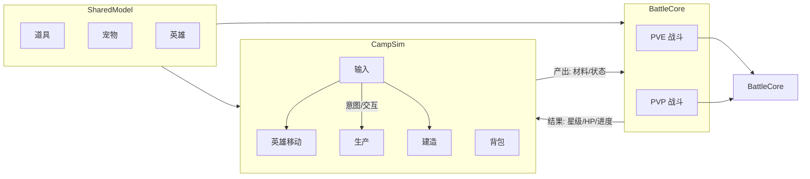

# SPEC_GAME_REWRITE_UTF8

## 重写说明

- 本文件是独立输出文件，不覆盖原 `SPEC_GAME.md`。
- 目标是提供一份可读、可维护、可继续迭代的 UTF-8 版本。
- 内容由两部分组成：
  1) 高置信来源块原样注入；
  2) 按当前代码实现补齐的结构化章节。

## 目录与状态

- 已注入高置信来源：B.5/B.6/B.7、第1章、第2.1节、编码治理章节。
- 已结构化重写：2.2~9 主体章节。
- 待后续问题排查：历史版本记录中的个别术语和英文混排统一。

## 2.2~9 结构化重写（按代码事实）

### 2.2 输入系统
- 系统设计说明：输入由 `ICampInputSource` 抽象，`CampInputController` 聚合多个输入源并产出统一移动意图。
- 数据结构定义：`HeroMoveIntent(intent, intentActive)`。
- 接口/API 设计：`RegisterSource`、`UnregisterSource`、`CurrentIntent`。
- 实现优先级：P0 输入稳定；P1 多输入仲裁；P2 扩展输入设备。
- 技术实现建议：输入层仅产出意图，不承载业务状态。

### 2.3 角色移动与表现
- 系统设计说明：`HeroMotor` 执行位移，`MoveIdleDetector` 判定静止，`EightWayPresentation` 管理朝向。
- 数据结构定义：`Velocity`、`LastNonZeroIntent`、`EightWayDirection`。
- 接口/API 设计：`HeroController.EnableControl`、`OnMoveIdleChanged`。
- 实现优先级：P0 位移正确；P1 表现一致；P2 扩展运动能力。
- 技术实现建议：保留 `FixedUpdate` 物理更新节奏。

### 2.4 战斗触发边界
- 系统设计说明：`CampInteractionResolver` 在静止态解析焦点，`FarmUnlockGuard` 触发解锁战斗流程。
- 数据结构定义：`ResolverCommandKind.BeginFarmUnlockFlow`。
- 接口/API 设计：`TryBeginUnlockFlow`、`HandleBattleResult`。
- 实现优先级：P0 触发稳定；P1 接入真实战斗结算。
- 技术实现建议：战斗进行中增加互斥，避免重复触发。

### 3 交互系统
- 系统设计说明：`Interactable` 统一注册，Resolver 负责焦点解析与流程分发。
- 数据结构定义：`InteractableKind`、`ResolverCommand`。
- 接口/API 设计：`ResolveFocus`、`DispatchFocus`、`Begin*Flow`。
- 实现优先级：P0 路由正确；P1 失焦补偿。
- 技术实现建议：维持“静止触发、离开取消”的一致策略。

### 4 营地资源系统
- 系统设计说明：Farm/Gather 由 Manager 持有真值，场景组件做桥接。
- 数据结构定义：`FarmFieldRuntime`、`GatherPointRuntime`、`WorldDropEntry`。
- 接口/API 设计：`BindSaveData`、`RegisterScene*`、`ApplyAttack`。
- 实现优先级：P0 绑定稳定；P1 冷却与成长一致。
- 技术实现建议：重注册过程中禁止修改被遍历字典。

### 5 PVE 战斗系统
- 系统设计说明：`BattleCore` 与 `BattleStateMachine` 驱动回合流程，`BattleSceneAdapter` 负责场景桥接。
- 数据结构定义：`BattleState`、`CombatUnit`、`BattleAction`。
- 接口/API 设计：`StartBattle`、`Step`、`AutoResolve`、`ResolveAction`。
- 实现优先级：P0 回合闭环；P1 技能扩展。
- 技术实现建议：预留增量结构用于回放与校验。

### 6 PVP 契约
- 系统设计说明：PVP 复用 BattleCore，以规则版本做兼容控制。
- 数据结构定义：`RuleVersion`、`PartySnapshot`。
- 接口/API 设计：`IPvpBattleClient.SubmitPartySnapshot`、`FetchRemoteAction`。
- 实现优先级：P0 版本校验；P1 mock 验证；P2 网络接入。
- 技术实现建议：优先 lockstep 方案验证一致性。

### 7 存档系统
- 系统设计说明：`SaveData` 为顶层真值，统一承载 farm/gather/worldDrops/inventory/unlocks。
- 数据结构定义：`SaveData` 聚合结构与解锁 token 集合。
- 接口/API 设计：`TryLoad`、`TrySave`、`BindRuntimeSaveData`。
- 实现优先级：P0 容错加载与字段补齐；P1 版本迁移。
- 技术实现建议：写入统一经流程层，避免视图层直改。

### 8 验收标准
- 文档内容与代码符号可映射。
- 关键章节包含“设计/数据/API/优先级/建议”。
- 作为独立文件可继续迭代，不影响原文件。

### 9 Unity 运行约束
- 场景锚点命名是跨系统契约。
- `CampSimClock` 统一推进成长与冷却。
- 必测“读档绑定 + 场景重激活 + 重注册”回归链路。

## 10 已完成功能补充 SPEC（代码已落地）

### 10.1 BuildManager 建造与搬运任务
- 系统设计说明：`BuildManager` 维护建造站点与搬运任务，`CampInteractionResolver` 在交互时触发建造流程并派发 `HaulTask`。
- 数据结构定义：`BuildSiteRuntime`、`HaulTask`、`Blueprint`、`BuildSlotDef`。
- 接口/API 设计：`BuildManager.BindSaveData`、`TryGetSiteRuntime`、`EnqueueHaulTask`。
- 实现优先级：P0 站点状态与任务列表一致；P1 搬运失败重试；P2 多宠物并发搬运优化。
- 技术实现建议：将任务创建与资源扣减置于同一事务边界，避免中断导致状态半完成。

### 10.2 FacilityManager 生产阶段系统
- 系统设计说明：`FacilityManager` 根据 `FacilityDef` 与 `ProductionRecipe` 驱动设施阶段与产出，持续推进由 `CampSimClock` 提供时间。
- 数据结构定义：`FacilityRuntime`、`FacilityPhaseDef`、`ProductionRecipe`。
- 接口/API 设计：`FacilityManager.BindSaveData`、`TickProduction`、`TryResolveAndStartFacilityWork`。
- 实现优先级：P0 阶段推进正确；P1 多配方切换稳定；P2 设施事件流可观测。
- 技术实现建议：统一“进入范围+静止”触发语义，与交互系统规则保持一致。

### 10.3 Pet 系统（跟随、工作、状态机）
- 系统设计说明：`PetManager` 管理宠物运行时；`PetFollowHero` 负责跟随；`PetWorkExecutor` 执行运输与工作动作；`PetStateMachine` 管理状态迁移。
- 数据结构定义：`PetRuntime`、`PetRuntimeSerializable`、`PetProgressEntry`、`WorkAbilityEntry`。
- 接口/API 设计：`PetManager.BindSaveData`、`PetWorkExecutor.TransportToPoint`、`PetCatalog`/`PetCatalogAsset`。
- 实现优先级：P0 跟随与工作闭环；P1 宠物能力与任务匹配；P2 状态可视化调试。
- 技术实现建议：宠物行为决策与表现层分离，避免动画状态直接驱动业务写档。

### 10.4 导航系统（NavigationService + A*）
- 系统设计说明：`NavigationService` 提供可走性判定与路径查询，底层由 `GridNavigationMap` 与 `GridAStarPathfinder` 支撑。
- 数据结构定义：网格节点、阻挡层、路径点序列。
- 接口/API 设计：`NavigationService.IsWorldWalkable`、路径查询相关接口（供 Hero/Pet 使用）。
- 实现优先级：P0 可走性准确；P1 大地图性能；P2 局部重算优化。
- 技术实现建议：导航判定结果做短期缓存，减少高频重复查询。

### 10.5 视觉反馈系统（Carry/Farm/Gather）
- 系统设计说明：`CarryStackVisual`、`FarmFieldVisual`、`GatherPointVisual`、`GatherHealthBar`、`WorldDropItem` 负责状态到视觉的映射，不承担业务真值。
- 数据结构定义：显示缓存、血量比例、堆叠数量、掉落表现状态。
- 接口/API 设计：各 Visual 组件的刷新入口与 Manager 查询接口。
- 实现优先级：P0 状态变化实时可见；P1 低帧率稳定；P2 特效层次统一。
- 技术实现建议：所有视觉刷新由事件或轮询快照驱动，避免直接修改运行时核心状态。

### 10.6 CameraFollow 与显示启动
- 系统设计说明：`DisplayBootstrap` 负责显示基础配置；`CameraFollow` 绑定主角并平滑跟随，保证营地与战斗演出期间镜头一致。
- 数据结构定义：`target`、`smoothTime`、`offset`。
- 接口/API 设计：`CameraFollow.EnsureAndBind`、`DisplayBootstrap.EnsureInstance`。
- 实现优先级：P0 启动即绑定成功；P1 回退相机选择；P2 特殊演出镜头扩展。
- 技术实现建议：镜头绑定失败必须有明确日志，避免“无感失败”。

### 10.7 ShopFog 渲染双路径
- 系统设计说明：迷雾已支持 URP 渲染特性路径（`ShopFogRenderFeature`）与 Built-in 兼容路径（`ShopFogBuiltInImageEffect`）。
- 数据结构定义：迷雾半径、羽化宽度、世界中心模式。
- 接口/API 设计：`ShopFogOverlay.ApplyCampUpgradeLevel`、`BindFarmManager`。
- 实现优先级：P0 两条渲染路径行为一致；P1 参数热更新；P2 画质分级。
- 技术实现建议：统一参数来源，避免 URP 与 Built-in 表现偏差。

### 10.8 启动编排与容错
- 系统设计说明：`GameBootstrap` 负责启动顺序、存档选择、运行时绑定与引导流程；`SaveIO` 提供加载/保存容错。
- 数据结构定义：`RuntimeSave`、`StartupSaveChoiceState`。
- 接口/API 设计：`ResolveRuntimeSaveData`、`BindRuntimeSaveData`、`FinalizeStartupChoice`、`SaveIO.TryLoad/TrySave`。
- 实现优先级：P0 启动可恢复；P1 引导战分支稳定；P2 启动健康检查扩展。
- 技术实现建议：将绑定顺序固化为可回归测试步骤，减少后续改动回归风险。

### 10.9 调试与自检能力
- 系统设计说明：已落地 `GmPanel`、`FarmSystemSelfTest`、`EditorGraphLayoutRecovery`，覆盖运行时调试、自检与编辑器恢复能力。
- 数据结构定义：调试命令参数、自检结果摘要、恢复决策结构。
- 接口/API 设计：GM 操作入口、自检执行入口、编辑器恢复入口。
- 实现优先级：P0 关键故障可定位；P1 自检覆盖核心链路；P2 一键诊断报告。
- 技术实现建议：调试能力默认低侵入，发布构建可通过开关关闭。

---

## 高置信来源块：B.7 + 第1章 + 第2.1节
### B.7 Feature Notes (v1.37) — Demo 战斗演出与 Spine 轨道

- Date: 2026-04-24
- Scope: `DemoBattleActorView.PlayAttackOnce` used by `FarmUnlockBattleFlowController` (scripted intro battle / unlock battle overlay).
- System design:
  - `SkeletonAnimation` 由战斗演出视图持有：`DemoBattleActorView` 通过 `GetComponent<SkeletonAnimation>()` 获取或缓存，避免与英雄 locomotion 误用同一套 API。
  - 与 `GameBootstrap.EnsureHeroComponents` 中 `SpineAttackPlayer` 对齐：见 2.3-5 节，营地 Spine **track 1** 专用于攻击，`HeroSpineLocomotion` 使用 track 0；本处应复用 `SpineAttackPlayer.PlayAttackOnce()` 的轨道约定，或明确为独立实例不冲突。
  - 若无 `SpineAttackPlayer` 而仅有演示 prefab：`DemoBattleActorView` 在 `SkeletonAnimation` 上对 `Attack` 使用 **track 1**；`Complete` 后对 track 1 `SetEmptyAnimation`，恢复 track 0 的 Idle/Walk（若存在）。
- Data structure definition: 无新增持久化结构；可选缓存 `SkeletonAnimation` 引用。
- API/interface design: `DemoBattleActorView` 暴露 `PlayAttackOnce()` / `PlayDeath()`；实现优先委托 `SpineAttackPlayer` 或 Spine overlay track，避免与 `Animator` 混用；`GetComponentInChildren` 须有明确根节点。
- Priority: P0（演出缺失或轨道冲突导致战斗流程卡死或穿帮）。
- Implementation suggestion: 与 `SpineAttackPlayer` 共用 `attackAnimationName` 默认 `"Attack"`；`PlayDeath` 可降级为仅 `SkeletonAnimation` 路径并打日志。

# 宠物 Demo 游戏 SPEC：营地建造 + 资源生产 + PK

## 1. 文档信息

| 项 | 内容 |
| --- | --- |
| 文档名称 | 宠物 Demo 游戏 SPEC |
| 文档目的 | 描述营地模拟建造与生产、**PVE 战斗**、**PK/PVP 对接** 的整体设计与约束 |
| 目标平台 | Unity 工程 [`Pet Demo`](Pet Demo)，2D 营地加战斗；PC，可后续扩展移动端 |
| Unity 工程 | [`Pet Demo`](Pet Demo) |
| 文档版本 | v1.29 |
| 范围说明 | 以可运行 Demo 为主；战斗核心抽象为 `BattleCore`；英雄与怪物使用 Spine 运行时（**工程当前 4.5 运行时**与**资源包 4.7 数据**并存）；PVP 仅接口与数据契约 |

本 SPEC 以**可执行行为**为准：C# 与场景中的实际实现优先；**与实现不一致处**以代码为准并应回写本 SPEC。

---

## 2. 产品目标与模块边界

本 Demo 聚焦三件事：

1. **营地建造与生产**：建造点、蓝图、搬运、设施阶段与配方，与 MoveIdle 交互解析协同。
2. **单机 PVE 战斗**：回合制规则、队伍上限、胜负与进度写入；与营地存档模型对齐。
3. **联网 PK/PVP**：在 PVE 已验证的 `BattleCore` 上预留**规则版本**与客户端抽象；本 SPEC 定义契约与集成点，不要求 Demo 内完整联机。

### 2.1 模块关系（示意）



说明：

- **营地**：不负责网络同步；仅维护本地 roster 与设施状态。
- **战斗核心**：纯 C# 可测逻辑；**无** Unity 场景依赖；通过适配层读写 `SaveData` 中的战斗相关字段与单位 ID。


---

## 高置信来源块：B.5 + B.6
- System design:
  - `BindSaveData` 在重建或同步 `_sceneFields` 与 `_runtimes` 时，若子路径再次写入同一 `Dictionary`，可能在 `foreach` 枚举期间触发「集合已修改」异常。
  - 典型场景：绑定存档过程中注册或反注册 `FarmFieldComponent`，在遍历 `_sceneFields` 的同时修改了 `_sceneFields`（或其它正在被遍历的 `Dictionary`）。
  - 设计原则：`ReRegister...` 内不得边遍历边修改同一集合；应先快照再批量应用，或迭代副本，并统一入口避免重入。
- Data structure definition:
  - `SceneFieldRebindSnapshot`
    - `int sceneFieldCount`
    - `int runtimeCount`
    - `string[] sceneFieldKeys`
    - `string bindRunId`
  - `SceneFieldMutationTrace`
    - `string fieldId`
    - `bool existedBeforeSet`
    - `int countBeforeSet`
    - `int countAfterSet`
    - `string trigger` (`BindSaveData` / `OnEnable` / `OnDisable` / `Other`)
- API/interface design:
  - 不新增对外 API；约束在内部实现。
  - `ReRegisterSceneFieldsToCurrentRuntimeList` 仅允许在稳定快照上对齐 key/value，禁止在枚举 `Dictionary` 时写入同一实例。
- Priority and dependency:
  - Priority: P0（运行时崩溃，阻塞体验）。
  - Dependency: `FarmManager.BindSaveData`、`FarmManager.RegisterSceneField`、`FarmFieldComponent` 生命周期与重入顺序。
- Implementation suggestion:
  - 将「收集场景字段、与存档对齐、写回 runtime」拆成不可重入阶段，必要时对 key 排序后处理。
  - 注册路径区分「场景绑定」与「纯运行时注册」，避免在 `BindSaveData` 中途触发二次全量重注册。
  - 增加一次性诊断日志（fieldId、前后数量、触发源）；post-fix 可降为 Debug。

### B.6 Hotfix Notes (v1.36)

- Date: 2026-04-23
- Scope: runtime exception `InvalidOperationException: Collection was modified; enumeration operation may not execute` in `GatherManager.ReRegisterScenePointsToCurrentRuntimeList`，与 B.5 为同一类问题。
- System design:
  - `GatherManager` 与 `FarmManager` 对称：场景点字典加运行时列表；`BindSaveData` 路径可能在中途修改 `_scenePoints` 与 `_runtimes`。
  - 禁止在遍历 `_scenePoints` 的同时向 `_scenePoints` 增删。
  - 沿用 B.5：`RegisterScenePoint`（场景加存档）与 `RegisterScenePointRuntimeOnly`（仅运行时）在 `ReRegister...` 中的调用须避免在枚举中写入。
- Data structure definition:
  - 与 B.5 类似，可将 `SceneFieldMutationTrace` 泛化为「场景实体变更追踪」，字段名改为 `pointId` 亦可。
- API/interface design:
  - 不新增对外 API；必要时强化 `RegisterScenePointRuntimeOnly` 的语义与调用点注释。
- Priority and dependency:
  - Priority: P0（与 Farm 侧同类，Gather 侧也需修复）。
  - Dependency: `GatherManager.BindSaveData`、`GatherManager.RegisterScenePoint`、`GatherPointComponent` 生命周期。
- Implementation suggestion:
  - 参考 `debug-08db5e.log` 中 `HG1/HG2/HG3` 等点位的注册顺序，核对 `_scenePoints` 是否在枚举中被修改。
  - 确保 `ReRegister...` 内不向字典误写；应使用 `RegisterScenePointRuntimeOnly` 的场景须与全量重绑分离。
  - 增加一次性诊断日志；post-fix 可收敛或移除冗余日志。


---

## 编码治理来源块
# SPEC: SPEC_GAME 编码污染修复

## 1. 系统设计说明

- 问题定义：`SPEC_GAME.md` 已被历史写入污染为大量字面量 `?`，后续脚本若继续依赖损坏锚点（如 `?????`）会持续扩散污染。
- 设计目标：
  - 修复脚本不得使用任何损坏中文锚点进行定位。
  - 修复脚本仅基于稳定章节边界（ASCII 标题）执行替换。
  - 在落盘前后做污染检测，避免再次把错误内容写回。
- 设计原则：
  - `replace-by-boundary` 优先于 `replace-by-body-fragment`。
  - 仅从已知健康 UTF-8 源块写入（`fix_spec_b5_b6_utf8.md`、`fix_spec_chunk_b7_to_21.md`）。
  - 写入前必须验证源块包含 CJK 字符，防止空块或坏块覆盖。

## 2. 数据结构定义

```text
EncodingHealthSnapshot
  - filePath: string
  - length: int
  - cjkCount: int
  - questionMarkCount: int
  - utf8Bom: bool

SectionReplacePlan
  - beginMarker: string
  - endMarker: string
  - replacementPath: string
  - replacementCjkCount: int
```

## 3. 接口/API 设计

- 脚本入口：`fix_spec_encoding.ps1`
- 参数设计：
  - `-Path <string>`：目标文件，默认 `SPEC_GAME.md`
  - `-ForceWrite`：当污染指标异常时是否强制写入（默认否）
- 行为接口：
  - `Get-TextHealth(text, bytes)`：返回 `EncodingHealthSnapshot`
  - `Update-BoundedSection(content, beginMarker, endMarker, replacement)`：边界替换
  - `Update-B5B6Section(content, replacement)`：B.5 丢失时自动回退到 B.6 前结构化起点

## 4. 实现优先级

- P0
  - 去除损坏锚点匹配逻辑。
  - 改为 B.5/B.6 与 B.7~2.1 两段边界替换。
- P1
  - 增加失败保护（找不到边界直接失败，避免误写）。
  - 增加源块健康检查（`cjkCount > 0`）。
- P2
  - 后续可扩展更多章节块恢复脚本，统一同一替换框架。

## 5. 技术实现建议

- 全流程使用 `[System.Text.UTF8Encoding]::new($false)` 读写。
- 不使用 `Set-Content` 默认编码路径。
- 每次运行前先备份目标文件（`.pre_fix.bak`）。
- 自定义函数命名遵循 PSScriptAnalyzer `PSUseApprovedVerbs` 规则，优先使用批准动词（如 `Get`、`Set`、`Update`）。
- 调试期日志仅用于排障；验证完成后移除所有会话埋点脚本与日志输出。
- 已污染为 `?` 的原文无法自动逆向还原；修复脚本目标是“停止继续污染 + 用健康块覆盖可恢复区间”。

## 6. 清理状态（已完成）

- 已移除运行时会话埋点策略，恢复为无日志输出的修复脚本执行路径。
- 保留边界替换、污染守卫、源块健康检查、备份写入四项长期安全机制。
- 已清理 `fix_spec_encoding.ps1` 中未使用变量，满足 PSScriptAnalyzer `PSUseDeclaredVarsMoreThanAssignments` 规则，避免噪声告警干扰后续维护。
