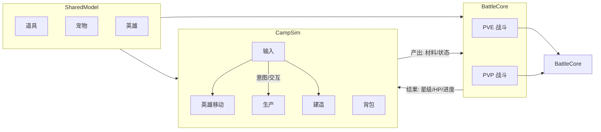

# SPEC_GAME_REWRITE_UTF8

## 重写说明

- 本文件是独立输出文件，不覆盖原 `SPEC_GAME.md`。
- 目标是提供一份可读、可维护、可继续迭代的 UTF-8 版本。
- 内容由两部分组成：
  1) 高置信来源块原样注入；
  2) 按当前代码实现补齐的结构化章节。

## 目录与状态

- 已注入高置信来源：B.5/B.6/B.7、第1章、第2.1节、编码治理章节。
- 已结构化重写：2.2~9 主体章节。
- 待后续问题排查：历史版本记录中的个别术语和英文混排统一。

# 宠物 Demo 游戏 SPEC（重写版）
## 1. 文档信息
- 文档名称：宠物 Demo 游戏 SPEC
- 工程路径：`Pet Demo`
- 目标平台：Unity 2D（PC 优先，预留移动端输入）
- 当前目标：营地循环、PVE 回合战斗、PVP 接口预留
- 文档基准：以当前代码实现为准，文档与代码不一致时先修正文档

## 2.2~9 结构化重写（按代码事实）

### 2.2 输入系统
- 系统设计说明：输入由 `ICampInputSource` 抽象，`CampInputController` 聚合多个输入源并产出统一移动意图。
- 数据结构定义：`HeroMoveIntent(intent, intentActive)`。
- 接口/API 设计：`RegisterSource`、`UnregisterSource`、`CurrentIntent`。
- 实现优先级：P0 输入稳定；P1 多输入仲裁；P2 扩展输入设备。
- 技术实现建议：输入层仅产出意图，不承载业务状态。

### 2.3 角色移动与表现
- 系统设计说明：`HeroMotor` 执行位移，`MoveIdleDetector` 判定静止，`EightWayPresentation` 管理朝向。
- 数据结构定义：`Velocity`、`LastNonZeroIntent`、`EightWayDirection`。
- 接口/API 设计：`HeroController.EnableControl`、`OnMoveIdleChanged`。
- 实现优先级：P0 位移正确；P1 表现一致；P2 扩展运动能力。
- 技术实现建议：保留 `FixedUpdate` 物理更新节奏。

### 2.4 战斗触发边界
- 系统设计说明：`CampInteractionResolver` 在静止态解析焦点，`FarmUnlockGuard` 触发解锁战斗流程。
- 数据结构定义：`ResolverCommandKind.BeginFarmUnlockFlow`。
- 接口/API 设计：`TryBeginUnlockFlow`、`HandleBattleResult`。
- 实现优先级：P0 触发稳定；P1 接入真实战斗结算。
- 技术实现建议：战斗进行中增加互斥，避免重复触发。

### 3 交互系统
- 系统设计说明：`Interactable` 统一注册，Resolver 负责焦点解析与流程分发。
- 数据结构定义：`InteractableKind`、`ResolverCommand`。
- 接口/API 设计：`ResolveFocus`、`DispatchFocus`、`Begin*Flow`。
- 实现优先级：P0 路由正确；P1 失焦补偿。
- 技术实现建议：维持“静止触发、离开取消”的一致策略。

### 4 营地资源系统
- 系统设计说明：Farm/Gather 由 Manager 持有真值，场景组件做桥接。
- 数据结构定义：`FarmFieldRuntime`、`GatherPointRuntime`、`WorldDropEntry`。
- 接口/API 设计：`BindSaveData`、`RegisterScene*`、`ApplyAttack`。
- 实现优先级：P0 绑定稳定；P1 冷却与成长一致。
- 技术实现建议：重注册过程中禁止修改被遍历字典。

### 5 PVE 战斗系统
- 系统设计说明：`BattleCore` 与 `BattleStateMachine` 驱动回合流程，`BattleSceneAdapter` 负责场景桥接。
- 数据结构定义：`BattleState`、`CombatUnit`、`BattleAction`。
- 接口/API 设计：`StartBattle`、`Step`、`AutoResolve`、`ResolveAction`。
- 实现优先级：P0 回合闭环；P1 技能扩展。
- 技术实现建议：预留增量结构用于回放与校验。

### 6 PVP 契约
- 系统设计说明：PVP 复用 BattleCore，以规则版本做兼容控制。
- 数据结构定义：`RuleVersion`、`PartySnapshot`。
- 接口/API 设计：`IPvpBattleClient.SubmitPartySnapshot`、`FetchRemoteAction`。
- 实现优先级：P0 版本校验；P1 mock 验证；P2 网络接入。
- 技术实现建议：优先 lockstep 方案验证一致性。

### 7 存档系统
- 系统设计说明：`SaveData` 为顶层真值，统一承载 farm/gather/worldDrops/inventory/unlocks。
- 数据结构定义：`SaveData` 聚合结构与解锁 token 集合。
- 接口/API 设计：`TryLoad`、`TrySave`、`BindRuntimeSaveData`。
- 实现优先级：P0 容错加载与字段补齐；P1 版本迁移。
- 技术实现建议：写入统一经流程层，避免视图层直改。

### 8 验收标准
- 文档内容与代码符号可映射。
- 关键章节包含“设计/数据/API/优先级/建议”。
- 作为独立文件可继续迭代，不影响原文件。

### 9 Unity 运行约束
- 场景锚点命名是跨系统契约。
- `CampSimClock` 统一推进成长与冷却。
- 必测“读档绑定 + 场景重激活 + 重注册”回归链路。

## 10 已完成功能补充 SPEC（代码已落地）

### 10.1 BuildManager 建造与搬运任务
- 系统设计说明：`BuildManager` 维护建造站点与搬运任务，`CampInteractionResolver` 在交互时触发建造流程并派发 `HaulTask`。
- 数据结构定义：`BuildSiteRuntime`、`HaulTask`、`Blueprint`、`BuildSlotDef`。
- 接口/API 设计：`BuildManager.BindSaveData`、`TryGetSiteRuntime`、`EnqueueHaulTask`。
- 实现优先级：P0 站点状态与任务列表一致；P1 搬运失败重试；P2 多宠物并发搬运优化。
- 技术实现建议：将任务创建与资源扣减置于同一事务边界，避免中断导致状态半完成。

### 10.2 FacilityManager 生产阶段系统
- 系统设计说明：`FacilityManager` 根据 `FacilityDef` 与 `ProductionRecipe` 驱动设施阶段与产出，持续推进由 `CampSimClock` 提供时间。
- 数据结构定义：`FacilityRuntime`、`FacilityPhaseDef`、`ProductionRecipe`。
- 接口/API 设计：`FacilityManager.BindSaveData`、`TickProduction`、`TryResolveAndStartFacilityWork`。
- 实现优先级：P0 阶段推进正确；P1 多配方切换稳定；P2 设施事件流可观测。
- 技术实现建议：统一“进入范围+静止”触发语义，与交互系统规则保持一致。

### 10.3 Pet 系统（跟随、工作、状态机）
- 系统设计说明：`PetManager` 管理宠物运行时；`PetFollowHero` 负责跟随；`PetWorkExecutor` 执行运输与工作动作；`PetStateMachine` 管理状态迁移。
- 数据结构定义：`PetRuntime`、`PetRuntimeSerializable`、`PetProgressEntry`、`WorkAbilityEntry`。
- 接口/API 设计：`PetManager.BindSaveData`、`PetWorkExecutor.TransportToPoint`、`PetCatalog`/`PetCatalogAsset`。
- 实现优先级：P0 跟随与工作闭环；P1 宠物能力与任务匹配；P2 状态可视化调试。
- 技术实现建议：宠物行为决策与表现层分离，避免动画状态直接驱动业务写档。
- 喂养工作门禁（P0）：宠物进入 `Work` 必须先完成喂养动作；喂养条件为“主角在宠物交互半径内 + 主角背包 `berry >= 1` + 宠物当前非 `Work`”。
- 喂养按钮样式（P1）：宠物头顶“喂养”按钮文字字号固定为 `45`，确保远景下可读性。
- 工作时长规则（P0）：每次喂养成功后设置 `WorkingDurationSec = 180`，倒计时结束后强制回到 `Free`。
- 自由巡游规则（P0）：宠物处于非工作状态时进入自由巡游，移动速度系数固定 `0.5`，仅可在“可走且无迷雾”区域随机取点巡游。
- 非持久化约束（P0）：`workRemainingSec` 与自由巡游目标点均为运行时态，不写入存档；重进场景后宠物默认 `Free`。
- 数据结构补充（P0）：
  - `PetWorkRuntime { state: PetState, workRemainingSec: float, lastFeedTimeSec: float }`
  - `PetFreeWanderRuntime { currentTarget: Vector3, repathCooldownSec: float }`
- 接口/API 补充（P0）：
  - `PetManager.TryFeedPet(petId, playerInventory)`：尝试消耗 `berry x1` 并开启 180 秒工作态。
  - `PetManager.TickPetWork(dt)`：推进工作倒计时并在到时回退 `Free`。
  - `PetFollowHero.TryPickFreeWanderTarget(nonFogWalkableArea)`：自由态随机目标点选择。
- 工作态可观测性约束（P0，调试基线）：
  - 喂养成功后必须可观测到 `State=Work` 且 `workRemainingSec>0` 的同帧成立。
  - 喂养触发 `Work` 时必须同步初始化 `LastWorkType`（来源：上次有效工作类型或当前能力表兜底选择），禁止出现 `State=Work` 且 `LastWorkType=""` 的阻塞态。
  - 工作初始化必须可观测到 `LastWorkType in {Farming,Gathering}` 或明确记录“无能力可分配”原因。
  - `PetWorkExecutor.Update` 在 `State=Work` 时必须输出一次执行分支判定（Farming/Gathering/Transport/Blocked），用于判定“原地不动”是否因目标绑定失败、管理器缺失或工作类型缺失导致。
  - 调试日志采用 NDJSON，字段最少包含：`sessionId/runId/hypothesisId/location/message/data/timestamp`。

### 10.4 导航系统（NavigationService + A*）
- 系统设计说明：`NavigationService` 提供可走性判定与路径查询，底层由 `GridNavigationMap` 与 `GridAStarPathfinder` 支撑。
- 数据结构定义：网格节点、阻挡层、路径点序列。
- 接口/API 设计：`NavigationService.IsWorldWalkable`、路径查询相关接口（供 Hero/Pet 使用）。
- 实现优先级：P0 可走性准确；P1 大地图性能；P2 局部重算优化。
- 技术实现建议：导航判定结果做短期缓存，减少高频重复查询。

### 10.5 视觉反馈系统（Carry/Farm/Gather）
- 系统设计说明：`CarryStackVisual`、`FarmFieldVisual`、`GatherPointVisual`、`GatherHealthBar`、`WorldDropItem` 负责状态到视觉的映射，不承担业务真值。
- 数据结构定义：显示缓存、血量比例、堆叠数量、掉落表现状态。
- 接口/API 设计：各 Visual 组件的刷新入口与 Manager 查询接口。
- 实现优先级：P0 状态变化实时可见；P1 低帧率稳定；P2 特效层次统一。
- 技术实现建议：所有视觉刷新由事件或轮询快照驱动，避免直接修改运行时核心状态。
- Carry 锚点布局基线（P0）：`HeroRoot/CarryAnchor` 的默认本地坐标基线为 `localPosition=(0, 7.35, 0)`；后续若调整携带堆叠高度或朝向镜像逻辑，必须先更新本条规格再改实现。

### 10.6 CameraFollow 与显示启动
- 系统设计说明：`DisplayBootstrap` 负责显示基础配置；`CameraFollow` 绑定主角并平滑跟随，保证营地与战斗演出期间镜头一致。
- 数据结构定义：`target`、`smoothTime`、`offset`。
- 接口/API 设计：`CameraFollow.EnsureAndBind`、`DisplayBootstrap.EnsureInstance`。
- 实现优先级：P0 启动即绑定成功；P1 回退相机选择；P2 特殊演出镜头扩展。
- 技术实现建议：镜头绑定失败必须有明确日志，避免“无感失败”。

### 10.7 ShopFog 渲染双路径
- 系统设计说明：迷雾已支持 URP 渲染特性路径（`ShopFogRenderFeature`）与 Built-in 兼容路径（`ShopFogBuiltInImageEffect`）。
- 数据结构定义：迷雾半径、羽化宽度、世界中心模式。
- 接口/API 设计：`ShopFogOverlay.ApplyCampUpgradeLevel`、`BindFarmManager`。
- 实现优先级：P0 两条渲染路径行为一致；P1 参数热更新；P2 画质分级。
- 技术实现建议：统一参数来源，避免 URP 与 Built-in 表现偏差。

### 10.8 启动编排与容错
- 系统设计说明：`GameBootstrap` 负责启动顺序、存档选择、运行时绑定与引导流程；`SaveIO` 提供加载/保存容错。
- 数据结构定义：`RuntimeSave`、`StartupSaveChoiceState`。
- 接口/API 设计：`ResolveRuntimeSaveData`、`BindRuntimeSaveData`、`FinalizeStartupChoice`、`SaveIO.TryLoad/TrySave`。
- 实现优先级：P0 启动可恢复；P1 引导战分支稳定；P2 启动健康检查扩展。
- 技术实现建议：将绑定顺序固化为可回归测试步骤，减少后续改动回归风险。

### 10.9 调试与自检能力
- 系统设计说明：已落地 `GmPanel`、`FarmSystemSelfTest`、`EditorGraphLayoutRecovery`，覆盖运行时调试、自检与编辑器恢复能力。
- 数据结构定义：调试命令参数、自检结果摘要、恢复决策结构。
- 接口/API 设计：GM 操作入口、自检执行入口、编辑器恢复入口。
- 实现优先级：P0 关键故障可定位；P1 自检覆盖核心链路；P2 一键诊断报告。
- 技术实现建议：调试能力默认低侵入，发布构建可通过开关关闭。

### 10.10 Farm Rage 追逐系统
- 系统设计说明：`FarmRageManager` 根据农田攻击成功事件累计怒气，达到阈值后触发追逐怪物并通过 `FarmRageProgressHud` 显示进度。
- 数据结构定义：`currentCount`、`attackThreshold`、`isChaseActive`、追逐目标状态。
- 接口/API 设计：`NotifyFarmAttackSuccess`、怒气重置接口、HUD 刷新入口。
- 实现优先级：P0 怒气累计与触发一致；P1 追逐结束回收；P2 多追逐配置扩展。
- 技术实现建议：战斗流程 active 时冻结 Rage 计数，避免跨流程状态污染。

### 10.11 Battle 模型层与规则常量
- 系统设计说明：`BattleState`、`BattleParty`、`CombatUnit` 构成战斗核心数据模型，`BattleConstants` 与 `BattleRuleVersion` 提供规则边界。
- 数据结构定义：回合阶段、单位属性、队伍上限、规则版本号。
- 接口/API 设计：模型对象构造与核心读取接口，规则版本读取入口。
- 实现优先级：P0 模型字段完整且可序列化；P1 规则常量集中管理；P2 向后兼容字段扩展。
- 技术实现建议：模型层保持纯数据语义，避免混入场景行为逻辑。

### 10.12 SaveModel 细分结构
- 系统设计说明：除 `SaveData` 外，`HeroProgress`、`PetProgressEntry`、`ItemContainer` 等细分结构已独立落地，支撑成长、背包与长期进度。
- 数据结构定义：英雄进度字段、宠物成长项、物品容器容量与堆叠条目。
- 接口/API 设计：`ItemContainer` 的添加/移除/溢出判断接口，`SaveIO` 的读写入口。
- 实现优先级：P0 读写不丢字段；P1 容器边界条件稳定；P2 版本迁移工具。
- 技术实现建议：新增存档字段时必须同步默认值与迁移策略，避免旧档崩溃。

### 10.13 宠物需求与行为驱动
- 系统设计说明：`PetNeedsTicker` 周期推进宠物需求，`PetAI` 基于需求和任务状态进行决策，`PetSpineLocomotion` 负责表现同步。
- 数据结构定义：需求值、行为状态、目标点与移动状态。
- 接口/API 设计：需求 Tick 入口、AI 决策入口、表现层状态更新入口。
- 实现优先级：P0 需求推进稳定；P1 AI 状态切换平滑；P2 复杂行为扩展。
- 技术实现建议：需求计算与行为表现分层，避免动画回调反向修改需求真值。
- 工作门禁联动（P0）：`PetAI` 不得在常规 1s 巡检中主动进入 `Work`；`Work` 仅由喂养动作触发。
- 倒计时退出规则（P0）：`PetAI`/`PetManager` 每 Tick 先推进 `workRemainingSec`，当 `workRemainingSec <= 0` 时无条件退出 `Work -> Free`。
- 强制打断优先级（P1）：当 `Eat/Rest` 强制打断发生时清空 `workRemainingSec` 并回收当前工作目标，避免恢复后无门禁重入工作。

### 10.14 资源与材质兼容修复
- 系统设计说明：`MaterialFallbackFixer` 提供材质缺失或渲染异常时的回退修复，降低资源不一致导致的运行时黑屏/粉材质风险。
- 数据结构定义：目标渲染器集合、候选回退材质、修复结果统计。
- 接口/API 设计：修复触发入口、批量扫描入口、日志输出接口。
- 实现优先级：P0 关键对象可渲染；P1 批量修复效率；P2 自动化预检。
- 技术实现建议：修复逻辑默认仅替换明显损坏材质，并输出可审计日志。

### 10.15 采集点血条与状态可视化
- 系统设计说明：`GatherHealthBar` 与 `GatherPointVisual` 已形成采集点状态可视化链路，依据运行时状态展示血量和冷却反馈。
- 数据结构定义：血量比例、冷却比例、显示缓存状态；新增 `isCollectedHidden: bool`（采集后到重生完成前保持隐藏）与 `isRespawnReady: bool`（冷却完成可重新显示）。
- 接口/API 设计：视觉刷新入口、Manager 状态查询接口、组件绑定入口；新增 `SetCollectedHidden(pointId, hidden)` 用于统一切换采集物可见性。
- 实现优先级：P0 视觉与状态一致（`berry/stone/wood` 在 CD 中保持不可见）；P1 低性能设备稳定；P2 样式主题扩展。
- 技术实现建议：血条更新频率做节流处理，避免高频刷新带来 GC 抖动；采集成功瞬间必须先执行隐藏，再启动冷却倒计时，杜绝“CD 中短暂闪现”。

### 10.16 CampUpgradeFlow 升级流程
- 系统设计说明：`CampUpgradeFlow` 负责升级入口、条件检查、提交升级与持久化回写，并联动迷雾显示更新。
- 数据结构定义：当前升级等级、升级成本、可升级上限、提交结果状态。
- 接口/API 设计：`TryCommitUpgrade`、升级可行性检查接口、升级后通知接口。
- 实现优先级：P0 升级提交正确写档；P1 升级失败反馈明确；P2 升级动画与音效扩展。
- 技术实现建议：升级扣减与等级提升保持原子性，失败必须回滚到提交前状态。
- 地图入场可见性诊断（P0）：出现“进入地图后 Campfire 不可见/升级按钮不显示”时，必须先记录运行时证据：`GameBootstrap.IsStartupFlowComplete`、`RuntimeSave.campUpgradeCount`、`FarmUnlockBattleFlowController.IsAnyFlowActive`、`map` 根节点激活状态、`Campfire1-1`/`Campfire2-1` 的存在与激活状态、当前升级视觉档位、Hero 与当前篝火距离、按钮投影坐标与相机解析结果。
- 数据结构定义：诊断日志按 `sessionId`、`runId`、`hypothesisId`、`location`、`message`、`data`、`timestamp` 写入 NDJSON；`data` 至少包含 `campUpgradeCount`、`campfire1`、`campfire2`、`mapRoot`、`hero`、`camera`、`distanceToCampfire`、`isHeroNear`。
- 接口/API 设计：仅在 `CampUpgradeFlow.OnGUI` 与升级视觉切换点输出折叠调试日志，不改变 `TryCommitUpgrade` 的业务提交接口；后续修复必须以日志确认的根因为依据。
- 实现优先级：P0 先区分“对象被隐藏/不存在”和“UI 条件未满足”；P1 再验证迷雾 overlay 与升级档位联动；P2 补充编辑器预检。
- 技术实现建议：调试期间日志必须节流，禁止记录任何账号、路径外凭据或个人信息；问题确认前不得加入兼容性兜底或猜测性修复。

### 10.17 ShopFogOverlay 中心锚点与模式
- 系统设计说明：`ShopFogOverlay` 按 `worldCenterMode` 决定迷雾中心来源，可结合 `FarmManager` 锚点解析实现动态对齐。
- 数据结构定义：`worldCenterMode`、`worldCenterOverride`、`clearRadiusPx`、`featherWidthPx`。
- 接口/API 设计：`BindFarmManager`、`ApplyCampUpgradeLevel`、中心点解析与刷新接口。
- 实现优先级：P0 中心点正确解析；P1 升级联动无延迟；P2 多区域迷雾扩展。
- 技术实现建议：中心点解析失败要有确定回退，不可出现 NaN 或屏外异常采样。
- 调试诊断约束（P1）：出现“迷雾无法启动/不显示”时，必须先记录运行时证据（绑定结果、渲染相机解析、中心点有效性、`TryGetFogRenderParams` 返回值与关键参数），在证据确认根因前不得直接改动业务逻辑。
- 生命周期一致性规则（P0）：场景中存在多个 `ShopFogOverlay` 时，若当前静态活跃实例在运行时被禁用（如篝火阶段切换导致旧对象 `SetActive(false)`），系统必须立即切换到另一个仍处于 `activeInHierarchy && isActiveAndEnabled` 的 overlay；禁止保留空静态引用导致渲染帧 `ResolveForRendering` 失败。

### 10.18 FarmUnlockBattleFlowController 状态机
- 系统设计说明：解锁战流程由 `FarmUnlockBattleFlowController` 驱动，包含对话、冒险剧情、开战、结算、失败回落与场景恢复。新游戏入口必须先展示“冒险剧情”，再由玩家点击按钮进入原本的脚本开局战斗。
- 数据结构定义：`FlowState`、玩家/敌方血量显示比、结算目标值、脚本敌方绑定、冒险剧情文案与主角循环动作名。
- 接口/API 设计：`TryOpenDialog`、`TryStartBattleWithoutDialog`、`TryStartScriptedIntroBattle`、状态 Tick 与结果回调接口。`TryStartScriptedIntroBattle` 在新游戏开局时先进入冒险剧情状态，按钮确认后复用原战斗入口继续脚本战斗。
- 实现优先级：P0 新游戏冒险剧情必须稳定出现在开局战斗前；P0 流程闭环可恢复；P1 演出与结算同步；P2 正式战斗核心接管。
- 技术实现建议：将流程状态切换集中在单一驱动方法，避免多入口并发改状态。
- 冒险剧情演出规则（P0）：主角在屏幕中上部居中显示，垂直位置与战斗角色 `ActorViewportY` 一致，按战斗覆盖层倍率放大，禁用主角 locomotion 朝向写入，并在 Spine track 0 循环播放 `exclusive_2`；缺少该动画时静默保持当前动作，不阻断流程。
- 冒险剧情 UI 规则（P0）：主角下方显示文本“你即将面对恶魔，只有消灭恶魔你才能跳出无尽的循环！”，文本下方显示按钮“开始吧！”。点击按钮后不立即进入战斗，而是先让主角在原地循环播放 `move_1` 1 秒；过渡期间按钮保持按下/变暗状态且不可重复点击，1 秒后剧情 UI 消失并进入原本开局脚本战斗，敌方、固定失败、后续失败剧情与“前往”逻辑保持不变。
- 朝向约束（P0）：战斗演出阶段玩家控制的英雄必须面朝右侧，敌方怪物必须面朝左侧；当 `HeroSpineLocomotion`（基于营地输入/速度）与战斗演出同时存在时，朝向仲裁优先级为 `FarmUnlockBattleFlowController > HeroSpineLocomotion`，防止角色在战斗中被营地朝向逻辑反写。
- 朝向锁定实现建议（P0）：进入战斗时临时禁用主角 `HeroSpineLocomotion`，并由战斗演出层接管根节点 `transform.localScale.x`；流程结束后恢复原启用状态与原始变换，避免营地 locomotion 在战斗演出帧内覆盖 Spine 朝向导致“背对敌人”。
- 运行时诊断建议（P1）：当“代码朝向值与视觉朝向不一致”时，战斗层应输出主角下多 `SkeletonAnimation` 节点的路径与 `skeleton/local/lossy` 缩放快照，优先排查“锁定了非可见 Skeleton 节点”的问题。
- 战斗演出符号修正规则（P0）：敌我朝向符号不可“一刀切”整体翻转，需按角色分别解析：`Role_cunmin` 初始朝左且 `HeroSpineLocomotion.invertHorizontalFacing=true`，所以主角向右需要负向根节点镜像；`Fantazia Animated 2D Monsters` 怪物初始朝右，所以怪物向左也需要负向根节点镜像。演出层应使用根节点 `transform.localScale.x` 作为唯一镜像来源，并将可见 `SkeletonAnimation.Skeleton.ScaleX` 归一为正值，避免根节点与 Skeleton 同时负向导致双重翻转。
- 朝向角色判定规则（P0）：敌我朝向解析必须使用显式角色身份（hero/enemy）判定，禁止通过 `GetComponentInParent<HeroSpineLocomotion>()` 等层级推断，以免将主角反转约定错误传播到敌方对象。

### 10.19 DemoBattleActorView 与 SpineAttackPlayer 协同
- 系统设计说明：`DemoBattleActorView` 负责演出层攻击/死亡播放，`SpineAttackPlayer` 负责轨道化攻击覆盖，二者约定轨道分工避免冲突。
- 数据结构定义：攻击动画名、轨道索引、缓存的 `SkeletonAnimation` 引用。
- 接口/API 设计：`PlayAttackOnce`、`PlayDeath`、`SpineAttackPlayer.PlayAttackOnce`。
- 实现优先级：P0 攻击必播且可恢复；P1 动画中断处理；P2 动作混合优化。
- 技术实现建议：确保攻击轨道播放结束后清空覆盖轨道，恢复 locomotion 基础轨。

### 10.20 VirtualJoystick 与 KeyboardInputSource 双端输入
- 系统设计说明：项目已实现键盘与虚拟摇杆双输入源，均通过 `ICampInputSource` 接入并由优先级仲裁。
- 数据结构定义：摇杆按压状态、拖拽向量、归一化意图、键盘轴向输入。
- 接口/API 设计：`ReadIntent`、注册与反注册接口、输入优先级字段；新增运行期门控 `CanUseVirtualJoystick()`（或等效实现）以统一判定摇杆是否允许显示与输出意图。
- 实现优先级：P0 输入切换平稳与“启动默认隐藏”；P1 死区与抖动控制；P2 手柄输入接入。
- 技术实现建议：
  - 启动后在“存档选择/剧情演出/开局战斗”等不可操控阶段，虚拟摇杆必须保持隐藏且 `ReadIntent` 返回零向量；
  - 进入可操控地图阶段后，摇杆再按触控行为显示；
  - 可见性控制应覆盖摇杆根节点下全部 `Graphic`，避免只隐藏背景/手柄导致残留 UI 可见；
  - 保持统一 deadzone 语义，减少设备差异导致的移动体验不一致。

### 10.21 SaveIO 持久化策略与故障降级
- 系统设计说明：`SaveIO` 承担 JSON 存档读写；加载失败时可降级为新存档，避免阻塞启动主流程。
- 数据结构定义：存档路径、序列化文本、加载结果标志、错误消息摘要。
- 接口/API 设计：`TryLoad(out save)`、`TrySave(save)`。
- 实现优先级：P0 读写可靠；P1 异常可观测；P2 备份与版本迁移工具。
- 技术实现建议：保存失败要保留原文件并输出可定位日志，避免坏档覆盖好档。

### 10.22 GameBootstrap 组件自愈装配
- 系统设计说明：`GameBootstrap` 在启动阶段确保关键组件齐备（输入、角色控制、相机、管理器），减少场景配置缺失导致的运行失败。
- 数据结构定义：必需组件清单、装配结果状态、启动阶段标记。
- 接口/API 设计：`EnsureHeroComponents`、`EnsureCampRuntimeCore`、`EnsureCampRuntimeAfterSaveBound`。
- 实现优先级：P0 启动可达主循环；P1 缺组件自动修复；P2 启动诊断报告。
- 技术实现建议：自愈流程保持幂等，重复执行不得产生重复组件或重复绑定。

### 10.23 FarmFieldGroup 场景解锁可见性
- 系统设计说明：`FarmFieldGroup` 根据解锁状态控制场景对象可见性/可交互性，与 `unlockedSystems` token 保持一致。
- 数据结构定义：`groupId`、`startsUnlocked`、组内字段列表、解锁缓存状态。
- 接口/API 设计：组状态刷新接口、守卫联动回调接口、组注册接口。
- 实现优先级：P0 解锁后即时生效；P1 重进场景状态一致；P2 组间依赖扩展。
- 技术实现建议：场景显示状态刷新和存档写入时序要固定，避免“已解锁但未显示”。

### 10.24 WorldDropItem 交互与回收
- 系统设计说明：`WorldDropItem` 承接世界掉落显示与拾取行为，作为 Farm/Gather 溢出物的统一场景对象。
- 数据结构定义：掉落物 ID、数量、来源标识、当前位置、拾取状态。
- 接口/API 设计：初始化入口、拾取回调、与 `FarmManager/GatherManager` 对接接口；新增 `TryCollectNearbyWorldDrops(actor, bag, actorPos, radius)` 作为角色自动拾取入口。
- 实现优先级：P0 掉落可见可拾取；P1 回收与入包一致；P2 吸附拾取优化。
- 技术实现建议：掉落回收后应立即更新存档映射，防止场景重建时重复生成；当角色拾取成功入包时，必须同 tick 同步移除场景图标与 `SaveData.worldDrops` 对应条目，且当前版本采用整堆拾取（`PeekTryAddOverflow == 0`）避免部分拾取导致的场景/存档不一致。

### 10.25 BattleSceneAdapter 战斗桥接
- 系统设计说明：`BattleSceneAdapter` 连接营地上下文与 `BattleCore`，负责开战参数整理、逐步推进、自动结算与结果写回。
- 数据结构定义：战斗上下文、阶段配置、结算结果、`pveProgress` 写回条目。
- 接口/API 设计：`BindSaveData`、`StartBattle`、`StepOnce`、`AutoResolve`。
- 实现优先级：P0 可稳定开战和回写；P1 异常中断恢复；P2 多战斗入口复用。
- 技术实现建议：桥接层只做数据转换和流程编排，不下沉战斗规则实现。

### 10.26 GmPanel 调试命令面板
- 系统设计说明：`GmPanel` 提供运行期调试命令入口，用于快速验证战斗、资源、解锁和状态切换。
- 数据结构定义：命令项定义、参数输入、执行结果与日志记录。
- 接口/API 设计：面板开关入口、命令执行入口、结果回显接口。
- 实现优先级：P0 常用调试命令可执行；P1 参数校验；P2 命令分组与权限控制。
- 技术实现建议：GM 命令默认只影响当前运行会话，避免误写入长期存档。

### 10.27 PetCatalogBuilder 资源目录构建
- 系统设计说明：`PetCatalogBuilder` 在编辑器侧扫描资源并生成可用宠物目录，供运行时 `PetCatalog` 查询。
- 数据结构定义：宠物条目列表、资源路径映射、构建结果摘要。
- 接口/API 设计：构建入口、目录保存入口、错误条目输出接口。
- 实现优先级：P0 目录可构建可读取；P1 缺资源告警；P2 增量构建优化。
- 技术实现建议：构建结果要可重复，避免同一资源在不同机器生成不一致 ID。

### 10.28 PetCatalog / PetCatalogAsset 运行时索引
- 系统设计说明：`PetCatalog` 与 `PetCatalogAsset` 提供宠物模板的运行时查询，支撑出生、展示和能力初始化。
- 数据结构定义：模板 ID、显示名、Prefab 引用、能力参数集合。
- 接口/API 设计：按 ID 查询、默认模板回退、目录初始化接口。
- 实现优先级：P0 查询稳定；P1 缺失模板回退；P2 多目录合并策略。
- 技术实现建议：目录加载失败需回退到最小可运行模板，保证 Demo 不阻断。

### 10.29 EditorGraphLayoutRecovery 编辑器恢复
- 系统设计说明：`EditorGraphLayoutRecovery` 在编辑器启动时检测已知布局异常并执行一次性修复，避免域重载后反复报错。
- 数据结构定义：恢复决策、目标布局文件列表、会话标记键。
- 接口/API 设计：异常检测入口、恢复执行入口、最近日志匹配接口。
- 实现优先级：P0 异常可恢复；P1 防重复触发；P2 恢复报告输出。
- 技术实现建议：恢复前做备份并带时间戳，保证可回滚排障。

### 10.30 CampSimClock 统一逻辑时钟
- 系统设计说明：`CampSimClock` 提供统一逻辑 Tick，驱动农田成长、采集冷却、设施生产等持续状态推进。
- 数据结构定义：时间源接口、Tick 频率、订阅列表、运行状态。
- 接口/API 设计：Tick 订阅/取消、时间源注入、时钟启停接口。
- 实现优先级：P0 Tick 稳定且顺序可控；P1 订阅安全；P2 多时钟域扩展。
- 技术实现建议：订阅回调应短小无阻塞，避免单个系统阻塞全局推进。

### 10.31 DisplayBootstrap 显示初始化
- 系统设计说明：`DisplayBootstrap` 在启动阶段统一设置显示模式、分辨率和方向策略，保证 UI 与输入区域行为可预测。
- 数据结构定义：目标分辨率、方向标记、初始化状态。
- 接口/API 设计：`EnsureInstance`、显示参数应用入口。
- 实现优先级：P0 显示初始化一次成功；P1 多平台策略兼容；P2 动态切换支持。
- 技术实现建议：显示初始化应早于交互系统启动，避免首帧输入坐标偏差。

### 10.32 FarmSystemSelfTest 自动自检
- 系统设计说明：`FarmSystemSelfTest` 提供农田系统关键链路自检，覆盖状态机推进、攻击结算、掉落与解锁一致性。
- 数据结构定义：测试用例集合、断言结果、统计摘要。
- 接口/API 设计：自检触发入口、报告输出入口、失败明细接口。
- 实现优先级：P0 核心链路可回归；P1 自检覆盖扩展；P2 持续集成接入。
- 技术实现建议：自检应尽量无场景依赖，优先纯逻辑层快速验证。

### 10.33 BattleRuleVersion 与协议演进
- 系统设计说明：`BattleRuleVersion` 为 PVP 协议与规则一致性提供版本门控，防止规则漂移造成对战不一致。
- 数据结构定义：当前规则版本号、兼容版本范围、握手结果。
- 接口/API 设计：版本读取接口、匹配校验入口。
- 实现优先级：P0 版本不一致拦截；P1 兼容范围策略；P2 自动迁移提示。
- 技术实现建议：版本变更必须伴随变更日志和回归用例，禁止隐式升级。

### 10.34 FarmFieldGroup 守卫显隐与耕种门禁排障规范
- 系统设计说明：`FarmFieldGroup`（组解锁状态）、`FarmFieldGroupUnlockGuard`（守卫显隐）、`CampInteractionResolver.BeginFarmFieldFlow`（耕种入口）共同构成门禁链路。链路必须满足“组未解锁时守卫可见且地块不可进入耕种流程”。
- 数据结构定义：
  - `FarmGroupGateTrace`
    - `groupId: string`
    - `unlockToken: string`
    - `startsUnlocked: bool`
    - `isUnlockedRuntime: bool`
    - `hasSaveBound: bool`
    - `saveTokenMatched: bool`
  - `GuardRestoreTrace`
    - `boundGroupId: string`
    - `groupUnlocked: bool`
    - `guardDefeatedBeforeRestore: bool`
    - `disableGameObjectOnWin: bool`
  - `FarmFieldFlowTrace`
    - `fieldId: string`
    - `groupId: string`
    - `groupUnlocked: bool`
    - `flowRejectedByLock: bool`
- 接口/API 设计：
  - `FarmFieldGroup.SyncUnlockedFromTokenSet(...)`：仅当 token 命中时提升为已解锁，不允许反向覆盖为未解锁。
  - `FarmFieldGroupUnlockGuard.RestoreFromGroupState()`：以 `FarmManager.IsGroupUnlocked(groupId)` 为唯一判据决定守卫是否禁用。
  - `CampInteractionResolver.BeginFarmFieldFlow(...)`：组未解锁时必须提前返回，且不得设置 `_activeFarmFieldId`。
- 实现优先级：
  - P0：保证未解锁组不可耕种、守卫不提前隐藏。
  - P1：保证读档后守卫显隐与组状态一致。
  - P2：增加可观测日志用于复现定位并支持回归验证。
- 技术实现建议：
  - 优先排查“旧存档 token 残留导致组被提前判定解锁”与“组注册早晚导致查询命中默认值”两类问题。
  - 增加最小化运行时埋点，覆盖组状态加载、守卫恢复、耕种入口决策三个关键节点。
  - 修复前保留埋点；完成前后两次对比验证后再清理日志代码。

### 10.35 NavigationService 可达性与阻挡层排障规范
- 系统设计说明：`NavigationService`、`GridNavigationMap`、`GridAStarPathfinder` 共同决定 Hero/Pet 的寻路与可达性判定。任何阻挡层配置错误都会放大为“可见但不可达”或“穿模”问题。
- 数据结构定义：
  - `NavWalkabilityTrace`
    - `worldPos: Vector3`
    - `gridCell: Vector2Int`
    - `isBlocked: bool`
    - `blockingLayer: string`
  - `PathQueryTrace`
    - `startCell: Vector2Int`
    - `endCell: Vector2Int`
    - `pathFound: bool`
    - `pathLength: int`
- 接口/API 设计：
  - `NavigationService.IsWorldWalkable(...)`：作为移动前置硬判定。
  - `GridAStarPathfinder.FindPath(...)`：路径查询失败时返回空路径并给出失败原因。
- 实现优先级：
  - P0：阻挡层与可达性判定一致。
  - P1：路径查询失败可定位。
  - P2：高频查询性能优化。
- 技术实现建议：
  - 将阻挡层配置纳入场景启动期校验，避免运行时才暴露问题。
  - 为寻路失败增加统一错误码，区分“不可达”与“输入非法”。

### 10.36 PetNeedsTicker 与 PetAI 行为一致性规范
- 系统设计说明：`PetNeedsTicker` 推进需求，`PetAI` 基于需求与任务状态决策，`PetWorkExecutor` 执行动作。三者必须保证“需求变化 -> 决策变化 -> 执行变化”的单向一致链路。
- 数据结构定义：
  - `PetNeedTrace`
    - `petId: string`
    - `needType: string`
    - `valueBefore: float`
    - `valueAfter: float`
  - `PetDecisionTrace`
    - `petId: string`
    - `stateBefore: string`
    - `stateAfter: string`
    - `reason: string`
- 接口/API 设计：
  - `PetNeedsTicker.TickNeeds(dt)`：需求推进入口。
  - `PetAI.Evaluate(...)`：决策入口。
  - `PetWorkExecutor.Execute(...)`：动作执行入口。
- 实现优先级：
  - P0：需求与行为同步更新。
  - P1：状态抖动抑制。
  - P2：复杂需求扩展。
- 技术实现建议：
  - 为状态切换增加最小时长阈值，避免帧间抖动。
  - 需求推进与执行层写档分离，防止循环依赖。
  - 喂养门禁下的工作状态切换需通过单一入口 `TryFeedPet`，禁止在 AI 分支直接写 `State=Work`。
  - 自由巡游目标点选择必须同时满足 `NavigationService.IsWorldWalkable` 与迷雾区域约束，避免“可见但不可达”与“进入迷雾区”。

### 10.37 MaterialFallbackFixer 渲染降级规范
- 系统设计说明：`MaterialFallbackFixer` 用于修复材质丢失、Shader 不兼容导致的不可见渲染问题，保障核心对象可视化。
- 数据结构定义：
  - `MaterialFixTrace`
    - `rendererName: string`
    - `oldMaterial: string`
    - `newMaterial: string`
    - `fixApplied: bool`
- 接口/API 设计：
  - 扫描入口：批量检查场景渲染器材质。
  - 修复入口：按规则应用回退材质。
- 实现优先级：
  - P0：关键角色与交互物体可见。
  - P1：修复结果可审计。
  - P2：自动预检工具化。
- 技术实现建议：
  - 仅对已判定损坏材质执行替换，避免覆盖美术合法配置。
  - 输出修复摘要，便于回归对比。

### 10.38 ShopFogRenderFeature 与 Built-in 一致性规范
- 系统设计说明：`ShopFogRenderFeature`（URP）与 `ShopFogBuiltInImageEffect`（Built-in）需在核心参数上保持一致，避免平台/管线切换导致视觉偏差。
- 数据结构定义：
  - `FogParamSnapshot`
    - `clearRadiusPx: float`
    - `featherWidthPx: float`
    - `worldCenter: Vector3`
    - `pipelineMode: string`
- 接口/API 设计：
  - 参数同步入口：由 `ShopFogOverlay` 统一分发。
  - 渲染应用入口：URP pass 与 Built-in effect 各自接收同源参数。
- 实现优先级：
  - P0：两管线视觉结果一致。
  - P1：运行时切换稳定。
  - P2：参数调试面板支持。
- 技术实现建议：
  - 以 `ShopFogOverlay` 为单一参数真源，禁止双向改写。
  - 增加截图基线回归，用于对比管线差异。

### 10.39 SaveData 旧档兼容与迁移规范
- 系统设计说明：随着字段扩展，`SaveData` 需要维持旧档可读、缺省可补齐、行为不降级。
- 数据结构定义：
  - `SaveMigrationTrace`
    - `fromVersion: int`
    - `toVersion: int`
    - `patchedFields: string[]`
    - `hasBreakingRisk: bool`
- 接口/API 设计：
  - `SaveIO.TryLoad(...)`：加载后执行字段补齐与迁移。
  - 迁移入口：版本判定与补丁应用链路。
- 实现优先级：
  - P0：旧档可启动。
  - P1：迁移可观测。
  - P2：迁移自动化测试。
- 技术实现建议：
  - 新增字段必须定义默认值与迁移策略。
  - 迁移过程写入日志但不污染业务层状态。

### 10.40 回归测试矩阵（已完成功能）
- 系统设计说明：围绕“输入 -> 交互 -> 资源 -> 战斗 -> 存档 -> 恢复”建立最小闭环回归矩阵，确保已完成功能持续稳定。
- 数据结构定义：
  - `RegressionCase`
    - `caseId: string`
    - `module: string`
    - `precondition: string`
    - `assertions: string[]`
  - `RegressionRunSummary`
    - `total: int`
    - `passed: int`
    - `failed: int`
- 接口/API 设计：
  - 自检入口：`FarmSystemSelfTest` + GM 快速指令。
  - 报告入口：控制台与文件摘要输出。
- 实现优先级：
  - P0：核心主链路回归。
  - P1：渲染与输入差异回归。
  - P2：持续集成接入。
- 技术实现建议：
  - 每个热修点至少绑定一个可重复回归用例。
  - 回归报告统一格式，便于版本间对比。

### 10.41 BattleCore 异常码与结算可观测规范
- 系统设计说明：`BattleCore` 在动作解析、目标选择、终局判定中必须返回可区分的结果码，避免“结算失败但无原因”。
- 数据结构定义：
  - `BattleResolveTrace`
    - `turnIndex: int`
    - `actionKind: string`
    - `sourceId: string`
    - `targetId: string`
    - `resultCode: string`
  - `BattleEndTrace`
    - `winnerSide: string`
    - `roundCount: int`
    - `elapsedMs: int`
- 接口/API 设计：
  - `ResolveAction(...)`：输出动作结果码与变化摘要。
  - `CheckBattleEnd(...)`：输出终局状态与胜负信息。
- 实现优先级：
  - P0：失败原因可定位。
  - P1：结算链路全程可追踪。
  - P2：对局统计可导出。
- 技术实现建议：
  - 将核心失败码集中定义，禁止散落字符串常量。
  - 结算日志使用结构化字段，便于自动分析。

### 10.42 BattleStateMachine 阶段流转审计规范
- 系统设计说明：状态机必须保证阶段迁移合法且可回放，避免出现跳阶段或重复阶段死循环。
- 数据结构定义：
  - `PhaseTransitionTrace`
    - `phaseBefore: string`
    - `phaseAfter: string`
    - `trigger: string`
    - `isValid: bool`
- 接口/API 设计：
  - `Step(...)`：每步返回阶段迁移结果。
  - `AutoResolve(...)`：返回阶段序列摘要。
- 实现优先级：
  - P0：阶段流转无非法跳转。
  - P1：自动战斗可稳定收敛。
  - P2：阶段回放工具支持。
- 技术实现建议：
  - 在开发环境下启用阶段断言，快速暴露状态机错误。

### 10.43 CampInteractionResolver 异常码统一规范
- 系统设计说明：交互解析器在焦点解析、流程派发、锁定检查时必须输出统一失败码，避免 UI 无反馈。
- 数据结构定义：
  - `InteractionDecisionTrace`
    - `focusKind: string`
    - `targetId: string`
    - `decision: string`
    - `rejectReason: string`
- 接口/API 设计：
  - `ResolveFocus(...)`：返回焦点与冲突消解信息。
  - `Begin*Flow(...)`：统一返回成功/拒绝码。
- 实现优先级：
  - P0：拒绝原因明确。
  - P1：冲突决策可复现。
  - P2：交互指标面板。
- 技术实现建议：
  - 将“未静止/范围外/未解锁/冷却中”统一编码，供 UI 复用提示文案。

### 10.44 FarmManager 结果码与统计指标规范
- 系统设计说明：`FarmManager` 的攻击、解锁、掉落、转移行为需要标准结果码和指标统计，支撑排障与平衡调优。
- 数据结构定义：
  - `FarmActionTrace`
    - `fieldId: string`
    - `action: string`
    - `resultCode: string`
    - `dropCount: int`
  - `FarmMetrics`
    - `attackSuccessCount: int`
    - `lockedRejectCount: int`
    - `dropOverflowCount: int`
- 接口/API 设计：
  - `ApplyAttack(...)`：返回动作结果与掉落摘要。
  - `UnlockGroup(...)`：返回解锁结果码。
- 实现优先级：
  - P0：结果码正确。
  - P1：关键统计可观测。
  - P2：平衡数据导出。
- 技术实现建议：
  - 指标统计按会话与累计双维度输出，便于定位“单次异常”与“长期偏差”。

### 10.45 GatherManager 结果码与冷却审计规范
- 系统设计说明：`GatherManager` 在采集、冷却推进、恢复可采集状态时必须有完整结果码和冷却审计记录。
- 数据结构定义：
  - `GatherActionTrace`
    - `pointId: string`
    - `stateBefore: string`
    - `stateAfter: string`
    - `resultCode: string`
  - `GatherCooldownTrace`
    - `cooldownBefore: float`
    - `cooldownAfter: float`
    - `tickDt: float`
  - `GatherVisibilityTrace`
    - `pointId: string`
    - `resourceType: string` // berry/stone/wood
    - `hiddenDuringCooldown: bool`
    - `visibleAfterRespawn: bool`
- 接口/API 设计：
  - `ApplyAttack(...)`：返回采集结果码。
  - 冷却 Tick 入口：返回状态变化摘要，并在 `cooldownAfter <= 0` 时触发重生可见化。
  - 可见性入口：`SyncGatherVisibility(pointId)`，按状态机统一应用隐藏/显示，避免散落在多个脚本中直接 `SetActive`。
- 实现优先级：
  - P0：冷却逻辑正确且 CD 期间保持隐藏。
  - P1：状态切换可审计。
  - P2：采集效率统计。
- 技术实现建议：
  - 对“冷却中重复攻击”使用节流日志，避免海量重复输出。
  - 可见性状态机必须遵循：`Alive(可见) -> CollectedCooldown(隐藏) -> RespawnReady(可见)`；禁止在 `CollectedCooldown` 期间提前显示模型。

### 10.46 SaveIO 错误分级与恢复策略
- 系统设计说明：`SaveIO` 错误需按“可恢复/需重试/不可恢复”分级，避免统一吞错导致数据风险。
- 数据结构定义：
  - `SaveErrorTrace`
    - `operation: string`
    - `errorType: string`
    - `isRecoverable: bool`
    - `fallbackApplied: bool`
- 接口/API 设计：
  - `TryLoad`/`TrySave` 返回布尔与错误摘要。
  - 恢复策略入口：新档降级、备份回退、重试逻辑。
- 实现优先级：
  - P0：不可恢复错误可见。
  - P1：恢复路径稳定。
  - P2：自动修复建议输出。
- 技术实现建议：
  - 保存前后分别记录校验信息，防止部分写入导致坏档。

### 10.47 全链路观测指标基线
- 系统设计说明：为输入、交互、资源、战斗、存档建立最小统一指标集，形成版本间可比基线。
- 数据结构定义：
  - `RuntimeMetricSnapshot`
    - `timestamp: long`
    - `module: string`
    - `metricName: string`
    - `value: float`
  - `MetricBaseline`
    - `metricName: string`
    - `expectedRange: string`
    - `alertThreshold: string`
- 接口/API 设计：
  - 指标采集入口、汇总入口、导出入口。
- 实现优先级：
  - P0：核心链路指标齐全。
  - P1：异常阈值可配置。
  - P2：自动告警接入。
- 技术实现建议：
  - 先从关键路径最小指标开始，逐步扩展，避免一次性埋点过重。

### 10.48 C# 调试日志字符串编译安全规范
- 系统设计说明：对宠物系统调试日志采用“表达式与 JSON 文本分离”的构造规则，避免在插值表达式中使用错误转义导致编译失败。
- 数据结构定义：
  - `PetDebugPayload`
    - `petId: string`
    - `state: string`
    - `workRemainingSec: string` // 使用 InvariantCulture 格式化后字符串
    - `lastWorkType: string`
    - `workAbilityCount: int`
    - `bagBerryAfter: int`
- 接口/API 设计：
  - `EmitDebugLog(hypothesisId, location, message, payloadJson)` 的 `payloadJson` 必须来源于合法 C# 表达式拼接或序列化结果。
  - 数值格式化接口统一使用 `ToString("0.000", CultureInfo.InvariantCulture)`，禁止在插值表达式中写 `\"` 形式的伪转义。
- 实现优先级：
  - P0：确保 `PetManager` 相关日志语句可编译。
  - P1：统一宠物子系统日志格式化规范。
  - P2：后续替换为结构化序列化以降低手写 JSON 风险。
- 技术实现建议：
  - 插值字符串仅在文本层使用转义；表达式层按标准 C# 语法书写。
  - 对复杂 payload，优先抽取局部变量后再写入日志，减少括号与引号嵌套。
  - 临时调试埋点遵循生命周期：`加埋点 -> 复现采样 -> 修复验证 -> 清理埋点`；确认问题已修复后必须移除临时代码，避免污染正式逻辑。

### 10.48 CampSim Tick 性能预算
- 系统设计说明：`CampSimClock` 每次 Tick 驱动多个子系统，需定义单帧预算避免逻辑峰值导致卡顿。
- 数据结构定义：
  - `TickBudgetProfile`
    - `targetFps: int`
    - `frameBudgetMs: float`
    - `logicBudgetMs: float`
    - `maxSpikeMs: float`
  - `TickModuleCost`
    - `module: string`
    - `costMs: float`
- 接口/API 设计：
  - Tick 采样入口、模块耗时上报入口、预算告警入口。
- 实现优先级：
  - P0：总预算不超标。
  - P1：模块预算可配置。
  - P2：自动降级策略接入。
- 技术实现建议：
  - 预算评估按平均值与 P95 同时监控，避免只看平均掩盖尖峰。

### 10.49 GC 压力与分配控制规范
- 系统设计说明：高频路径（Tick、交互解析、UI 刷新）需控制临时分配，降低 GC 抖动。
- 数据结构定义：
  - `GcSample`
    - `frameIndex: int`
    - `allocBytes: long`
    - `gcCountDelta: int`
  - `AllocationHotspot`
    - `module: string`
    - `reason: string`
    - `estimatedBytesPerSec: long`
- 接口/API 设计：
  - 分配采样入口、热点统计入口、阈值告警接口。
- 实现优先级：
  - P0：关键链路低分配。
  - P1：热点可定位。
  - P2：自动化采样报告。
- 技术实现建议：
  - 循环内避免字符串拼接与临时集合分配，优先复用缓存容器。

### 10.50 对象池与临时对象复用规范
- 系统设计说明：对世界掉落、特效对象、临时 UI 节点采用对象池，避免频繁 Instantiate/Destroy。
- 数据结构定义：
  - `PoolStats`
    - `poolName: string`
    - `activeCount: int`
    - `inactiveCount: int`
    - `expandCount: int`
- 接口/API 设计：
  - 池初始化入口、取用与回收入口、统计查询入口。
- 实现优先级：
  - P0：核心对象池化。
  - P1：扩容策略稳定。
  - P2：跨场景池复用。
- 技术实现建议：
  - 回收对象前统一重置状态，防止脏状态泄漏到下一次使用。

### 10.51 日志分级与开关策略
- 系统设计说明：日志按 `Error/Warning/Info/Debug/Trace` 分级，并按模块开关，避免发布版日志淹没与性能损耗。
- 数据结构定义：
  - `LogPolicy`
    - `module: string`
    - `level: string`
    - `enabledInRelease: bool`
- 接口/API 设计：
  - 日志级别设置入口、模块级开关入口、会话级临时提升入口。
- 实现优先级：
  - P0：错误日志保留。
  - P1：调试日志可控。
  - P2：远程动态开关。
- 技术实现建议：
  - 高频路径日志必须可禁用，默认关闭 Trace 级输出。

### 10.52 UI 刷新频率与批处理规范
- 系统设计说明：进度条、血条、提示文本等 UI 更新应节流并批处理，避免每帧全量刷新。
- 数据结构定义：
  - `UiRefreshPolicy`
    - `widgetId: string`
    - `refreshIntervalMs: int`
    - `forceRefreshOnStateChange: bool`
- 接口/API 设计：
  - UI 刷新调度入口、状态变化触发入口、批处理提交入口。
- 实现优先级：
  - P0：关键 UI 实时准确。
  - P1：高频 UI 节流。
  - P2：自适应刷新频率。
- 技术实现建议：
  - “值未变化不刷新”作为默认规则，减少无效 UI 更新。

### 10.53 寻路与导航查询上限
- 系统设计说明：限制单帧路径查询次数与最大节点扩展，防止多实体同时寻路导致帧时长尖峰。
- 数据结构定义：
  - `PathBudget`
    - `maxQueriesPerFrame: int`
    - `maxExpandedNodes: int`
    - `timeoutMs: float`
- 接口/API 设计：
  - 查询排队入口、预算扣减入口、超时回退入口。
- 实现优先级：
  - P0：查询不过载。
  - P1：超预算降级。
  - P2：优先级调度。
- 技术实现建议：
  - 对低优先级实体使用延迟查询，保证主角与关键流程优先。

### 10.54 战斗自动结算性能上限
- 系统设计说明：`AutoResolve` 在批量对局或长回合场景下需限制单次结算耗时，避免卡住主线程。
- 数据结构定义：
  - `AutoResolveBudget`
    - `maxRoundsPerSlice: int`
    - `maxSliceMs: float`
    - `yieldBetweenSlices: bool`
- 接口/API 设计：
  - 分片结算入口、分片统计上报、超时中断入口。
- 实现优先级：
  - P0：自动结算可完成。
  - P1：分片流畅。
  - P2：后台批处理模式。
- 技术实现建议：
  - 对长回合使用分片推进，必要时让出主线程避免卡顿。

### 10.55 存档写入频率与防抖策略
- 系统设计说明：高频状态变化应合并写入，避免 `TrySave` 被频繁触发造成 I/O 抖动与磁盘压力。
- 数据结构定义：
  - `SaveDebouncePolicy`
    - `minIntervalMs: int`
    - `maxDelayMs: int`
    - `forceFlushEvents: string[]`
- 接口/API 设计：
  - 延迟保存入口、强制落盘入口、未落盘状态查询入口。
- 实现优先级：
  - P0：关键节点必落盘。
  - P1：常规变更防抖。
  - P2：后台批量写入。
- 技术实现建议：
  - 解锁、战斗结算等关键事件必须绕过防抖立即写盘。

### 10.56 启动阶段性能分层
- 系统设计说明：启动流程拆分为“必须同步完成”和“可延迟异步初始化”两层，缩短首可交互时间。
- 数据结构定义：
  - `StartupPhaseCost`
    - `phase: string`
    - `mustCompleteBeforePlay: bool`
    - `costMs: float`
- 接口/API 设计：
  - 启动阶段打点入口、延迟任务队列入口、启动完成信号入口。
- 实现优先级：
  - P0：首帧可交互达标。
  - P1：非关键初始化后移。
  - P2：并行初始化策略。
- 技术实现建议：
  - 保留启动阶段耗时日志，用于版本间冷启动回归比较。

### 10.57 性能回归基线与报警阈值
- 系统设计说明：为关键模块建立版本化性能基线，超过阈值触发告警并阻断发布。
- 数据结构定义：
  - `PerfBaseline`
    - `module: string`
    - `metric: string`
    - `baselineValue: float`
    - `regressionThresholdPct: float`
- 接口/API 设计：
  - 基线写入入口、回归对比入口、报警输出接口。
- 实现优先级：
  - P0：核心指标有基线。
  - P1：自动对比。
  - P2：CI 阻断集成。
- 技术实现建议：
  - 基线按设备档位分层，避免单机基线误判跨平台回归。

### 10.58 发布前检查清单规范
- 系统设计说明：发布前必须执行统一检查清单，覆盖功能正确性、性能基线、存档兼容、关键流程可恢复性。
- 数据结构定义：
  - `ReleaseChecklistItem`
    - `id: string`
    - `module: string`
    - `status: string`
    - `owner: string`
  - `ReleaseChecklistSummary`
    - `total: int`
    - `passed: int`
    - `blocked: int`
- 接口/API 设计：
  - 检查项执行入口、结果汇总入口、阻断发布入口。
- 实现优先级：
  - P0：高风险项全通过。
  - P1：中风险项可追踪。
  - P2：自动化检查接入。
- 技术实现建议：
  - 对“战斗结算、解锁写档、读档恢复”设置不可豁免检查项。

### 10.59 版本回滚与数据保护规范
- 系统设计说明：发布异常时需支持快速回滚，并确保存档与关键配置文件可恢复。
- 数据结构定义：
  - `RollbackPlan`
    - `fromVersion: string`
    - `toVersion: string`
    - `dataCompatibility: string`
    - `estimatedRecoveryMin: int`
  - `BackupArtifact`
    - `path: string`
    - `createdAt: string`
    - `checksum: string`
- 接口/API 设计：
  - 回滚触发入口、备份恢复入口、回滚结果验证入口。
- 实现优先级：
  - P0：可在目标时间内恢复。
  - P1：回滚后核心链路可用。
  - P2：回滚演练自动化。
- 技术实现建议：
  - 回滚流程必须附带“读档 + 主循环 + 战斗入口”三步复测。

### 10.60 灰度发布与风险隔离规范
- 系统设计说明：新特性按灰度范围逐步放量，优先小范围验证再全量开启。
- 数据结构定义：
  - `GrayReleasePolicy`
    - `featureId: string`
    - `trafficPercent: int`
    - `enableCondition: string`
    - `rollbackCondition: string`
- 接口/API 设计：
  - 灰度开关配置入口、放量策略入口、紧急关闭入口。
- 实现优先级：
  - P0：可随时回退。
  - P1：放量过程可观测。
  - P2：策略自动化调整。
- 技术实现建议：
  - 灰度开关默认关闭，新版本上线仅开启白名单或低比例流量。

### 10.61 故障分级与 SLA 响应规范
- 系统设计说明：按故障影响范围和可恢复性分级（S0~S3），明确响应时间和责任人链路。
- 数据结构定义：
  - `IncidentRecord`
    - `incidentId: string`
    - `severity: string`
    - `startTime: string`
    - `owner: string`
    - `status: string`
  - `SlaPolicy`
    - `severity: string`
    - `ackMin: int`
    - `mitigationMin: int`
- 接口/API 设计：
  - 故障登记入口、升级通知入口、结案复盘入口。
- 实现优先级：
  - P0：S0/S1 即时响应。
  - P1：S2 可控恢复。
  - P2：S3 批次修复。
- 技术实现建议：
  - 故障分级与报警阈值绑定，避免人工判断滞后。

### 10.62 发布后观测窗口规范
- 系统设计说明：发布后设置固定观测窗口，持续监控核心指标并判断是否继续放量或回滚。
- 数据结构定义：
  - `PostReleaseWindow`
    - `durationMin: int`
    - `watchMetrics: string[]`
    - `stopLossRule: string`
- 接口/API 设计：
  - 观测窗口启动入口、指标聚合入口、止损决策入口。
- 实现优先级：
  - P0：窗口内高风险指标稳定。
  - P1：异常可快速定位。
  - P2：自动化止损执行。
- 技术实现建议：
  - 发布后首窗口优先关注：崩溃率、读档失败率、战斗结算失败率。

### 10.63 变更审计与可追溯规范
- 系统设计说明：所有影响核心链路的变更必须具备可追溯记录，关联需求、实现、测试与风险评估。
- 数据结构定义：
  - `ChangeAuditRecord`
    - `changeId: string`
    - `scope: string`
    - `riskLevel: string`
    - `testEvidence: string[]`
    - `rollbackReady: bool`
- 接口/API 设计：
  - 变更登记入口、审计查询入口、风险审批入口。
- 实现优先级：
  - P0：高风险变更有完整证据。
  - P1：中风险变更可追踪。
  - P2：审计流程自动化。
- 技术实现建议：
  - 变更记录要能直接映射到 SPEC 条目和回归用例编号。

### 10.64 线上问题复盘闭环规范
- 系统设计说明：线上问题需形成“发现 -> 缓解 -> 修复 -> 验证 -> 复盘 -> 规范回写”的闭环。
- 数据结构定义：
  - `Postmortem`
    - `incidentId: string`
    - `rootCause: string`
    - `fixSummary: string`
    - `preventiveActions: string[]`
- 接口/API 设计：
  - 复盘文档入口、行动项跟踪入口、SPEC 回写入口。
- 实现优先级：
  - P0：高严重度问题必须复盘。
  - P1：行动项可跟踪验收。
  - P2：复盘模板标准化。
- 技术实现建议：
  - 每次复盘至少产出 1 条可执行预防规则并同步到本 SPEC。

### 10.65 存档篡改防护规范
- 系统设计说明：`SaveIO` 读档前需执行最小完整性校验，识别结构破坏、非法字段和可疑篡改，降低坏档导致的逻辑异常风险。
- 数据结构定义：
  - `SaveIntegrityCheck`
    - `isValid: bool`
    - `schemaMatched: bool`
    - `suspiciousFields: string[]`
    - `fallbackApplied: bool`
- 接口/API 设计：
  - 存档校验入口、异常字段修复入口、降级新档入口。
- 实现优先级：
  - P0：坏档不崩溃。
  - P1：可疑篡改可观测。
  - P2：校验规则可扩展。
- 技术实现建议：
  - 校验失败先隔离原档并生成诊断摘要，再执行降级恢复。

### 10.66 GM 命令权限边界规范
- 系统设计说明：`GmPanel` 与调试命令必须区分开发/测试/发布环境权限，防止发布版误触高权限操作。
- 数据结构定义：
  - `GmPermissionPolicy`
    - `commandId: string`
    - `allowedEnv: string[]`
    - `requiresConfirm: bool`
- 接口/API 设计：
  - 命令鉴权入口、二次确认入口、执行审计记录入口。
- 实现优先级：
  - P0：发布版禁用高危命令。
  - P1：命令执行有审计。
  - P2：权限策略动态配置。
- 技术实现建议：
  - 关键命令（写档、解锁、战斗直结）必须双重确认并落日志。

### 10.67 配置资产签名与校验规范
- 系统设计说明：关键配置（战斗参数、掉落、解锁条件）需在加载时做版本与签名校验，防止资源错配引发行为漂移。
- 数据结构定义：
  - `ConfigSignature`
    - `configId: string`
    - `version: string`
    - `checksum: string`
    - `verified: bool`
- 接口/API 设计：
  - 配置加载校验入口、签名比对入口、不匹配回退入口。
- 实现优先级：
  - P0：关键配置可校验。
  - P1：不匹配可回退。
  - P2：批量校验工具化。
- 技术实现建议：
  - 签名校验失败时禁止进入高风险流程，优先启用安全默认配置。

### 10.68 输入注入与非法状态防护规范
- 系统设计说明：输入链路需防止异常值注入（NaN/Inf/越界向量），避免移动与交互状态被污染。
- 数据结构定义：
  - `InputSanitizeTrace`
    - `source: string`
    - `rawIntent: Vector2`
    - `sanitizedIntent: Vector2`
    - `rejectedReason: string`
- 接口/API 设计：
  - 输入净化入口、非法值拦截入口、错误上报入口。
- 实现优先级：
  - P0：非法输入不传播。
  - P1：异常来源可追踪。
  - P2：输入规则可配置。
- 技术实现建议：
  - 对 `HeroMoveIntent` 统一做 `ClampMagnitude` 与 NaN 过滤。

### 10.69 关键状态写保护规范
- 系统设计说明：战斗进行中、解锁流程中、存档读写窗口中，关键状态字段必须受写保护，防止并发路径误写。
- 数据结构定义：
  - `StateWriteGuard`
    - `stateKey: string`
    - `lockedBy: string`
    - `lockReason: string`
    - `lockUntil: string`
- 接口/API 设计：
  - 状态加锁入口、解锁入口、冲突写入拒绝入口。
- 实现优先级：
  - P0：关键状态不被并发污染。
  - P1：冲突写入可观测。
  - P2：锁策略精细化。
- 技术实现建议：
  - 关键流程采用“单写入口”，禁止多组件直接改同一核心字段。

### 10.70 资源路径与加载白名单规范
- 系统设计说明：运行时资源加载应限定白名单路径，避免意外加载未审计资源。
- 数据结构定义：
  - `ResourceLoadPolicy`
    - `allowedPrefixes: string[]`
    - `blockedPatterns: string[]`
    - `strictMode: bool`
- 接口/API 设计：
  - 资源请求校验入口、白名单匹配入口、拒绝加载上报入口。
- 实现优先级：
  - P0：关键资源仅白名单可加载。
  - P1：异常路径可告警。
  - P2：白名单自动生成。
- 技术实现建议：
  - 加载拒绝时输出可定位路径和调用来源，便于快速修复。

### 10.71 运行时安全事件审计规范
- 系统设计说明：将高风险操作（写档、解锁、规则切换、GM 命令）记录为安全事件，便于复盘与合规审计。
- 数据结构定义：
  - `SecurityAuditEvent`
    - `eventId: string`
    - `eventType: string`
    - `actor: string`
    - `timestamp: string`
    - `result: string`
- 接口/API 设计：
  - 事件记录入口、查询入口、导出入口。
- 实现优先级：
  - P0：高风险事件全记录。
  - P1：审计查询可用。
  - P2：异常模式检测。
- 技术实现建议：
  - 事件字段统一规范，便于跨版本横向分析。

### 10.72 安全回归与攻防演练规范
- 系统设计说明：为存档、输入、调试命令、配置加载建立最小安全回归集，并定期执行攻防演练。
- 数据结构定义：
  - `SecurityRegressionCase`
    - `caseId: string`
    - `attackVector: string`
    - `expectedDefense: string`
    - `status: string`
- 接口/API 设计：
  - 安全用例执行入口、结果汇总入口、风险整改入口。
- 实现优先级：
  - P0：核心攻击向量可防护。
  - P1：演练结果可复现。
  - P2：自动化安全测试接入。
- 技术实现建议：
  - 每次高风险改动至少补充一条安全回归用例并绑定发布检查项。

### 10.73 配置热更新边界规范
- 系统设计说明：运行中允许热更新的配置仅限无状态或可安全重载项，状态机核心参数需在安全窗口更新。
- 数据结构定义：
  - `HotReloadPolicy`
    - `configId: string`
    - `reloadMode: string`
    - `requiresSafePoint: bool`
    - `rollbackSupported: bool`
- 接口/API 设计：
  - 配置拉取入口、热更新应用入口、安全窗口判定入口。
- 实现优先级：
  - P0：热更新不破坏主循环。
  - P1：失败可回滚。
  - P2：灰度热更新。
- 技术实现建议：
  - 战斗进行中禁止更新结算核心参数，延迟到流程结束后应用。

### 10.74 功能开关治理规范
- 系统设计说明：功能开关统一由配置中心管理，避免散落硬编码导致行为不可控。
- 数据结构定义：
  - `FeatureToggle`
    - `featureId: string`
    - `enabled: bool`
    - `owner: string`
    - `expireAt: string`
- 接口/API 设计：
  - 开关读取入口、默认值回退入口、开关变更通知入口。
- 实现优先级：
  - P0：关键开关可即时生效。
  - P1：开关状态可追踪。
  - P2：自动过期清理。
- 技术实现建议：
  - 每个临时开关必须设置过期时间与责任人，防止永久遗留。

### 10.75 运营活动参数安全边界
- 系统设计说明：活动参数（掉率、奖励、门槛）需受上下限约束，防止误配置破坏经济和进度平衡。
- 数据结构定义：
  - `EventParamGuard`
    - `paramKey: string`
    - `minValue: float`
    - `maxValue: float`
    - `currentValue: float`
    - `isValid: bool`
- 接口/API 设计：
  - 参数校验入口、越界拒绝入口、默认回退入口。
- 实现优先级：
  - P0：越界参数不可生效。
  - P1：异常参数可告警。
  - P2：参数模拟预演。
- 技术实现建议：
  - 活动参数上线前执行离线校验与小流量验证，禁止直接全量生效。

### 10.76 应急开关与止损策略
- 系统设计说明：针对高风险链路（存档、战斗、解锁）预置应急开关，异常时可快速止损。
- 数据结构定义：
  - `EmergencySwitch`
    - `switchId: string`
    - `scope: string`
    - `state: string`
    - `triggerThreshold: string`
- 接口/API 设计：
  - 应急开关启用入口、自动触发入口、恢复入口。
- 实现优先级：
  - P0：故障时可立即止损。
  - P1：触发条件可配置。
  - P2：自动恢复策略。
- 技术实现建议：
  - 止损开关触发后强制记录事件并通知责任人，避免静默降级。

### 10.77 运营配置版本化规范
- 系统设计说明：运营配置采用显式版本号管理，保证回溯、对比、回滚和审计能力。
- 数据结构定义：
  - `OpsConfigVersion`
    - `version: string`
    - `publishedAt: string`
    - `changedKeys: string[]`
    - `compatibleClientRange: string`
- 接口/API 设计：
  - 版本发布入口、版本对比入口、版本回滚入口。
- 实现优先级：
  - P0：版本一致性可校验。
  - P1：版本差异可追踪。
  - P2：自动兼容建议。
- 技术实现建议：
  - 客户端加载配置前先校验兼容区间，不兼容时回退稳定版本。

### 10.78 运维变更审批与双人复核规范
- 系统设计说明：高风险运维操作（开关全量、活动参数改写、应急止损）需双人复核后执行。
- 数据结构定义：
  - `OpsApprovalRecord`
    - `changeId: string`
    - `requester: string`
    - `reviewer: string`
    - `approved: bool`
    - `reason: string`
- 接口/API 设计：
  - 变更申请入口、复核入口、执行锁定入口。
- 实现优先级：
  - P0：高风险操作必须审批。
  - P1：审批记录可审计。
  - P2：审批自动化流转。
- 技术实现建议：
  - 未完成复核的变更禁止进入执行链路。

### 10.79 运维告警分组与值班规范
- 系统设计说明：告警按模块与严重度分组，绑定值班职责和升级链路，降低误报与漏报风险。
- 数据结构定义：
  - `AlertRoutingPolicy`
    - `module: string`
    - `severity: string`
    - `onCallGroup: string`
    - `escalationMin: int`
- 接口/API 设计：
  - 告警路由入口、值班查询入口、升级通知入口。
- 实现优先级：
  - P0：高严重度告警必达。
  - P1：升级链路可靠。
  - P2：静默窗口管理。
- 技术实现建议：
  - 告警规则应与故障分级（10.61）保持一致，避免口径冲突。

### 10.80 可运营能力回归规范
- 系统设计说明：每次版本发布需回归“热更新、开关、活动参数、应急止损”四类可运营能力，确保线上可控。
- 数据结构定义：
  - `OpsRegressionCase`
    - `caseId: string`
    - `capability: string`
    - `expectedResult: string`
    - `actualResult: string`
- 接口/API 设计：
  - 回归执行入口、结果归档入口、阻断发布入口。
- 实现优先级：
  - P0：关键可运营能力可用。
  - P1：回归证据完备。
  - P2：自动化回归接入。
- 技术实现建议：
  - 可运营回归失败时，发布流程必须阻断并触发修复流程。

### 10.81 分支策略与集成节奏规范
- 系统设计说明：多人协作采用“主干稳定 + 功能分支短生命周期”策略，减少长期分叉带来的集成风险。
- 数据结构定义：
  - `BranchPolicy`
    - `branchType: string`
    - `maxLifetimeDays: int`
    - `mergeRequirement: string`
- 接口/API 设计：
  - 分支创建命名规范入口、合并前检查入口、冲突处理入口。
- 实现优先级：
  - P0：主干可随时发布。
  - P1：功能分支及时回合。
  - P2：自动化分支健康检查。
- 技术实现建议：
  - 功能分支超过生命周期阈值必须拆分或回合，避免“巨型合并”。

### 10.82 代码评审门禁规范
- 系统设计说明：核心链路改动必须经过评审门禁，重点关注行为回归、异常码完整性、存档兼容与性能影响。
- 数据结构定义：
  - `ReviewGate`
    - `changeScope: string`
    - `requiredReviewers: int`
    - `mustHaveTests: bool`
    - `riskLevel: string`
- 接口/API 设计：
  - 评审发起入口、门禁检查入口、阻断合并入口。
- 实现优先级：
  - P0：高风险改动强制双审。
  - P1：中风险改动单审。
  - P2：低风险抽检。
- 技术实现建议：
  - 涉及 `FarmManager/GatherManager/BattleCore/SaveIO` 的改动默认按高风险处理。

### 10.83 提交消息与变更粒度规范
- 系统设计说明：提交应保持单一目的，消息说明“为什么改”而非仅“改了什么”。
- 数据结构定义：
  - `CommitPolicy`
    - `type: string`
    - `scope: string`
    - `reason: string`
    - `linkedSpecSection: string`
- 接口/API 设计：
  - 提交格式校验入口、变更范围检查入口。
- 实现优先级：
  - P0：提交可追溯。
  - P1：粒度合理。
  - P2：自动化校验。
- 技术实现建议：
  - 单次提交跨多个核心模块时必须拆分为独立提交。

### 10.84 SPEC 与实现同步规则
- 系统设计说明：任何影响行为的实现变更必须先更新或同步更新 SPEC，避免文档失真。
- 数据结构定义：
  - `SpecSyncRecord`
    - `changeId: string`
    - `specSection: string`
    - `codeModules: string[]`
    - `syncStatus: string`
- 接口/API 设计：
  - SPEC 变更登记入口、实现映射入口、同步校验入口。
- 实现优先级：
  - P0：核心行为改动必同步。
  - P1：辅助行为改动可批量同步。
  - P2：自动映射建议。
- 技术实现建议：
  - PR 模板中增加“对应 SPEC 条目”必填字段。

### 10.85 版本号与发布标识规范
- 系统设计说明：版本号采用语义化规则并记录发布标识，确保问题定位可追溯到构建产物。
- 数据结构定义：
  - `ReleaseVersion`
    - `major: int`
    - `minor: int`
    - `patch: int`
    - `buildId: string`
- 接口/API 设计：
  - 版本生成入口、构建标识写入入口、版本查询入口。
- 实现优先级：
  - P0：发布包可定位。
  - P1：版本比较可用。
  - P2：自动递增策略。
- 技术实现建议：
  - 热修仅增加 patch，不混入功能性大改。

### 10.86 合并冲突处理与回归规范
- 系统设计说明：冲突解决后必须执行目标模块最小回归，防止“编译通过但行为漂移”。
- 数据结构定义：
  - `ConflictResolutionRecord`
    - `files: string[]`
    - `resolutionType: string`
    - `postMergeTests: string[]`
    - `riskNote: string`
- 接口/API 设计：
  - 冲突记录入口、回归执行入口、结果确认入口。
- 实现优先级：
  - P0：冲突后核心链路回归。
  - P1：中风险模块回归。
  - P2：自动化冲突检测建议。
- 技术实现建议：
  - 涉及存档结构或状态机代码的冲突，必须人工复审。

### 10.87 朝向演出回归专项规范
- 系统设计说明：针对 `FarmUnlockBattleFlowController`、`HeroSpineLocomotion`、`DemoBattleActorView` 的朝向仲裁建立专项回归，防止“背对敌人”回归。
- 数据结构定义：
  - `FacingRegressionCase`
    - `roleType: string`
    - `expectedFacing: string`
    - `scaleXRuntime: float`
    - `scaleXVisual: float`
    - `skeletonPath: string`
- 接口/API 设计：
  - 进入战斗朝向锁定检查入口、流程结束恢复检查入口、异常快照输出入口。
- 实现优先级：
  - P0：敌我朝向正确。
  - P1：战斗结束恢复正确。
  - P2：多 Skeleton 节点自动诊断。
- 技术实现建议：
  - 朝向判定必须基于显式角色身份，不允许层级推断替代角色语义。

### 10.88 跨模块责任边界清单
- 系统设计说明：明确 Boot、Interaction、Farm/Gather、Battle、Save、Visual 的读写责任边界，减少隐式耦合。
- 数据结构定义：
  - `ModuleOwnership`
    - `module: string`
    - `ownsState: string[]`
    - `readOnlyState: string[]`
    - `forbiddenWrites: string[]`
- 接口/API 设计：
  - 边界规则登记入口、违规写入检测入口、审查辅助入口。
- 实现优先级：
  - P0：核心状态单写入口。
  - P1：跨模块写入可检测。
  - P2：自动规则检查。
- 技术实现建议：
  - 以“谁拥有状态，谁负责落盘”为原则设计接口，禁止旁路写入。

---

## 高置信来源块：B.7 + 第1章 + 第2.1节
### B.7 Feature Notes (v1.37) — Demo 战斗演出与 Spine 轨道

- Date: 2026-04-24
- Scope: `DemoBattleActorView.PlayAttackOnce` used by `FarmUnlockBattleFlowController` (scripted intro battle / unlock battle overlay).
- System design:
  - `SkeletonAnimation` 由战斗演出视图持有：`DemoBattleActorView` 通过 `GetComponent<SkeletonAnimation>()` 获取或缓存，避免与英雄 locomotion 误用同一套 API。
  - 与 `GameBootstrap.EnsureHeroComponents` 中 `SpineAttackPlayer` 对齐：见 2.3-5 节，营地 Spine **track 1** 专用于攻击，`HeroSpineLocomotion` 使用 track 0；本处应复用 `SpineAttackPlayer.PlayAttackOnce()` 的轨道约定，或明确为独立实例不冲突。
  - 若无 `SpineAttackPlayer` 而仅有演示 prefab：`DemoBattleActorView` 在 `SkeletonAnimation` 上对 `Attack` 使用 **track 1**；`Complete` 后对 track 1 `SetEmptyAnimation`，恢复 track 0 的 Idle/Walk（若存在）。
- Data structure definition: 无新增持久化结构；可选缓存 `SkeletonAnimation` 引用。
- API/interface design: `DemoBattleActorView` 暴露 `PlayAttackOnce()` / `PlayDeath()`；实现优先委托 `SpineAttackPlayer` 或 Spine overlay track，避免与 `Animator` 混用；`GetComponentInChildren` 须有明确根节点。
- Priority: P0（演出缺失或轨道冲突导致战斗流程卡死或穿帮）。
- Implementation suggestion: 与 `SpineAttackPlayer` 共用 `attackAnimationName` 默认 `"Attack"`；`PlayDeath` 可降级为仅 `SkeletonAnimation` 路径并打日志。

# 宠物 Demo 游戏 SPEC：营地建造 + 资源生产 + PK

## 1. 文档信息

| 项 | 内容 |
| --- | --- |
| 文档名称 | 宠物 Demo 游戏 SPEC |
| 文档目的 | 描述营地模拟建造与生产、**PVE 战斗**、**PK/PVP 对接** 的整体设计与约束 |
| 目标平台 | Unity 工程 [`Pet Demo`](Pet Demo)，2D 营地加战斗；PC，可后续扩展移动端 |
| Unity 工程 | [`Pet Demo`](Pet Demo) |
| 文档版本 | v1.29 |
| 范围说明 | 以可运行 Demo 为主；战斗核心抽象为 `BattleCore`；英雄与怪物使用 Spine 运行时（**工程当前 4.5 运行时**与**资源包 4.7 数据**并存）；PVP 仅接口与数据契约 |

本 SPEC 以**可执行行为**为准：C# 与场景中的实际实现优先；**与实现不一致处**以代码为准并应回写本 SPEC。

---

## 2. 产品目标与模块边界

本 Demo 聚焦三件事：

1. **营地建造与生产**：建造点、蓝图、搬运、设施阶段与配方，与 MoveIdle 交互解析协同。
2. **单机 PVE 战斗**：回合制规则、队伍上限、胜负与进度写入；与营地存档模型对齐。
3. **联网 PK/PVP**：在 PVE 已验证的 `BattleCore` 上预留**规则版本**与客户端抽象；本 SPEC 定义契约与集成点，不要求 Demo 内完整联机。

### 2.1 模块关系（示意）



说明：

- **营地**：不负责网络同步；仅维护本地 roster 与设施状态。
- **战斗核心**：纯 C# 可测逻辑；**无** Unity 场景依赖；通过适配层读写 `SaveData` 中的战斗相关字段与单位 ID。


---

## 高置信来源块：B.5 + B.6
- System design:
  - `BindSaveData` 在重建或同步 `_sceneFields` 与 `_runtimes` 时，若子路径再次写入同一 `Dictionary`，可能在 `foreach` 枚举期间触发「集合已修改」异常。
  - 典型场景：绑定存档过程中注册或反注册 `FarmFieldComponent`，在遍历 `_sceneFields` 的同时修改了 `_sceneFields`（或其它正在被遍历的 `Dictionary`）。
  - 设计原则：`ReRegister...` 内不得边遍历边修改同一集合；应先快照再批量应用，或迭代副本，并统一入口避免重入。
- Data structure definition:
  - `SceneFieldRebindSnapshot`
    - `int sceneFieldCount`
    - `int runtimeCount`
    - `string[] sceneFieldKeys`
    - `string bindRunId`
  - `SceneFieldMutationTrace`
    - `string fieldId`
    - `bool existedBeforeSet`
    - `int countBeforeSet`
    - `int countAfterSet`
    - `string trigger` (`BindSaveData` / `OnEnable` / `OnDisable` / `Other`)
- API/interface design:
  - 不新增对外 API；约束在内部实现。
  - `ReRegisterSceneFieldsToCurrentRuntimeList` 仅允许在稳定快照上对齐 key/value，禁止在枚举 `Dictionary` 时写入同一实例。
- Priority and dependency:
  - Priority: P0（运行时崩溃，阻塞体验）。
  - Dependency: `FarmManager.BindSaveData`、`FarmManager.RegisterSceneField`、`FarmFieldComponent` 生命周期与重入顺序。
- Implementation suggestion:
  - 将「收集场景字段、与存档对齐、写回 runtime」拆成不可重入阶段，必要时对 key 排序后处理。
  - 注册路径区分「场景绑定」与「纯运行时注册」，避免在 `BindSaveData` 中途触发二次全量重注册。
  - 增加一次性诊断日志（fieldId、前后数量、触发源）；post-fix 可降为 Debug。

### B.6 Hotfix Notes (v1.36)

- Date: 2026-04-23
- Scope: runtime exception `InvalidOperationException: Collection was modified; enumeration operation may not execute` in `GatherManager.ReRegisterScenePointsToCurrentRuntimeList`，与 B.5 为同一类问题。
- System design:
  - `GatherManager` 与 `FarmManager` 对称：场景点字典加运行时列表；`BindSaveData` 路径可能在中途修改 `_scenePoints` 与 `_runtimes`。
  - 禁止在遍历 `_scenePoints` 的同时向 `_scenePoints` 增删。
  - 沿用 B.5：`RegisterScenePoint`（场景加存档）与 `RegisterScenePointRuntimeOnly`（仅运行时）在 `ReRegister...` 中的调用须避免在枚举中写入。
- Data structure definition:
  - 与 B.5 类似，可将 `SceneFieldMutationTrace` 泛化为「场景实体变更追踪」，字段名改为 `pointId` 亦可。
- API/interface design:
  - 不新增对外 API；必要时强化 `RegisterScenePointRuntimeOnly` 的语义与调用点注释。
- Priority and dependency:
  - Priority: P0（与 Farm 侧同类，Gather 侧也需修复）。
  - Dependency: `GatherManager.BindSaveData`、`GatherManager.RegisterScenePoint`、`GatherPointComponent` 生命周期。
- Implementation suggestion:
  - 参考 `debug-08db5e.log` 中 `HG1/HG2/HG3` 等点位的注册顺序，核对 `_scenePoints` 是否在枚举中被修改。
  - 确保 `ReRegister...` 内不向字典误写；应使用 `RegisterScenePointRuntimeOnly` 的场景须与全量重绑分离。
  - 增加一次性诊断日志；post-fix 可收敛或移除冗余日志。


---

## 编码治理来源块
# SPEC: SPEC_GAME 编码污染修复

## 1. 系统设计说明

- 问题定义：`SPEC_GAME.md` 已被历史写入污染为大量字面量 `?`，后续脚本若继续依赖损坏锚点（如 `?????`）会持续扩散污染。
- 设计目标：
  - 修复脚本不得使用任何损坏中文锚点进行定位。
  - 修复脚本仅基于稳定章节边界（ASCII 标题）执行替换。
  - 在落盘前后做污染检测，避免再次把错误内容写回。
- 设计原则：
  - `replace-by-boundary` 优先于 `replace-by-body-fragment`。
  - 仅从已知健康 UTF-8 源块写入（`fix_spec_b5_b6_utf8.md`、`fix_spec_chunk_b7_to_21.md`）。
  - 写入前必须验证源块包含 CJK 字符，防止空块或坏块覆盖。

## 2. 数据结构定义

```text
EncodingHealthSnapshot
  - filePath: string
  - length: int
  - cjkCount: int
  - questionMarkCount: int
  - utf8Bom: bool

SectionReplacePlan
  - beginMarker: string
  - endMarker: string
  - replacementPath: string
  - replacementCjkCount: int
```

## 3. 接口/API 设计

- 脚本入口：`fix_spec_encoding.ps1`
- 参数设计：
  - `-Path <string>`：目标文件，默认 `SPEC_GAME.md`
  - `-ForceWrite`：当污染指标异常时是否强制写入（默认否）
- 行为接口：
  - `Get-TextHealth(text, bytes)`：返回 `EncodingHealthSnapshot`
  - `Update-BoundedSection(content, beginMarker, endMarker, replacement)`：边界替换
  - `Update-B5B6Section(content, replacement)`：B.5 丢失时自动回退到 B.6 前结构化起点

## 4. 实现优先级

- P0
  - 去除损坏锚点匹配逻辑。
  - 改为 B.5/B.6 与 B.7~2.1 两段边界替换。
- P1
  - 增加失败保护（找不到边界直接失败，避免误写）。
  - 增加源块健康检查（`cjkCount > 0`）。
- P2
  - 后续可扩展更多章节块恢复脚本，统一同一替换框架。

## 5. 技术实现建议

- 全流程使用 `[System.Text.UTF8Encoding]::new($false)` 读写。
- 不使用 `Set-Content` 默认编码路径。
- 每次运行前先备份目标文件（`.pre_fix.bak`）。
- 自定义函数命名遵循 PSScriptAnalyzer `PSUseApprovedVerbs` 规则，优先使用批准动词（如 `Get`、`Set`、`Update`）。
- 调试期日志仅用于排障；验证完成后移除所有会话埋点脚本与日志输出。
- 已污染为 `?` 的原文无法自动逆向还原；修复脚本目标是“停止继续污染 + 用健康块覆盖可恢复区间”。

## 6. 清理状态（已完成）

- 已移除运行时会话埋点策略，恢复为无日志输出的修复脚本执行路径。
- 保留边界替换、污染守卫、源块健康检查、备份写入四项长期安全机制。
- 已清理 `fix_spec_encoding.ps1` 中未使用变量，满足 PSScriptAnalyzer `PSUseDeclaredVarsMoreThanAssignments` 规则，避免噪声告警干扰后续维护。

## 7. PetAI 编译稳定性补充规范（2026-04-27）

- 系统设计说明：`PetAI` 的调试日志允许在 Tick 关键路径记录状态快照，但必须保证插值字符串中的表达式是合法 C# 代码，避免引号与花括号混用导致编译失败。
- 数据结构定义：
  - `PetAIDebugTrace`
    - `sessionId: string`
    - `runId: string`
    - `hypothesisId: string`
    - `location: string`
    - `message: string`
    - `data: object`
    - `timestamp: long`
- 接口/API 设计：
  - `EmitDebugLog(hypothesisId, location, message, dataJson)`：统一写入 NDJSON。
  - 规范：插值表达式内部（`{ ... }`）若调用 `ToString`，应写作 `ToString("0.000", InvariantCulture)`；禁止使用文本转义片段 `\"0.000\"`。
- 实现优先级：
  - P0：编译通过（零语法错误）。
  - P1：日志结构可解析（字段完整、格式稳定）。
  - P2：日志开销可控（仅关键分支记录）。
- 技术实现建议：
  - 复杂插值表达式优先提取局部变量，减少括号嵌套错误概率。
  - 统一使用 `Escape` 处理动态字符串字段，防止 JSON 结构破坏。
  - 调试日志会话信息（`sessionId/runId`）必须与当前调试会话一致。
- 文档同步：
  - 2026-04-27 已完成本轮 `PetAI` 调试 instrumentation 清理：移除 `#region agent log` 埋点调用与 `EmitDebugLog`/`Escape` 辅助方法，恢复为无会话日志输出实现。
