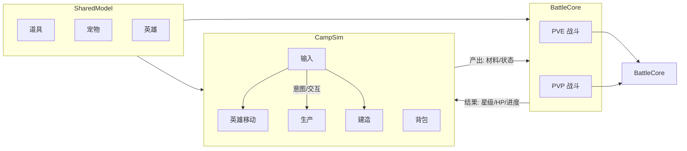

### B.7 Feature Notes (v1.37) — Demo 战斗演出与 Spine 轨道

- Date: 2026-04-24
- Scope: `DemoBattleActorView.PlayAttackOnce` used by `FarmUnlockBattleFlowController` (scripted intro battle / unlock battle overlay).
- System design:
  - `SkeletonAnimation` 由战斗演出视图持有：`DemoBattleActorView` 通过 `GetComponent<SkeletonAnimation>()` 获取或缓存，避免与英雄 locomotion 误用同一套 API。
  - 与 `GameBootstrap.EnsureHeroComponents` 中 `SpineAttackPlayer` 对齐：见 2.3-5 节，营地 Spine **track 1** 专用于攻击，`HeroSpineLocomotion` 使用 track 0；本处应复用 `SpineAttackPlayer.PlayAttackOnce()` 的轨道约定，或明确为独立实例不冲突。
  - 若无 `SpineAttackPlayer` 而仅有演示 prefab：`DemoBattleActorView` 在 `SkeletonAnimation` 上对 `Attack` 使用 **track 1**；`Complete` 后对 track 1 `SetEmptyAnimation`，恢复 track 0 的 Idle/Walk（若存在）。
- Data structure definition: 无新增持久化结构；可选缓存 `SkeletonAnimation` 引用。
- API/interface design: `DemoBattleActorView` 暴露 `PlayAttackOnce()` / `PlayDeath()`；实现优先委托 `SpineAttackPlayer` 或 Spine overlay track，避免与 `Animator` 混用；`GetComponentInChildren` 须有明确根节点。
- Priority: P0（演出缺失或轨道冲突导致战斗流程卡死或穿帮）。
- Implementation suggestion: 与 `SpineAttackPlayer` 共用 `attackAnimationName` 默认 `"Attack"`；`PlayDeath` 可降级为仅 `SkeletonAnimation` 路径并打日志。

# 宠物 Demo 游戏 SPEC：营地建造 + 资源生产 + PK

## 1. 文档信息

| 项 | 内容 |
| --- | --- |
| 文档名称 | 宠物 Demo 游戏 SPEC |
| 文档目的 | 描述营地模拟建造与生产、**PVE 战斗**、**PK/PVP 对接** 的整体设计与约束 |
| 目标平台 | Unity 工程 [`Pet Demo`](Pet Demo)，2D 营地加战斗；PC，可后续扩展移动端 |
| Unity 工程 | [`Pet Demo`](Pet Demo) |
| 文档版本 | v1.29 |
| 范围说明 | 以可运行 Demo 为主；战斗核心抽象为 `BattleCore`；英雄与怪物使用 Spine 运行时（**工程当前 4.5 运行时**与**资源包 4.7 数据**并存）；PVP 仅接口与数据契约 |

本 SPEC 以**可执行行为**为准：C# 与场景中的实际实现优先；**与实现不一致处**以代码为准并应回写本 SPEC。

---

## 2. 产品目标与模块边界

本 Demo 聚焦三件事：

1. **营地建造与生产**：建造点、蓝图、搬运、设施阶段与配方，与 MoveIdle 交互解析协同。
2. **单机 PVE 战斗**：回合制规则、队伍上限、胜负与进度写入；与营地存档模型对齐。
3. **联网 PK/PVP**：在 PVE 已验证的 `BattleCore` 上预留**规则版本**与客户端抽象；本 SPEC 定义契约与集成点，不要求 Demo 内完整联机。

### 2.1 模块关系（示意）

说明：

- **营地**：不负责网络同步；仅维护本地 roster 与设施状态。
- **战斗核心**：纯 C# 可测逻辑；**无** Unity 场景依赖；通过适配层读写 `SaveData` 中的战斗相关字段与单位 ID。

